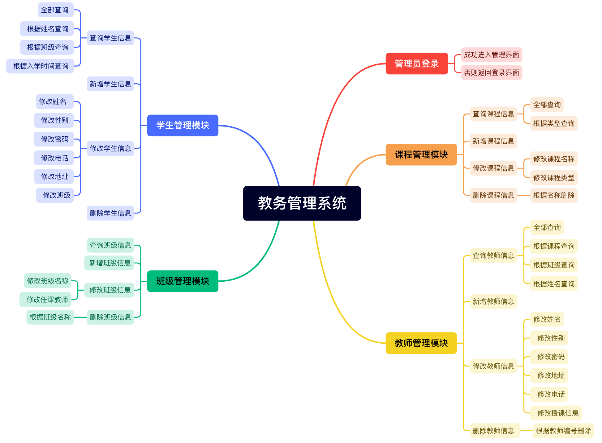

# 第三章 管理员模块开发2

**模块简介**	

管理员模块在各类系统中扮演着至关重要的角色，其主要作用包括对整个项目的所有数据和功能进行管理和维护。具体来说，管理员模块的功能包括但不限于以下几个方面。

1. 教师管理：管理员可以管理和维护教师的信息，包括教师的个人信息，教师的专业管理，教师授课班级分配等功能。
2. 学生管理：管理员可以管理系统的学生信息。管理员可以对学生数据进行增删改查等操作，确保数据的准确性和完整性。
3. 班级管理：管理员可以操作班级信息，以便即时根据院校情况进行班级调整。
4. 课程管理：管理员负责对院校课程的设置，方便学院即时对教师团队授课进行管理。

在教务管理系统中，管理员模块的作用尤为重要。通过管理员模块，学校可以实现对教务信息的全面管理和维护，提高工作效率和管理水平。同时，管理员模块还可以为师生提供便捷的服务，帮助他们更好地了解教务信息和课程安排。

 

基于控制台实现的教务管理系统

 

## 需求分析

 

##  **本章⽬标**	

###  1. 完成班级管理模块

 班级管理视图：

```java
private void classesView() {
    while (true) {
        System.out.println("当前所在位置：##########管理员系统>班级信息管理##########");
        System.out.println("请选择功能:1 查询班级信息 2 添加班级信息 3 修改班级信息 4 删除班级信息 0 返回上一级");
        String num = sc.nextLine();
        switch (num) {
            case "1":
                queryClassesView();
                break;
            case "2":
                addClassesView();
                break;
            case "3":
                editClassesView();
                break;
            case "4":
                removeClassesView();
                break;
            case "0":
                return;
            default:
                System.out.println("该功能暂未开放，请重新选择");

        }
    }
}
```

### 2. 完成学生管理模块

```java
private void studentView() {
    while (true) {
        System.out.println("当前所在位置：##########管理员系统>学生信息管理##########");
        System.out.println("请选择功能:1 查询学生信息 2 添加学生信息 3 修改学生信息 4 删除学生信息 0 返回上一级");
        String num = sc.nextLine();
        switch (num) {
            case "1":
                queryStudentsView();
                break;
            case "2":
                addStudentView();
                break;
            case "3":
                editStudentView();
                break;
            case "4":
                removeStudentView();
                break;
            case "0":
                return;
            default:
                System.out.println("该功能暂未开放，请重新选择");

        }
    }
}
```

## 涉及知识点

（⼀）日期格式话

（二）多表查询

## **知识点讲解**	

### 日期格式化

#### 1、什么是日期格式化

日期格式化就是把日期对象根据指定的格式，形成字符串。

#### 2、java中日期格式化

java.text.DateFormat` 是日期/时间格式化子类的抽象类，我们通过这个类可以帮我们完成日期和文本之间的转换,也就是可以在Date对象与String对象之间进行来回转换。

- **格式化**：按照指定的格式，从Date对象转换为String对象。
- **解析**：按照指定的格式，从String对象转换为Date对象

#### 3、DateFormat类的构造方法

由于DateFormat为抽象类，不能直接使用，所以需要常用的子类`java.text.SimpleDateFormat`。这个类需要一个模式（格式）来指定格式化或解析的标准。

| 方法名                                  | 说明                                                         |
| --------------------------------------- | ------------------------------------------------------------ |
| public SimpleDateFormat()               | 用默认的模式和默认语言环境的日期格式符号构造SimpleDateFormat。 |
| public SimpleDateFormat(String pattern) | 用给定的模式和默认语言环境的日期格式符号构造SimpleDateFormat。 |

参数pattern是一个字符串，代表日期时间的自定义格式；常见的格式规则：

| 标识字母（区分大小写） | 含义 |
| :--------------------- | ---- |
| y                      | 年   |
| M                      | 月   |
| d                      | 日   |
| H                      | 时   |
| m                      | 分   |
| s                      | 秒   |

代码演示

```java
import java.text.DateFormat;
import java.text.SimpleDateFormat;

public class Demo02SimpleDateFormat {
    public static void main(String[] args) {
        // 对应的日期格式如：2025-01-16 15:06:38
        DateFormat format = new SimpleDateFormat("yyyy-MM-dd HH:mm:ss");
    }    
}
```

#### 4、DateFormat类的常用方法

| 方法名                           | 说明                       |
| -------------------------------- | -------------------------- |
| public String format(Date date)  | 将Date对象格式化为字符串。 |
| public Date parse(String source) | 将字符串解析为Date对象。   |

##### 代码演示

```java
import java.text.DateFormat;
import java.text.ParseException;
import java.text.SimpleDateFormat;
import java.util.Date;
/*
 把Date对象转换成String
*/
public class Demo03DateFormatMethod {
	public static void main(String[] args) throws ParseException {
		// Date --> String
		Date d = new Date();
		// 创建格式化对象
		SimpleDateFormat sdf = new SimpleDateFormat("yyyy年MM月dd日 HH:mm:ss");
		String s = sdf.format(d);
		System.out.println(s);
		
		//String --> Date
		String str = "2025-08-08 12:12:12";
		//在把一个字符串解析为日期的时候，请注意格式必须和给定的字符串格式匹配
		SimpleDateFormat sdf2 = new SimpleDateFormat("yyyy-MM-dd HH:mm:ss");
		Date dd = sdf2.parse(str);
		System.out.println(dd);
	}
}
```

#### 5、SimpleDateFormat案例

- 案例需求

  > 请使用日期时间相关的API，计算出你和你对象相处了多少天。

- 案例分析

  ```markdown
  1. 获取当前时间对应的毫秒值
  2. 获取你处对象的日期对应毫秒值
  3. 两个时间相减（当前时间– 处对象日期）
  ```

- 案例代码

  ```java
  //注意：这个是计算年龄，案例代码自行编写，参考该案例。
  public static void function() throws Exception {
  	System.out.println("请输入出生日期 格式 YYYY-MM-dd");
  	// 获取出生日期,键盘输入
  	String birthdayString = new Scanner(System.in).next();
  	// 将字符串日期,转成Date对象
  	SimpleDateFormat sdf = new SimpleDateFormat("yyyy-MM-dd");
  	// 调用方法parse,字符串转成日期对象
  	Date birthdayDate = sdf.parse(birthdayString);	
      
  	// 获取今天的日期对象
  	Date todayDate = new Date();	
  	// 出生日期
  	long birthdaySecond = birthdayDate.getTime();
      // 今天日期
  	long todaySecond = todayDate.getTime();
      // 今天日期  - 出生日期 = 得到时间毫秒值
  	long secone = todaySecond-birthdaySecond;
      
  	if (secone < 0){
  		System.out.println("还没出生呢");
  	} else {
  		System.out.println(secone/1000/60/60/24);
  	}
  }
  ```


### MySQL多表查询

mysql中通常会把多张表中的相关数据联合查询，进行使用。

多表查询有以下几种方式：

1. 外连接查询
2. 内连接查询

#### 内连接查询

##### 隐式内连接查询

```sql
-- 没有INNER JOIN，形成的中间表为两个表的笛卡尔积，需要使用条件保留有意义的数据
select * from a,b where a.a_id = b.a_id;  
```

```sql
-- 查询老师对应的课程
select * from teacher , course where teacher.t_id = course.t_id;
```

##### 显式内连接查询

```sql
-- 显示的内连接，一般称为内连接，有INNER JOIN，形成的中间表为两个表经过ON条件过滤后的笛卡尔积
select * from a inner join b on a.a_id = b.a_id
```

```sql
-- 查询老师对应的课程
select * from teacher inner join course on teacher.t_id = course.t_id;
```

#### 外连接查

##### 左外连接

```SQL
select * from a left [outer] join b on a.a_id = b.b_id
```

```markdown
把left 关键字之前的表，是定义为左侧。 left关键字之后的表，定义右侧。
当两个表连接的时候，如果左侧表有数据，右测的表没有对应的数据。会把左侧的表中的数据显示出来。
如何去区分左右： left 关键字之前的 ，左侧。 left 关键字后面的表，右侧。
```

```sql
-- 需求：查询老师的授课情况，如果某个老师有授课，把老师和课程信息都显示出来。如果某个老师没有授课。则把老师的信息显示出来。
-- 要显示老师的信息。 把老师作为左侧
select * from teacher left join course on teacher.t_id = course.t_id;
```

##### 右外连接

```sql
select * from a  right [outer] join b on a.a_id = b.b_id
-- 如果右侧有数据，左侧没匹配到，把右侧的数据显示出来。
-- right之前的是左侧，right之后的是右侧。
```

##  模块功能实现

#### 班级模块

##### 添加班级

第一步：界面，在ManagerView.java中的`public void managerPage(Manager manager) `方法中解除`classesView();`的注释。

```java
public void managerPage(Manager manager) {
    while (true) {
        System.out.println("****************教务系统-管理员系统***************");
        System.out.println("***************当前管理员用户:" + manager.getUsername() + "****************");
        System.out.println("************************************************");
        System.out.println("请选择功能：1 教师管理 2 学生管理 3 课程管理 4 班级管理 5 密码修改 0 退出系统");

        String num = sc.nextLine();
        switch (num) {
            case "1":
                teacherView();
                break;
            case "2":
                //TODO studentView();
                break;
            case "3":
                courseView();
                break;
            case "4":
                classesView();//解除注释
                break;
            case "5":
                modifyPasswordView();
                break;
            case "0":
                return;
            default:
                System.out.println("功能暂未开放，请重新选择");
                break;
        }
    }
}
```

第二步：在`ManagerView.java`中的添加`classesView()`方法和`addClassesView()`方法

```java
private void classesView() {
    while (true) {
        System.out.println("当前所在位置：##########管理员系统>班级信息管理##########");
        System.out.println("请选择功能:1 查询班级信息 2 添加班级信息 3 修改班级信息 4 删除班级信息 0 返回上一级");
        String num = sc.nextLine();
        switch (num) {
            case "1":
                //queryClassesView();
                break;
            case "2":
                addClassesView();
                break;
            case "3":
                //editClassesView();
                break;
            case "4":
                //removeClassesView();
                break;
            case "0":
                return;
            default:
                System.out.println("该功能暂未开放，请重新选择");
        }
    }
}
```

添加班级视图：

```java
/**
 * 添加班级信息
 */
private void addClassesView() {
    Classes cls = new Classes();
    while (true) {
        System.out.println("当前所在位置：##########管理员系统>班级信息管理>班级信息添加##########");
        System.out.println("请输入班级名称:");
        String clsName = sc.nextLine();
        //验证班级名称是否存在: true存在  false不存在
        boolean bl = classesService.checkClassesName(clsName);
        if (!bl) {
            cls.setName(clsName);
            classesService.addClasses(cls);
            System.out.println("添加完成是否继续？y/n");

            if (!out()) {
                return;
            }
        }
        System.out.println("该班级已经存在，请重新添加");
    }
}
```

第三步：新建业务层接口和实现类

```java
public interface ClassesService {
    boolean checkClassesName(String clsName);
    void addClasses(Classes cls);
    List<Classes> findAllClasses();
}
```

 实现类：

```java
package cn.yunhe.service.impl;
import cn.yunhe.dao.ClassesDao;
import cn.yunhe.dao.impl.ClassesDaoImp;
import cn.yunhe.pojo.Classes;
import cn.yunhe.service.ClassesService;
import java.util.List;
/**
 * 班级业务实现类
 */
public class ClassesServiceImpl implements ClassesService {
    //持久层对象
    private ClassesDao classesDao = new ClassesDaoImp();
    /**
     * 查询所有班级的的业务
     * @return
     */
    @Override
    public List<Classes> findAllClasses() {
        return classesDao.findAllClasses();
    }
    /**
     * 验证班级是否存在
     * @param clsName
     * @return
     */
    @Override
    public boolean checkClassesName(String clsName) {
        Classes cls = classesDao.findClassesByName(clsName);
        if(cls!=null){
            return true;
        }
        return false;
    }
    /**
     * 添加班级的业务方法
     * @param cls
     */
    @Override
    public void addClasses(Classes cls) {
        classesDao.addClasses(cls);
    }
}
```

第四步：添加持久层接口和实现类：

持久层接口：

```java
package cn.yunhe.dao;
import cn.yunhe.pojo.Classes;
import java.util.List;
public interface ClassesDao {
    List<Classes> findAllClasses();
    Classes findClassesByName(String clsName);
    void addClasses(Classes cls);
}

```

持久层接口实现类：

```java
package cn.yunhe.dao.impl;
import cn.yunhe.dao.ClassesDao;
import cn.yunhe.pojo.Classes;
import cn.yunhe.util.DatabaseUtil;
import org.springframework.dao.EmptyResultDataAccessException;
import org.springframework.jdbc.core.BeanPropertyRowMapper;
import org.springframework.jdbc.core.JdbcTemplate;
import org.springframework.jdbc.core.SingleColumnRowMapper;
import java.util.List;

/**
 * 班级持久层类
 */
public class ClassesDaoImp implements ClassesDao {
    //工具对象
    private JdbcTemplate template = DatabaseUtil.template;
    /**
     * 查询所有班级
     * @return
     */
    @Override
    public List<Classes> findAllClasses() {
        return template.query("select * from classes",new BeanPropertyRowMapper<>(Classes.class));
    }

    /**
     * 根据班级名称查询
     * @param clsName
     * @return
     */
    @Override
    public Classes findClassesByName(String clsName) {
        try {
            return template.queryForObject("select * from classes where name=?",
                                           new BeanPropertyRowMapper<>(Classes.class),clsName);
        }catch (EmptyResultDataAccessException e){
            return null;
        }
    }
    /**
     * 添加班级
     * @param cls
     */
    @Override
    public void addClasses(Classes cls) {
        template.update("insert into classes values(null,?)",cls.getName());
    }
}
```


##### 修改班级

界面

```
 private void editClassesView() {
        while (true) {
            System.out.println("当前所在位置：##########管理员系统>班级信息管理>班级信息修改##########");
            System.out.println("*******************班级信息如下：**********************");
            showClasses();
            System.out.println("****************************************************");
            System.out.println("请选择功能:1 修改班级名称 2 修改班级任课教师 0 返回上一级");
            String num = sc.nextLine();

            switch (num) {

                case "1":
                    System.out.println("请输入修改的班级名称：");
                    String className;

                    while (true) {

                        className = sc.nextLine();

                        boolean bl = classesService.checkClassesName(className);

                        if (bl) {
                            break;
                        }
                        System.out.println("该班级不存在，请重新输入");
                    }

                    System.out.println("请输入新班级名称：");

                    while (true) {
                        String newName = sc.nextLine();
                        boolean bl = classesService.checkClassesName(newName);
                        if (!bl) {
                            classesService.modifyClassName(className, newName);
                            System.out.println("修改完成");
                            break;
                        }
                        System.out.println("该班级已存在，请重新输入");

                    }

                case "2":
                    while (true) {
                        System.out.println("############当前所在位置:管理员系统>班级管理>班级教师信息修改###########");
                        System.out.println("请选择功能：1 新增班级教师 2 移除班级教师 0 返回上一级");

                        String num1 = sc.nextLine();

                        switch (num1) {
                            case "1":
                                addClassTeacherView();
                                break;
                            case "2":
                                removeClassTeacherView();
                                break;

                            case "0":
                                return;

                            default:
                                System.out.println("该功能暂未开放，请重新选择");

                        }
                    }

                case "0":
                    return;

                default:
                    System.out.println("功能暂未开放，请重新选择");

            }

        }


    }
```

 

```
/**
 * 添加班级教师
 */
private void addClassTeacherView() {

    while (true) {
        System.out.println("请输入班级名称：");
        String className = sc.nextLine();
        boolean b = classesService.checkClassesName(className);
        if (b) {

            while (true) {
                System.out.println("请输入添加的教师编号：");
                String tid = sc.nextLine();

                //验证教师编号是否正确
                boolean bl = teacherService.findTeacherById(tid);

                if (bl) {

                    //进行添加
                    boolean bll = classesService.addClassesTeacher(tid, className);

                    if (bll) {
                        System.out.println("添加成功，是否继续？y/n");
                        if (!out()) {
                            return;
                        }

                    } else {
                        System.out.println("课程教师已经存在，请重新输入");
                    }


                } else {
                    System.out.println("该教师不存在，请重新输入");
                }
            }


        } else {
            System.out.println("班级不存在，请重新输入");
        }
    }


}
```

```
/**
     * 移除班级教师
     */
    private void removeClassTeacherView() {
        while (true) {
            System.out.println("############当前所在位置:管理员系统>班级管理>班级教师信息修改>移除班级授课教师###########");
            System.out.println("请输入班级名称：");
            String className = sc.nextLine();
            boolean b = classesService.checkClassesName(className);
            if (b) {

                List<Map<String, Object>> classesTeachers = teacherService.findTeacherByClassName(className);
                if (classesTeachers.size() == 0) {
                    System.out.println("该班级暂无授课教师，请先进行教师添加");
                    return;
                }
                System.out.println(className + "班的教师如下：");
                ArrayList<Object> tids = new ArrayList<>();
                for (Map<String, Object> classesTeacher : classesTeachers) {
                    System.out.println("\t教师编号:" + classesTeacher.get("id") + "\t姓名:" + classesTeacher.get("name") + "\t教授课程：" + classesTeacher.get("cname"));
                    tids.add(classesTeacher.get("id"));
                }

                System.out.println("请输入要移除的教师编号：");

                while (true) {
                    String tid = sc.nextLine();
                    if (tids.contains(tid)) {
                        classesService.removeClassesTeacher(tid);
                        System.out.println("移除成功成功，是否继续移除？y/n");
                        if (!out()) {
                            return;
                        }

                        break;
                    } else {
                        System.out.println("教师编号有误，请重新输入：");
                    }
                }

            }


        }

    }

```

持久层

```
 @Override
    public void modifyClassName(String className, String newName) {
        template.update("update classes set name=? where name=?",newName,className);
    }

    @Override
    public int findCountByClassNameAndCid(String className, int cid) {
        return template.queryForObject("select count(*) from classes cls,teachingclass tc,teacher t where cls.id=tc.classid and tc.tid = t.id and t.cid =? and cls.name=?", Integer.class,cid,className);
    }

    @Override
    public void addClassesTeacher(String tid, int id) {
        template.update("insert into teachingclass values (null,?,?)",tid,id);
    }
    
	public void removeClassesTeacherByTid(String id) {
        template.update("delete from teachingclass where tid=?",id);
    }
```

##### 查询班级

界面

```java
 /**
  * 查询子菜单
  */
private void queryClassesView() {

    System.out.println("当前所在位置：##########管理员系统>班级信息管理>班级信息查询##########");
    System.out.println("查询结果如下：");
    System.out.println("****************************************");
    showClasses();
    System.out.println("***************************************");

}


//展示班级信息
private void showClasses() {
    List<Map<String, List<Map<String, Object>>>> classes = classesService.allClassesDetails();
    if (classes.size() == 0) {
        System.out.println("暂无班级信息");
        return;
    }

    for (Map<String, List<Map<String, Object>>> aClass : classes) {
        Set<String> classNames = aClass.keySet();
        for (String className : classNames) {
            System.out.println("班级：" + className + "\t任课教师：");

            List<Map<String, Object>> maps = aClass.get(className);

            for (Map<String, Object> map : maps) {
                System.out.println("\t姓名:" + map.get("name") + "\t课程：" + map.get("cname"));
            }

            System.out.println("");
        }
    }
}
```

 持久层

```

    /**
     * 查询所有班级
     * @return
     */
    @Override
    public List<Classes> findAllClasses() {
        return template.query("select * from classes",new BeanPropertyRowMapper<>(Classes.class));
    }
    

    /**
     * 根据班级名称查询
     * @param clsName
     * @return
     */
    @Override
    public Classes findClassesByName(String clsName) {
        try {
            return template.queryForObject("select * from classes where name=?",new BeanPropertyRowMapper<>(Classes.class),clsName);
        }catch (EmptyResultDataAccessException e){
            return null;
        }
    }
```


##### 班级移除

界面

```
  private void removeClassesView() {
        System.out.println("当前所在位置：##########管理员系统>班级信息管理>班级移除##########");
        while (true) {
            System.out.println("请输入需要移除的班级名称：");
            String className = sc.nextLine();

            boolean bl = classesService.removeClasses(className);

            if (bl) {
                System.out.println("删除成功，是否继续删除？y/n");
                if (!out()) {
                    return;
                }
            } else {
                System.out.println("班级不存在");
            }
        }


}
```

持久层

```
 @Override
    public void removeClasses(String className) {

        template.update("delete from classes where name=?",className);
    }
```

#### 学生管理模块

#####  添加学生信息

界面

```
 private void addStudentView() {
        Student student = new Student();

        while (true) {

            System.out.println("当前所在位置：##########管理员系统>学生信息管理>学生信息新增##########");
            System.out.println("请输入学生姓名:");
            String name = sc.nextLine();
            student.setName(name);

            System.out.println("请输入性别:男 或 女");
            String sex = checkSex();
            student.setSex(sex);

            System.out.println("请输入手机号码:");
            String phone = checkStudentPhone();
            student.setPhone(phone);

            System.out.println("请输入家庭住址:");
            student.setAddress(sc.nextLine());

            //密码，使用手机后六位
            student.setPassword(student.getPhone().substring(5));

            //班级
            int clsId = chooseClasses();

            if (clsId == 0) { //没有班级，则结束添加
                return;
            }
            student.setClassId(clsId);

            //获取日期
            Date date = new Date();
            //入学时间
            student.setEnrollmentTime(date);

            //学号编号采用：年+班级编号+数字
            //获取班级最大学号
            int maxId = studentService.findMaxId(clsId);

            if (maxId == 0) { //该班级第一位学生的学号

                String dt = new SimpleDateFormat("yyyy").format(date);
                student.setId(dt + clsId + 1);

            } else {//其它学生的学号
                student.setId(String.valueOf(maxId + 1));
            }

            //添加
            studentService.addStudent(student);

            System.out.println("添加成功，是否继续添加：y/n");

            if (!out()) {
                return;
            }
            ;
        }
    }

```

```

/**
 * 验证学生手机号
 *
 * @return
 */
private String checkStudentPhone() {
    while (true) {
        String phone = sc.nextLine();
        boolean bl = phone.matches("^1(3[0-9]|4[5-9]|5[0-3,5-9]|6[6]|7[1-8]|8[0-9]|9[1,3,5,7,8,9])\\d{8}$");
        if (bl) {

            //查询手机号是否存在,手机号不能重复
            boolean repeated = studentService.checkStudentPhone(phone);

            if (!repeated) { //手机号不重复
                return phone;
            } else {
                System.out.println("手机号已经存在，请换个手机号码");
            }

        } else {
            System.out.println("手机号码格式不正确，请重新输入手机号码");
        }
    }
}
```

持久层

```
 /**
     * 添加学生信息
     * @param student
     */
    @Override
    public void addStudent(Student student) {
        template.update("insert into student values (?,?,?,?,?,?,?,?)",student.getId(),student.getName(),student.getSex(),student.getPhone(),student.getAddress(),student.getPassword(),student.getEnrollmentTime(),student.getClassId());
    }
```


##### 修改学生信息

界面

```
 private void editStudentView() {
        while (true) {
            System.out.println("当前所在位置：##########管理员系统>学生信息管理>学生信息修改##########");
            System.out.println("请选择功能：1 修改姓名  2 修改性别 3 修改密码 4 修改电话 5 修改地址 6 修改班级 0 返回上一级 ");
            String num = sc.nextLine();
            switch (num) {
                case "1":
                    System.out.println("请输入学生学号");
                    String id = sc.nextLine();

                    System.out.println("请输入学生新姓名");
                    String name = sc.nextLine();

                    boolean bl = studentService.updateName(id, name);
                    isSuccess(bl);
                    break;

                case "2":
                    System.out.println("请输入学生学号");
                    id = sc.nextLine();

                    System.out.println("请输入学生新性别");
                    String sex = checkSex();

                    bl = studentService.updateSex(id, sex);
                    isSuccess(bl);
                    break;

                case "3":
                    System.out.println("请输入学生学号");
                    id = sc.nextLine();

                    System.out.println("请输入学生新密码");
                    String password = sc.nextLine();

                    bl = studentService.updatePassword(id, password);
                    isSuccess(bl);
                    break;

                case "4":
                    System.out.println("请输入学生学号");
                    id = sc.nextLine();

                    System.out.println("请输入学生的新手机号码");
                    String phone = checkStudentPhone();

                    bl = studentService.updatePhone(id, phone);
                    isSuccess(bl);
                    break;

                case "5":
                    System.out.println("请输入学生学号");
                    id = sc.nextLine();

                    System.out.println("请输入学生新地址");
                    String address = sc.nextLine();

                    bl = studentService.updateAddress(id, address);
                    isSuccess(bl);
                    break;

                case "6":
                    System.out.println("请输入学生学号");
                    id = sc.nextLine();

                    int clsId = chooseClasses();

                    if (clsId == 0) { //没有班级，则结束添加
                        return;
                    }

                    //调用修改请求
                    bl = studentService.updateClasses(id, clsId);

                    isSuccess(bl);

                    break;

                case "0":
                    return;

                default:
                    System.out.println("该功能暂未开放，请重新选择");

            }

        }

    }
```


持久层

```
/**
     * 修改地址
     * @param id
     * @param address
     * @return
     */
    @Override
    public int updateAddress(String id, String address) {
        return template.update("update Student set address=? where id=?",address,id);
    }

    /**
     * 修改电话
     * @param id
     * @param phone
     * @return
     */
    @Override
    public int updatePhone(String id, String phone) {
        return template.update("update Student set phone=? where id=?",phone,id);
    }

    /**
     * 修改密码
     * @param id
     * @param password
     * @return
     */
    @Override
    public int updatePassword(String id, String password) {
        return template.update("update Student set password=? where id=?",password,id);
    }

    /**
     * 修改性别
     * @param id
     * @param sex
     * @return
     */
    @Override
    public int updateSex(String id, String sex) {
        return template.update("update Student set sex=? where id=?",sex,id);
    }

    /**
     * 修改姓名
     * @param id
     * @param name
     * @return
     */
    @Override
    public int updateName(String id, String name) {
        return template.update("update Student set name=? where id=?",name,id);
    }

    /**
     * 修改班级
     * @param id
     * @param clsId
     * @return
     */
    @Override
    public int updateClasses(String id, int clsId) {
        return template.update("update Student set classId=? where id=?",clsId,id);
    }
```

#####  查询学生信息

界面

```
 /**
  * 学生信息查询界面
  */
 private void queryStudentsView() {

      while (true) {
         System.out.println("当前所在位置：##########管理员系统>学生信息管理>学生信息查询##########");
          System.out.println("请选择功能:1 全部查询 2 根据姓名查询 3 根据班级查询 4 根据入学时间查询 0 返回上一级");
            String num = sc.nextLine();

            switch (num) {

                case "1": //全部学生查询

                    List<Map<String, Object>> students = studentService.findAllStudents();

                    if (students.size() == 0) {

                        System.out.println("暂无学生信息");
                    }

                    //展示
                    showManyStudents(students);

                    break;

                case "2": //根据姓名查询

                    System.out.println("请输入学生姓名:");

                    String name = sc.nextLine();

                    students = studentService.findStudentsByName(name);

                    if (students.size() == 0) {//未查询到结果

                        System.out.println("该学生不存在");

                    } else {//查询到

                        showManyStudents(students);
                    }

                    break;

                case "3": //根据班级名称查询
                    System.out.println("请输入班级名称:");

                    String className = sc.nextLine();

                    students = studentService.findStudentsByClassName(className);

                    if (students.size() == 0) {//未查询到结果

                        System.out.println("未查询到该班级的学生");

                    } else {//查询到

                        showManyStudents(students);
                    }
                    break;

                case "4": //根据入学时间进行查询

                    Object[] times = checkDate();

                    students = studentService.findStudentsByTime(times);

                    if (students.size() == 0) {//未查询到结果

                        System.out.println("未查询到该入学时间范围内的学生");

                    } else {//查询到

                        showManyStudents(students);
                    }
                    break;

                case "0":
                    return;

                default:
                    System.out.println("该功能暂未开放，请重新选择");
            }

        }

    }

    /**
     * 展示学生信息
     *
     * @param students
     */
    private void showManyStudents(List<Map<String, Object>> students) {
        System.out.println("##########查询结果如下：##############");
        students.stream().forEach(m -> showOneStudent(m));
        System.out.println("####################################");
    }

    /**
     * 单个学生数据展示
     *
     * @param student
     */
    private void showOneStudent(Map<String, Object> student) {
        System.out.println("学号:" + student.get("id") + "\t姓名:" + student.get("name") + "\t性别:" + student.get("sex") + "\t联系电话:" + student.get("phone")
                + "\t入学日期:" + DateUtil.format((Date) student.get("enrollmentTime"), "yyyy-MM-dd") + "\t班级:" + student.get("className") + "\t家庭住址:" + student.get("address"));


    }

```

持久层

```
  /**
     * 查询所有学生信息
     * @return
     */
    @Override
    public List<Map<String, Object>> findAllStudents() {
        return template.queryForList("select s.*,c.name className from student s,classes c where s.classid = c.id");
    }

    /**
     * 根据姓名查询学生信息
     * @param name
     * @return
     */
    @Override
    public List<Map<String, Object>> findStudentsByName(String name) {
        return template.queryForList("select s.*,c.name className from student s,classes c where s.classid = c.id and s.name like ?","%"+name+"%");
    }

    /**
     * 根据班级名称查询学生信息
     * @param className
     * @return
     */
    @Override
    public List<Map<String, Object>> findStudentsByClassName(String className) {
        return template.queryForList("select s.*,c.name className from student s,classes c where s.classid = c.id and c.name like ?","%"+className+"%");
    }

    /**
     * 根据入学时间查询学生信息
     * @param times
     * @return
     */
    @Override
    public List<Map<String, Object>> findStudentsByTime(Object[] times) {
        return template.queryForList("select s.*,c.name className from student s,classes c where s.classid = c.id and enrollmentTime>=? and enrollmentTime<=?",times);
    }

    /**
     * 根据班级编号查询学生总数
     * @param clsId
     * @return
     */
    @Override
    public int findStudentCountByClassId(int clsId) {
        return template.queryForObject("select count(*) from student where classid=?", Integer.class,clsId);
    }

```


##### 删除学生信息

界面

```
 private void removeStudentView() {

        while (true) {
            System.out.println("当前所在位置：##########管理员系统>学生信息管理>学生信息移除##########");
            System.out.println("学生信息如下：");
            System.out.println("*********************************************");
            List<Map<String, Object>> students = studentService.findAllStudents();

            if (students.size() == 0) { //防止无信息，进入死循环
                System.out.println("暂无学生信息");
                return;
            }

            //展示可操作的教师信息
            showManyStudents(students);
            System.out.println("*********************************************");
            System.out.println("请输入删除的学生学号:");
            String id = sc.nextLine();

            boolean bl = studentService.removeStudentById(id);

            if (bl) {

                System.out.println("删除成功,是否继续删除？y/n");

                if (out()) {
                    return;
                }
                ;

            } else {
                System.out.println("学号有误,请重新输入");
            }


        }


    }
```

持久层

```
  @Override
    public int removeStudentById(String id) {
        return template.update("delete from student where id=?",id);
    }
```

## 本章总结

1. 本章重点讲解管理员模块中班级模块和学生模块的开发实现。

## 布置作业

1. 完成界面创建。

2. 完成相关数据操作。

