# 第二章 管理员模块开发1

**模块简介**	

管理员模块在各类系统中扮演着至关重要的角色，其主要作用包括对整个项目的所有数据和功能进行管理和维护。具体来说，管理员模块的功能包括但不限于以下几个方面。

1. 教师管理：管理员可以管理和维护教师的信息，包括教师的个人信息，教师的专业管理，教师授课班级分配等功能。
2. 学生管理：管理员可以管理系统的学生信息。管理员可以对学生数据进行增删改查等操作，确保数据的准确性和完整性。
3. 班级管理：管理员可以操作班级信息，以便即时根据院校情况进行班级调整。
4. 课程管理：管理员负责对院校课程的设置，方便学院即时对教师团队授课进行管理。

在教务管理系统中，管理员模块的作用尤为重要。通过管理员模块，学校可以实现对教务信息的全面管理和维护，提高工作效率和管理水平。同时，管理员模块还可以为师生提供便捷的服务，帮助他们更好地了解教务信息和课程安排。

 **基于控制台实现的教务管理系统**

 

## 需求分析


## **本章⽬标**

完成教师管理、课程管理	

## 模块功能实现

新建一个项目，并创建lib文件夹，加入构建路径，把用到的jar包复制到lib文件夹；并创建项目的包，命名注意规范。

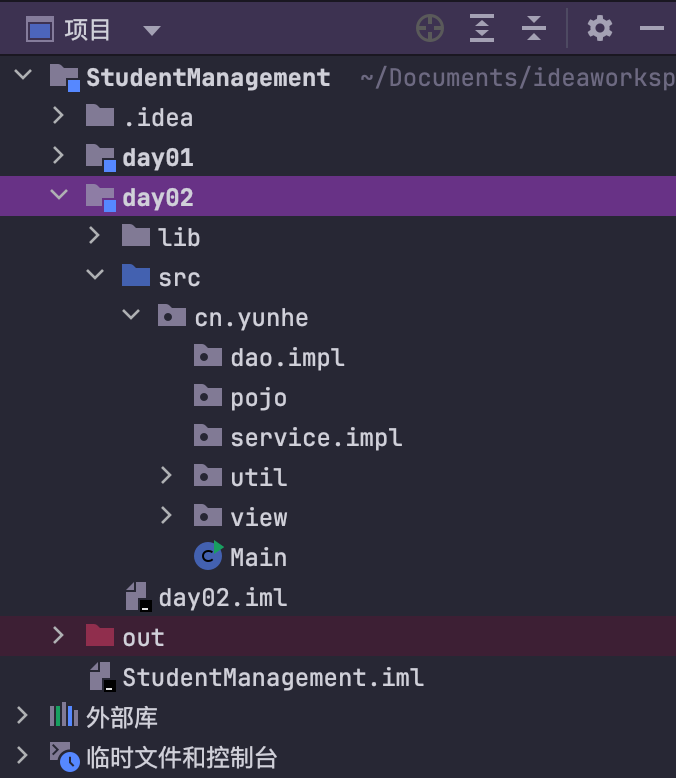

Main.java是程序的入口，代码如下：

```java
package cn.yunhe;
import cn.yunhe.view.MainView;
public class Main {
    public static void main(String[] args) {
        new MainView().mainView();
    }
}
```

为了方便系统的输入，在util工具包下面创建一个简单的工具类，用来获取Scanner对象。

```java
package cn.yunhe.util;
import java.util.Scanner;
public class ScannerUtil {
    public static Scanner sc = new Scanner(System.in);
}
```

### 1、完成管理员登录功能

登录界面设计：根据选择身份不同，进行登录；首先实现管理员登录。

```java
package cn.yunhe.view;
import cn.yunhe.util.ScannerUtil;

import java.util.Arrays;
import java.util.Scanner;

/**
 * 主界面类
 */
public class MainView {
    //输入扫描
    private Scanner sc = ScannerUtil.sc;
    //登录界面
    public void mainView() {
        while (true) {
            System.out.println("*************教务管理系统*******************");
            System.out.println("请选择：1 教师登录 2 学生登录 3 管理员登录 0 退出系统");
            String num = sc.nextLine();
            if (num.equals("0")) return;//结束系统
            //记录用户输入的账号和密码
            Object[] userInfo = new Object[2];
            System.out.println("***********请输入账号**************");
            userInfo[0] = sc.nextLine();
            System.out.println("***********请输入密码**************");
            userInfo[1] = sc.nextLine();

            String mess = "";
            System.out.println("输入的账号和密码是:"+ Arrays.toString(userInfo));
            switch (num) {
                case "1":
                    //TODO: 教师登录
                    break;
                case "2":
                    //TODO: 学生登录
                    break;
                case "3":
                    //TODO:管理员登录
                    break;
                default:
                    mess = "功能暂未开放";
            }
            System.out.println(mess);
        }
    }
}
```

执行效果如下：

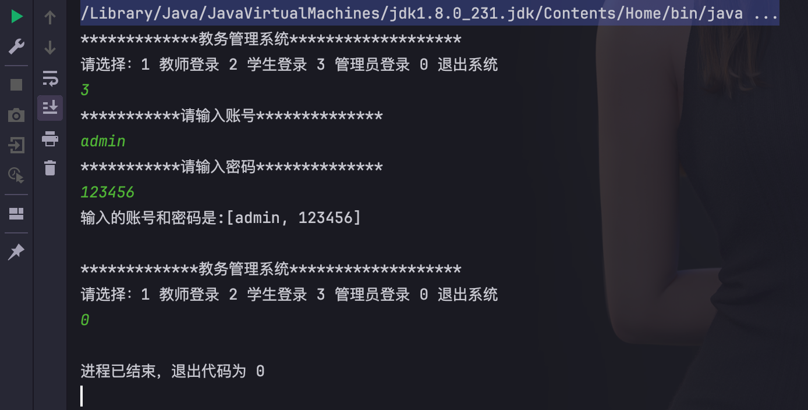

下面实现管理员登录功能：

第一步：确保完成数据库表的创建；并添加一条数据；admin/123456;

第二步：创建数据库连接池配置文件，放到src目录下；

```xml
<?xml version="1.0" encoding="UTF-8"?>
<c3p0-config>
    <!-- 我们希望在配置文件中，出现链接的参数信息 -->
    <default-config>
        <!-- name 属性定义 链接参数的key 标签的内容 代表值-->
        <property name="driverClass">com.mysql.cj.jdbc.Driver</property>
        <property name="jdbcUrl">jdbc:mysql://localhost:3306/academicaffairsmanagement?characterEncoding=utf-8</property>
        <property name="user">root</property>
        <property name="password">123456</property>

        <!-- 连接池参数 -->
        <property name="initialPoolSize">5</property>
        <property name="maxPoolSize">10</property>
        <property name="checkoutTimeout">3000</property>
    </default-config>
</c3p0-config>
```

第三步：在util包下创建DatabaseUtil工具类，获取JdbcTemplate对象；

```java
package cn.yunhe.util;

import com.mchange.v2.c3p0.ComboPooledDataSource;
import org.springframework.jdbc.core.JdbcTemplate;

/**
 * 获取JdbcTemplate对象
 */
public class DatabaseUtil {
    public static JdbcTemplate template = new JdbcTemplate(new ComboPooledDataSource());
}
```

第四步：创建Dao模式的相关类：

实体类，用来封装数据：

```java
package cn.yunhe.pojo;
import lombok.Data;
@Data
public class Manager {
    private int id;
    private String username;
    private String password;
}
```

Dao接口：

```java
package cn.yunhe.dao;
import cn.yunhe.pojo.Manager;
public interface ManagerDao {
    Manager findManagerByUsernameAndPassword(Object[] userInfo);
}
```

Dao接口实现类：

```java
package cn.yunhe.dao.impl;

import cn.yunhe.dao.ManagerDao;
import cn.yunhe.pojo.Manager;
import cn.yunhe.util.DatabaseUtil;
import org.springframework.dao.EmptyResultDataAccessException;
import org.springframework.jdbc.core.BeanPropertyRowMapper;
import org.springframework.jdbc.core.JdbcTemplate;
/**
 * 管理员持久层实现类
 */
public class ManagerDaoImpl implements ManagerDao {
    //工具对象
    private JdbcTemplate template = DatabaseUtil.template;
    @Override
    public Manager findManagerByUsernameAndPassword(Object[] userInfo) {
        try {
            return template.queryForObject("select * from manager where username=? and password=?", 
                    new BeanPropertyRowMapper<>(Manager.class),
                    userInfo);
        }catch (EmptyResultDataAccessException e){
            return null;
        }
    }
}
```

创建业务层接口：

```java
package cn.yunhe.service;
import cn.yunhe.pojo.Manager;

public interface ManagerService {
    Manager login(Object[] userInfo);
}
```

创建业务层接口实现类：

```java
package cn.yunhe.service.impl;
import cn.yunhe.dao.ManagerDao;
import cn.yunhe.dao.impl.ManagerDaoImpl;
import cn.yunhe.pojo.Manager;
import cn.yunhe.service.ManagerService;
/**
 * 管理员业务实现类
 */
public class ManagerServiceImpl implements ManagerService {
    //管理员持久对象
    private ManagerDao managerDao = new ManagerDaoImpl();
    /**
     * 登录业务
     * @param userInfo
     * @return 登录人员信息
     */
    @Override
    public Manager login(Object[] userInfo) {
      return managerDao.findManagerByUsernameAndPassword(userInfo);
    }
}
```

第五步：修改MainView类的方法，调用管理员登录的业务；

```java
//雷同代码删除了.....................
public class MainView {
    //输入扫描
    private Scanner sc = ScannerUtil.sc;
    //登录界面
    public void mainView() {
 			//雷同代码删除了.....................
            switch (num) {
                case "1":
                    //TODO: 教师登录
                    break;
                case "2":
                    //TODO: 学生登录
                    break;
                case "3":
                    //TODO:管理员登录
                    Manager manager = new ManagerServiceImpl().login(userInfo);
                    System.out.println("登录的管理员信息:"+manager);
                    break;
                default:
                    mess = "功能暂未开放";
            }
            System.out.println(mess);
        }
    }
}
```

第六步：再次执行效果如下：

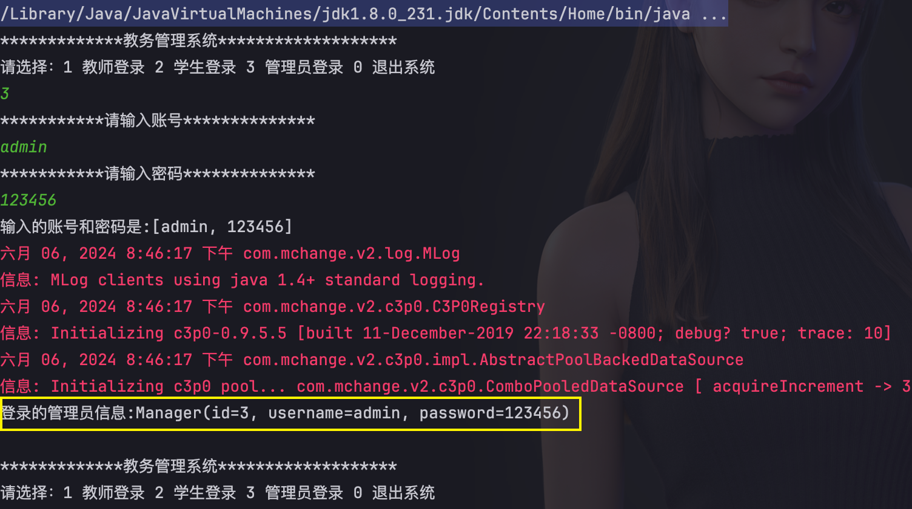

可以看到登录成功，显示管理员信息。管理员登录后要显示管理员操作的菜单，下面完善管理员的操作菜单。

项目的总体结构图如下，后面的功能开发不断的完善到对应的包即可。

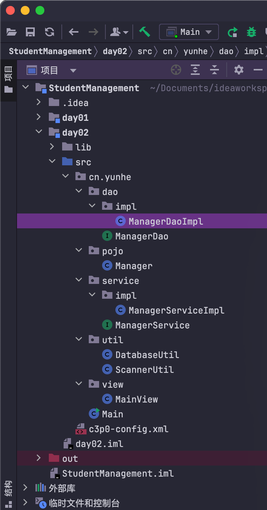

### 2、完成管理员界面主菜单设计

 在view包下面创建ManagerView.java类，并创建managerPage方法，显示操作的功能选择。

```JAVA
package cn.yunhe.view;
import cn.yunhe.pojo.Manager;
import cn.yunhe.util.ScannerUtil;
import java.util.Scanner;

public class ManagerView {
    //扫描器对象
    private Scanner sc = ScannerUtil.sc;
    /**
     * 主视图
     * @param manager
     */
    public void managerPage(Manager manager) {
        while (true) {
            System.out.println("****************教务系统-管理员系统***************");
            System.out.println("***************当前管理员用户:" + manager.getUsername() + "****************");
            System.out.println("************************************************");
            System.out.println("请选择功能：1 教师管理 2 学生管理 3 课程管理 4 班级管理 5 密码修改 0 退出系统");

            String num = sc.nextLine();
            switch (num) {
                case "1":
                    //TODO teacherView();
                    break;
                case "2":
                    //TODO studentView();
                    break;
                case "3":
                    //TODO courseView();
                    break;
                case "4":
                    //TODO classesView();
                    break;
                case "5":
                    modifyPasswordView();
                    break;
                case "0":
                    return;
                default:
                    System.out.println("功能暂未开放，请重新选择");
                    break;
            }
        }
    }
    private void modifyPasswordView() {
    }
}
```

在MainView中调用ManagerView的managerPage方法，就可以显示管理员功能列表了。

```java
//雷同代码删除.......
public class MainView {
    //输入扫描
    private Scanner sc = ScannerUtil.sc;
    //登录界面
    public void mainView() {
        while (true) {
			//雷同代码删除.......
            switch (num) {
                case "1":
                    //TODO: 教师登录
                    break;
                case "2":
                    //TODO: 学生登录
                    break;
                case "3":
                    //TODO:管理员登录
                    Manager manager = new ManagerServiceImpl().login(userInfo);
                    System.out.println("登录的管理员信息:"+manager);
                    //【注意：修改的位置】
                    if (manager != null){
                        new ManagerView().managerPage(manager);
                    } else {
                        mess = "账号或密码错误";
                    }
                    break;
                default:
                    mess = "功能暂未开放";
            }
            System.out.println(mess);
        }
    }
}

```

执行效果，可以看出进入到管理员系统界面。

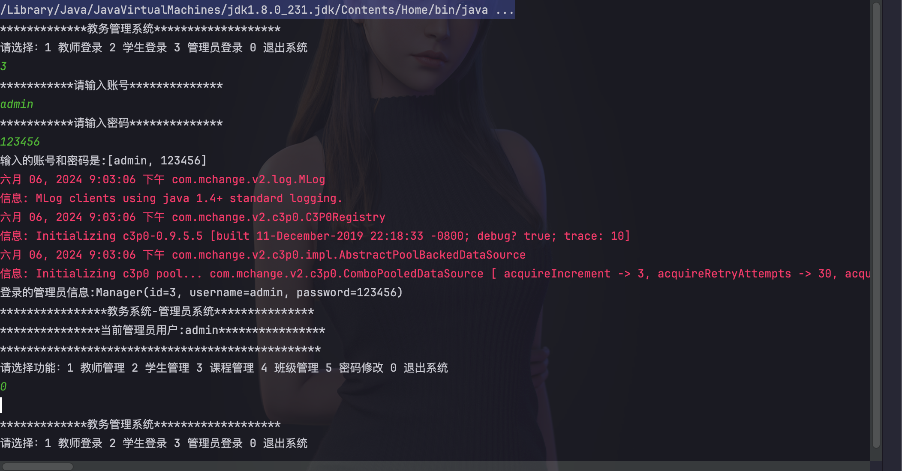

### 3、完成教师信息管理模块

教师信息管理界面菜单，在ManagerView.java中添加teacherView方法，代码如下：

#### 教师管理菜单

```java
/**
 * 教师管理菜单
 */
private void teacherView() {
    while (true) {
        System.out.println("***********管理员系统>教师信息管理*******************");
        System.out.println("请选择功能:1 查询教师信息 2 添加教师信息 3 修改教师信息 4 删除教师信息 0 返回上一级");
        String num = sc.nextLine();
        switch (num) {
            case "1":
                //TODO queryTeachersView();
                break;
            case "2":
                //TODO addTeacherView();
                break;
            case "3":
                //TODO editTeacherView();
                break;
            case "4":
                //TODO removeTeacherView();
                break;
            case "0":
                return;
            default:
                System.out.println("该功能暂未开放，请重新选择");
                break;
        }
    }
}
```

#### 查询教师模块

第一步：util包下添加日期工具类，用来对日期进行格式化处理；

```java
package cn.yunhe.util;
import java.text.ParseException;
import java.text.SimpleDateFormat;
import java.util.Date;

public class DateUtil {
    public static String format(Date date, String pattern){
        return new SimpleDateFormat(pattern).format(date);
    }

    public static Date parse(String dateTime,String pattern) throws ParseException {
        return new SimpleDateFormat(pattern).parse(dateTime);
    }
}
```

第二步：创建教师管理视图/界面，在ManagerView.java中添加queryTeachersView方法

```java
private void queryTeachersView() {
    while (true) {
        System.out.println("当前所在位置：##########管理员系统>教师信息管理>教师信息查询##########");
        System.out.println("请选择功能:1 全部查询 2 根据姓名查询 3 根据班级查询 4 根据课程查询 0 返回上一级");
        String num = sc.nextLine();
        switch (num) {
            case "1": //全部教师查询
                List<Map<String, Object>> teachers = teacherService.findAllTeachers();
                if (teachers.size() == 0) {
                    System.out.println("暂未教师信息");
                }
                //展示
                showManyTeachers(teachers);
                break;
            case "2": //根据姓名查询
                System.out.println("请输入教师姓名:");
                String name = sc.nextLine();
                teachers = teacherService.findTeacherByName(name);
                if (teachers.size() == 0) {//未查询到结果
                    System.out.println("该教师不存在");
                } else {//查询到
                    showManyTeachers(teachers);
                }
                break;
            case "3": //根据班级名称查询
                System.out.println("请输入班级名称:");
                String className = sc.nextLine();
                teachers = teacherService.findTeacherByClassName(className);
                if (teachers.size() == 0) {//未查询到结果
                    System.out.println("未查询到该班级的老师");
                } else {//查询到
                    showManyTeachers(teachers);
                }
                break;
            case "4": //根据课程名称进行查询
                System.out.println("请输入课程名称:");
                String courseName = sc.nextLine();
                teachers = teacherService.findTeacherByCourseName(courseName);
                if (teachers.size() == 0) {//未查询到结果
                    System.out.println("未查询到该课程的老师");
                } else {//查询到
                    showManyTeachers(teachers);
                }
                break;
            case "0":
                return;
            default:
                System.out.println("该功能暂未开放，请重新选择");
        }
    }
}
/**
  * 展示多个教师信息
  */
private void showManyTeachers(List<Map<String, Object>> teachers) {
    System.out.println("##########查询结果如下：##############");
    teachers.stream().forEach(t -> showOneTeacher(t));
    System.out.println("####################################");
}

/**
 * 展示单个教师信息
 */
private void showOneTeacher(Map<String, Object> teacher) {
    System.out.println("教师编号:" + teacher.get("id") + "\t姓名:" + teacher.get("name") + "\t性别:" + teacher.get("sex") + "\t联系电话:" + teacher.get("phone")
                       + "\t入职日期:" + DateUtil.format((Date) teacher.get("joineddate"), "yyyy-MM-dd") + "\t教授课程:" + teacher.get("cname") + "\t家庭住址:" + teacher.get("address"));
}
```

第三步：创建Teacher实体类

```java
package cn.yunhe.pojo;

import cn.yunhe.util.DateUtil;
import lombok.Data;

import java.util.Date;

/**
 * 教师类
 */
@Data
public class Teacher {
    private String id;
    private String name;
    private String sex;
    private String phone;
    private String address;
    private String password;
    private Date joinedDate;
    private int cid;
    private String joinedDateString;

    public String getJoinedDateString() {
        return DateUtil.format(joinedDate,"yyyy-MM-dd");
    }

    @Override
    public String toString() {
        return "教师编号："+id+"\t教师姓名："+name+"\t性别："+sex+"\t联系电话："+phone+"\t入职时间："+getJoinedDateString()+"\t地址："+address;
    }
}

```

第四步：创建Dao接口及其实现类：

Dao接口:

```java
package cn.yunhe.dao;


import cn.yunhe.pojo.Teacher;

import java.util.List;
import java.util.Map;

public interface TeacherDao {
    Teacher findTeacherByPhoneAndPassword(Object[] userInfo);
    List<Map<String, Object>> findAllTeachers();
    List<Map<String, Object>> findTeacherByName(String name);
    List<Map<String, Object>> findTeacherByClassName(String className);
    List<Map<String, Object>> findTeacherByCourseName(String courseName);
}

```

Dao接口实现类:

```java
package cn.yunhe.dao.impl;

import cn.yunhe.dao.TeacherDao;
import cn.yunhe.pojo.Teacher;
import cn.yunhe.util.DatabaseUtil;
import org.springframework.dao.EmptyResultDataAccessException;
import org.springframework.jdbc.core.BeanPropertyRowMapper;
import org.springframework.jdbc.core.JdbcTemplate;
import java.util.List;
import java.util.Map;

/**
 * 教师持久层实现
 */
public class TeacherDaoImpl implements TeacherDao {
    //工具对象
    private JdbcTemplate template = DatabaseUtil.template;
    /**
     * 根据电话和密码查询
     * @param userInfo
     * @return
     */
    @Override
    public Teacher findTeacherByPhoneAndPassword(Object[] userInfo) {
        try {
            return template.queryForObject("select * from teacher where phone=? and password=?", new BeanPropertyRowMapper<>(Teacher.class), userInfo);
        } catch (EmptyResultDataAccessException e) {
            return null;
        }
    }

    /**
     * 查询所有教师信息
     * @return
     */
    @Override
    public List<Map<String, Object>> findAllTeachers() {
        return template.queryForList("select t.*,cname from teacher t left join course c on t.cid = c.id");
    }


    /**
     * 根据姓名查询
     * @param name
     * @return
     */
    @Override
    public List<Map<String, Object>> findTeacherByName(String name) {
        return template.queryForList("select t.*,cname from teacher t left join course c on t.cid = c.id where name=?", name);
    }


    /**
     * 根据班级名称查询教师信息
     * @param className
     * @return
     */
    @Override
    public List<Map<String, Object>> findTeacherByClassName(String className) {
        return template.queryForList("select t.*,cname from teacher t,course c,teachingclass tc,classes cs where t.cid = c.id and t.id=tc.tid and tc.classid=cs.id and  cs.name=?", className);
    }

    /**
     * 根据课程名称进行查询
     * @param courseName
     * @return
     */
    public List<Map<String, Object>> findTeacherByCourseName(String courseName) {
        return template.queryForList("select t.*,cname from teacher t,course c where t.cid = c.id  and c.cname=?", courseName);
    }
}

```

第五步：创建Service接口及其实现类：

TeacherService接口：

```java
package cn.yunhe.service;


import cn.yunhe.pojo.Teacher;

import java.util.List;
import java.util.Map;

public interface TeacherService {
    Teacher login(Object[] userInfo);
    List<Map<String, Object>> findAllTeachers();
    List<Map<String, Object>> findTeacherByName(String name);
    List<Map<String, Object>> findTeacherByClassName(String className);
    List<Map<String, Object>> findTeacherByCourseName(String courseName);
}
```

TeacherService接口实现类：

```java
package cn.yunhe.service.impl;

import cn.yunhe.dao.TeacherDao;
import cn.yunhe.dao.impl.TeacherDaoImpl;
import cn.yunhe.pojo.Teacher;
import cn.yunhe.service.TeacherService;

import java.util.HashMap;
import java.util.List;
import java.util.Map;

/**
 * 教师业务实现
 */
public class TeacherServiceImpl implements TeacherService {

    //持久层对象
    private TeacherDao teacherDao = new TeacherDaoImpl();
    /**
     * 登录业务
     * @param userInfo
     * @return
     */
    @Override
    public Teacher login(Object[] userInfo) {
        return teacherDao.findTeacherByPhoneAndPassword(userInfo);
    }

    /**
     * 查询所有教师的信息
     * @return
     */
    @Override
    public List<Map<String, Object>> findAllTeachers() {
        return teacherDao.findAllTeachers();
    }

    /**
     * 根据姓名查询教师
     * @param name
     * @return
     */
    @Override
    public List<Map<String, Object>> findTeacherByName(String name) {
        return teacherDao.findTeacherByName(name);
    }

    /**
     * 根据班级名称查询教师信息
     * @param className
     * @return
     */
    @Override
    public List<Map<String, Object>> findTeacherByClassName(String className) {
        return teacherDao.findTeacherByClassName(className);
    }

    /**
     * 根据课程名称查询用户
     * @param courseName
     * @return
     */
    @Override
    public List<Map<String, Object>> findTeacherByCourseName(String courseName) {
        return teacherDao.findTeacherByCourseName(courseName);
    }
}
```

第六步：ManagerView类中创建Service接口对象

```java
public class ManagerView {
    //扫描器对象
    private Scanner sc = ScannerUtil.sc;
    private TeacherService teacherService = new TeacherServiceImpl();
    //代码略......
}
```

第七步：测试：

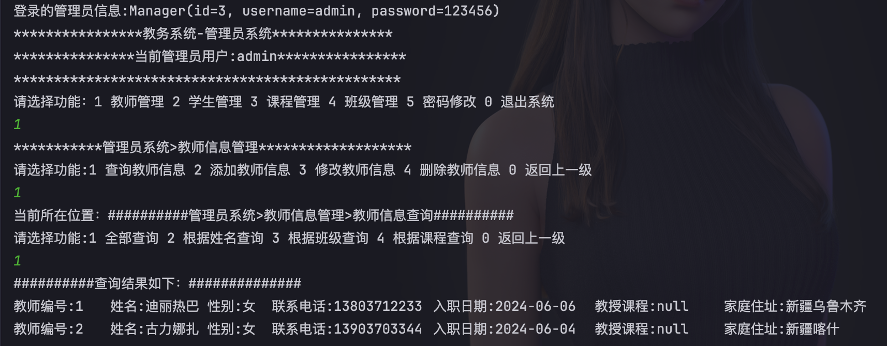

#### 添加教师信息

第一步：添加教师的视图层

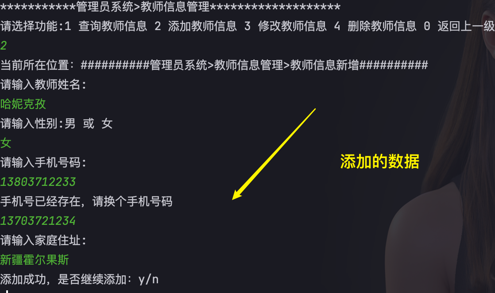

在ManagerView.java中增加方法`addTeacherView()`

```java
private void addTeacherView() {
    Teacher teacher = new Teacher();

    while (true) {
        System.out.println("当前所在位置：##########管理员系统>教师信息管理>教师信息新增##########");
        System.out.println("请输入教师姓名:");
        String name = sc.nextLine();
        teacher.setName(name);

        System.out.println("请输入性别:男 或 女");
        String sex = checkSex();
        teacher.setSex(sex);

        System.out.println("请输入手机号码:");
        String phone = checkTeacherPhone();
        teacher.setPhone(phone);

        System.out.println("请输入家庭住址:");
        teacher.setAddress(sc.nextLine());

        //密码，使用手机后六位
        teacher.setPassword(teacher.getPhone().substring(5));
        //教师编号采用年+月+日+时+分+随机数
        //获取日期
        Date date = new Date();
        String dt = new SimpleDateFormat("yyyyMMddHHmm").format(date);
        teacher.setId(dt + new Random().nextInt(20));
        //入职时间
        teacher.setJoinedDate(date);
        //添加
        teacherService.addTeacher(teacher);
        System.out.println("添加成功，是否继续添加：y/n");
        if (!out()) {
            return;
        }
    }
}
```

引用三个out()方法、checkSex()方法、checkTeacherPhone()方法，代码如下：

```java
/**
     * 是否继续
     * @return
     */
private boolean out() {
    while (true) {
        String option = sc.nextLine();
        if ("n".equalsIgnoreCase(option)) {
            return false;
        } else if ("y".equalsIgnoreCase(option)) {
            return true;
        } else {
            System.out.println("输入有误，请重新输入：y/n");
        }
    }
}
/**
 * 验证性别
 */
public String checkSex() {

    while (true) {
        String sex = sc.nextLine();
        if ("男".equals(sex) || "女".equals(sex)) {
            return sex;
        } else {
            System.out.println("性别有误，请重新输入性别");
        }
    }
}

/**
 * 验证教师手机号
 */
private String checkTeacherPhone() {
    while (true) {
        String phone = sc.nextLine();
        boolean bl = phone.matches("^1(3[0-9]|4[5-9]|5[0-3,5-9]|6[6]|7[1-8]|8[0-9]|9[1,3,5,7,8,9])\\d{8}$");
        if (bl) {
            //查询手机号是否存在,手机号不能重复
            boolean repeated = teacherService.findTeacherByPhone(phone);
            if (!repeated) { //手机号不重复
                return phone;
            } else {
                System.out.println("手机号已经存在，请换个手机号码");
            }
        } else {
            System.out.println("手机号码格式不正确，请重新输入手机号码");
        }
    }
}
```

第二步：业务层接口增加两个方法

TeacherService.java

```java
void addTeacher(Teacher teacher);
boolean findTeacherByPhone(String phone);
```

业务接口的实现类TeacherServiceImpl.java实现这两个方法：

```java
@Override
public void addTeacher(Teacher teacher) {
    teacherDao.addTeacher(teacher);
}

/**
 * 验证手机号的业务
 * @param phone
 * @return true:存在  false 不存在
 */
@Override
public boolean findTeacherByPhone(String phone) {
    Map<String,Object> teacher = teacherDao.findTeacherByPhone(phone);
    if(teacher!=null){
        return true;
    }
    return false;
}
```

第三步：TeacherDao.java接口增加两个方法

```java
void addTeacher(Teacher teacher);
Map<String, Object> findTeacherByPhone(String phone);
```

TeacherDaoImpl.java

```java
@Override
public void addTeacher(Teacher teacher) {
    template.update("insert into teacher values(?,?,?,?,?,?,?,null)",
                    teacher.getId(),teacher.getName(),teacher.getSex(),teacher.getPhone(),
                    teacher.getAddress(),teacher.getPassword(),teacher.getJoinedDate());
}

/**
 * 根据电话查询教师信息
 * @param phone
 * @return
 */
@Override
public Map<String, Object> findTeacherByPhone(String phone) {
    try {
        return template.queryForMap("select t.*,cname from teacher t left join course c 
                                    on t.cid = c.id where phone = ?",phone);
    }catch (EmptyResultDataAccessException e){
        return null;
    }
}
```

第四步：测试运行

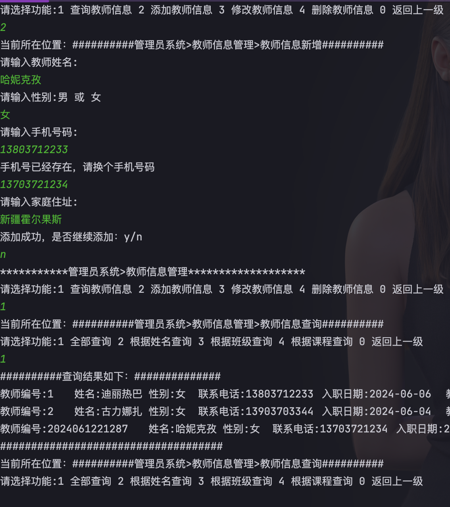


#### 修改教师信息

第一步：在ManagerView.java类中添加方法

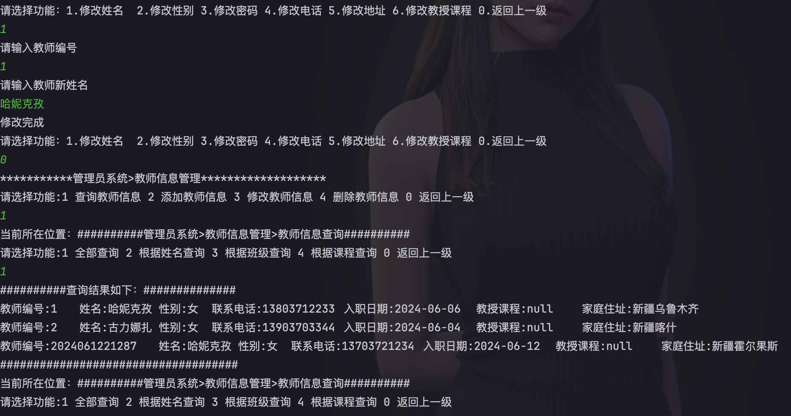

```java
private void editTeacherView() {
    System.out.println("当前所在位置：##########管理员系统>教师信息管理>教师信息修改##########");
    System.out.println("教师信息如下:");
    System.out.println("*********************************************");
    List<Map<String, Object>> teachers = teacherService.findAllTeachers();
    if (teachers.size() == 0) {
        System.out.println("暂无教师信息");
        return;
    }
    showManyTeachers(teachers);
    System.out.println("*********************************************");
    while (true) {
        System.out.println("请选择功能：1.修改姓名  2.修改性别 3.修改密码 4.修改电话 5.修改地址 6.修改教授课程 0.返回上一级");
        String num = sc.nextLine();
        switch (num) {
            case "1":
                System.out.println("请输入教师编号");
                String id = sc.nextLine();
                System.out.println("请输入教师新姓名");
                String name = sc.nextLine();
                boolean bl = teacherService.updateName(id, name);
                isSuccess(bl);
                break;
            case "2":
                System.out.println("请输入教师编号");
                id = sc.nextLine();
                System.out.println("请输入教师新性别");
                String sex = checkSex();
                bl = teacherService.updateSex(id, sex);
                isSuccess(bl);
                break;
            case "0":
                return;
            default:
                System.out.println("该功能暂未开放，请重新选择");
        }
    }
}
```

第二步：业务层接口增加两个方法

```java
public interface TeacherService {
    Teacher login(Object[] userInfo);
    List<Map<String, Object>> findAllTeachers();
    List<Map<String, Object>> findTeacherByName(String name);
    List<Map<String, Object>> findTeacherByClassName(String className);
    List<Map<String, Object>> findTeacherByCourseName(String courseName);
    void addTeacher(Teacher teacher);
    boolean findTeacherByPhone(String phone);
    boolean updateName(String id, String name);  //增加方法1
    boolean updateSex(String id, String sex);//增加方法2
}
```

业务接口的实现类：

```java
public class TeacherServiceImpl implements TeacherService {
	//代码略........

    /**
     * 修改教师姓名的业务
     * @param id
     * @param name
     * @return
     */
    @Override
    public boolean updateName(String id, String name) {
        int i = teacherDao.updateNameById(id,name);
        if(i>0){
            return true;
        }
        return false;
    }
    /**
     * 根据id修改性别
     * @param id
     * @param sex
     * @return
     */
    @Override
    public boolean updateSex(String id, String sex) {
        int i = teacherDao.updateSexById(id,sex);
        if(i>0){
            return true;
        }
        return false;
    }
}
```

第三步：TeacherDao.java接口增加两个方法

```java
public interface TeacherDao {
    Teacher findTeacherByPhoneAndPassword(Object[] userInfo);
    List<Map<String, Object>> findAllTeachers();
    List<Map<String, Object>> findTeacherByName(String name);
    List<Map<String, Object>> findTeacherByClassName(String className);
    List<Map<String, Object>> findTeacherByCourseName(String courseName);
    void addTeacher(Teacher teacher);
    Map<String, Object> findTeacherByPhone(String phone);
    int updateNameById(String id, String name);//增加方法1
    int updateSexById(String id, String sex);//增加方法2
}
```

```java
public class TeacherDaoImpl implements TeacherDao {
    //代码略........
    @Override
    public int updateNameById(String id, String name) {
        return template.update("update teacher set name=? where id=?",name,id);
    }

    @Override
    public int updateSexById(String id, String sex) {
        return template.update("update teacher set sex=? where id=?",sex,id);
    }
}
```

第四步：测试运行

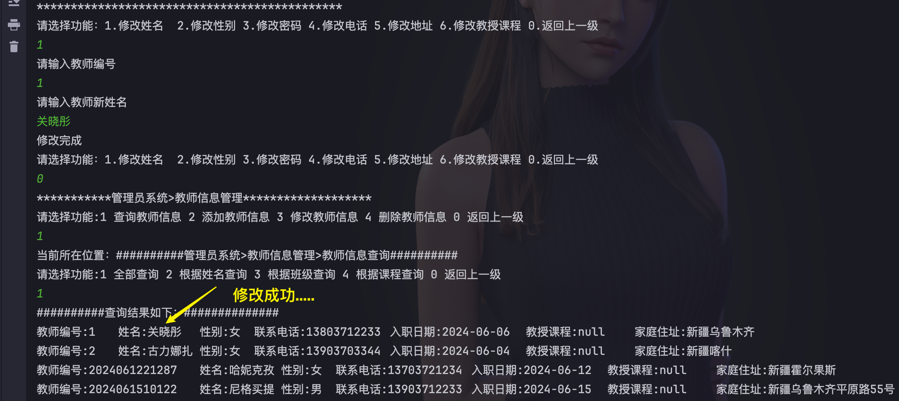

#### 删除教师信息

第一步：在ManagerView.java类中添加方法

```java
private void teacherView() {
    while (true) {
        System.out.println("***********管理员系统>教师信息管理*******************");
        System.out.println("请选择功能:1 查询教师信息 2 添加教师信息 3 修改教师信息 4 删除教师信息 0 返回上一级");
        String num = sc.nextLine();
        switch (num) {
            case "1":
                queryTeachersView();
                break;
            case "2":
                addTeacherView();
                break;
            case "3":
                editTeacherView();
                break;
            case "4":
                removeTeacherView();//解除注释
                break;
            case "0":
                return;
            default:
                System.out.println("该功能暂未开放，请重新选择");
                break;
        }
    }
}
```

增加的方法：

```java
private void removeTeacherView() {
    while (true) {
        System.out.println("当前所在位置：##########管理员系统>教师信息管理>教师信息移除##########");
        System.out.println("教师信息如下：");
        System.out.println("*********************************************");
        List<Map<String, Object>> maps = teacherService.findAllTeachers();
        if (maps.size() == 0) { //防止无信息，进入死循环
            System.out.println("已无教师信息");
            return;
        }
        //展示可操作的教师信息
        showManyTeachers(maps);
        System.out.println("*********************************************");
        System.out.println("请输入删除的教师编号：");
        String id = sc.nextLine();
        boolean bl = teacherService.removeTeacherById(id);
        if (bl) {
            System.out.println("删除成功,是否继续删除？y/n");
            if (!out()) {
                return;
            }
        } else {
            System.out.println("教师编号有误,请重新输入");
        }
    }
}
```

第二步：业务层增加一个方法

```java
public interface TeacherService {
    Teacher login(Object[] userInfo);
    List<Map<String, Object>> findAllTeachers();
    List<Map<String, Object>> findTeacherByName(String name);
    List<Map<String, Object>> findTeacherByClassName(String className);
    List<Map<String, Object>> findTeacherByCourseName(String courseName);
    void addTeacher(Teacher teacher);
    boolean findTeacherByPhone(String phone);
    boolean updateName(String id, String name);
    boolean updateSex(String id, String sex);
    boolean removeTeacherById(String id);
}
```

```java
package cn.yunhe.service.impl;

import cn.yunhe.dao.TeacherDao;
import cn.yunhe.dao.impl.TeacherDaoImpl;
import cn.yunhe.pojo.Teacher;
import cn.yunhe.service.TeacherService;

import java.util.HashMap;
import java.util.List;
import java.util.Map;

/**
 * 教师业务实现
 */
public class TeacherServiceImpl implements TeacherService {
    //代码略..........
  
    /**
     * 根据id移除用户
     * @param id
     * @return
     */
    @Override
    public boolean removeTeacherById(String id) {
        int i = teacherDao.removeTeacherById(id);
        if(i>0){
            //new ClassesDaoImp().removeClassesTeacherByTid(id);
            return true;
        }
        return false;
    }
}
```

第三步：数据访问层增加一个方法

```java
public interface TeacherDao {
    Teacher findTeacherByPhoneAndPassword(Object[] userInfo);
    List<Map<String, Object>> findAllTeachers();
    List<Map<String, Object>> findTeacherByName(String name);
    List<Map<String, Object>> findTeacherByClassName(String className);
    List<Map<String, Object>> findTeacherByCourseName(String courseName);
    void addTeacher(Teacher teacher);
    Map<String, Object> findTeacherByPhone(String phone);
    int updateNameById(String id, String name);
    int updateSexById(String id, String sex);
    int removeTeacherById(String id);
}
```

```java
package cn.yunhe.dao.impl;

import cn.yunhe.dao.TeacherDao;
import cn.yunhe.pojo.Teacher;
import cn.yunhe.util.DatabaseUtil;
import org.springframework.dao.EmptyResultDataAccessException;
import org.springframework.jdbc.core.BeanPropertyRowMapper;
import org.springframework.jdbc.core.JdbcTemplate;
import java.util.List;
import java.util.Map;

/**
 * 教师持久层实现
 */
public class TeacherDaoImpl implements TeacherDao {
    //代码略..........
   
    @Override
    public int removeTeacherById(String id) {
        return template.update("delete from teacher where id=?",id);
    }
}

```

第四步：测试运行

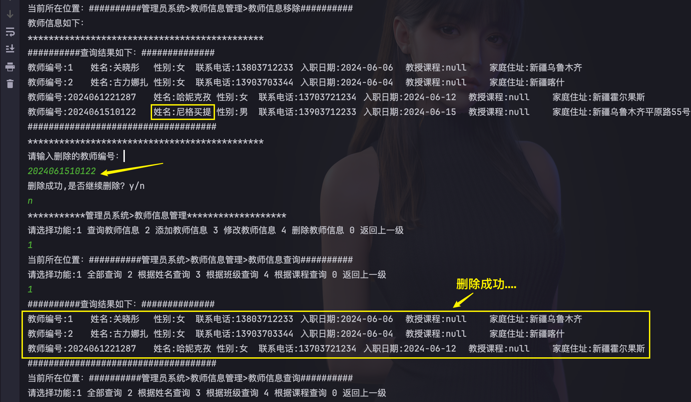

### 4、完成课程管理模块

首先在ManagerView.java的managerPage(Manager manager)方法中解锁`courseView();`注释。

```java
public void managerPage(Manager manager) {
    while (true) {
        System.out.println("****************教务系统-管理员系统***************");
        System.out.println("***************当前管理员用户:" + manager.getUsername() + "****************");
        System.out.println("************************************************");
        System.out.println("请选择功能：1 教师管理 2 学生管理 3 课程管理 4 班级管理 5 密码修改 0 退出系统");

        String num = sc.nextLine();
        switch (num) {
            case "1":
                teacherView();
                break;
            case "2":
                //TODO studentView();
                break;
            case "3":
                courseView();//解锁注释
                break;
            case "4":
                //TODO classesView();
                break;
            case "5":
                modifyPasswordView();
                break;
            case "0":
                return;
            default:
                System.out.println("功能暂未开放，请重新选择");
                break;
        }
    }
}
```

下面编写`courseView();`方法，课程管理总界面菜单。先开发查询课程信息模块，其他方法注释。

```JAVA
private void courseView() {
    while (true) {
        System.out.println("***********管理员系统>课程信息管理*******************");
        System.out.println("请选择功能:1 查询课程信息 2 添加课程信息 3 修改课程信息 4 删除课程信息 0 返回上一级");
        String num = sc.nextLine();
        switch (num) {
            case "1":
                queryCourseView();
                break;
            case "2":
                //TODO addCourseView();
                break;
            case "3":
                //TODO editCourseView();
                break;
            case "4":
                //TODO removeCourseView();
                break;
            case "0":
                return;
            default:
                System.out.println("该功能暂未开放，请重新选择");

        }
    }
}
```

##### 课程查询

界面:在ManagerView中添加`queryCourseView() `方法。

```java
private void queryCourseView() {
    while (true) {
        System.out.println("当前所在位置：##########管理员系统>课程信息管理>课程信息查询##########");
        System.out.println("请选择功能:1 查询全部课程  2 根据类型查询  0 返回上级");
        String num = sc.nextLine();
        switch (num) {
            case "1":
                List<Course> courses = courseService.findAllCourse();
                System.out.println("查询结果如下：");
                System.out.println("***************************************");
                if (courses.size() == 0) {
                    System.out.println("暂无课程信息");
                    return;
                }
                courses.stream().forEach(System.out::println);
                System.out.println("**************************************");
                break;
            case "2":
                System.out.println("请选择类型：1 必须 2 选修");
                String tid = chooseType();
                courses = courseService.findCourseByType(tid);
                System.out.println("查询结果如下：");
                System.out.println("***************************************");
                if (courses.size() == 0) {
                    System.out.println("暂无" + (tid.equals("1") ? "必修" : "选修") + "课程信息");
                    break;
                }
                courses.stream().forEach(System.out::println);
                System.out.println("***************************************");
                break;
            case "0":
                return;
            default:
                System.out.println("该查询功能暂未开放，请重新选择");
        }
    }
}
/**
 * 类型选择
 * @return
 */
private String chooseType() {
    while (true) {
        String tid = sc.nextLine();
        if ("1".equals(tid) || "2".equals(tid)) {
            return tid;
        }
        System.out.println("暂无该类型，请重新选择");
    }
}
```

第二步：业务层增加两个方法，新建CourseService.java

```java
package cn.yunhe.service;
import cn.yunhe.pojo.Course;
import java.util.List;
import java.util.Map;
public interface CourseService {
    List<Course> findAllCourse();//查询全部
    List<Course> findCourseByType(String tid);//根据类型查询
}
```

新建CourseService接口的实现类`CourseServiceImpl.java`

```java
package cn.yunhe.service.impl;
import cn.yunhe.dao.CourseDao;
import cn.yunhe.dao.impl.CourseDaoImpl;
import cn.yunhe.pojo.Course;
import cn.yunhe.service.CourseService;
import java.util.List;
import java.util.Map;
/**
 * 课程业务实现类
 */
public class CourseServiceImpl implements CourseService {
    //课程持久层实现类
    private CourseDao courseDao = new CourseDaoImpl();
    /**
     * 查询所有课程信息
     * @return
     */
    @Override
    public List<Course> findAllCourse() {
        return courseDao.findAllCourses();
    }
    /**
     * 根据类型查询课程
     * @param tid
     * @return
     */
    @Override
    public List<Course> findCourseByType(String tid) {
        return courseDao.findCourseByType(tid);
    }
}

```

第三步：数据访问层

在dao包创建CourseDao.java

```java
package cn.yunhe.dao;
import cn.yunhe.pojo.Course;
import java.util.List;
import java.util.Map;
public interface CourseDao {
    List<Course> findAllCourses();
    List<Course> findCourseByType(String tid);
}
```

在dao接口的实现包创建`CourseDaoImpl.java`

```java
public class CourseDaoImpl implements CourseDao {
    private JdbcTemplate template = DatabaseUtil.template;
    /**
     * 查询所有课程
     * @return
     */
    @Override
    public List<Course> findAllCourses() {
        return template.query("select * from course",new BeanPropertyRowMapper<>(Course.class));
    }
    /**
     * 根据课程类型，查询课程信息
     * @param tid
     * @return
     */
    @Override
    public List<Course> findCourseByType(String tid) {
        return template.query("select * from course where type=?",
                              new BeanPropertyRowMapper<>(Course.class),tid);
    }
}
```

第四步：测试

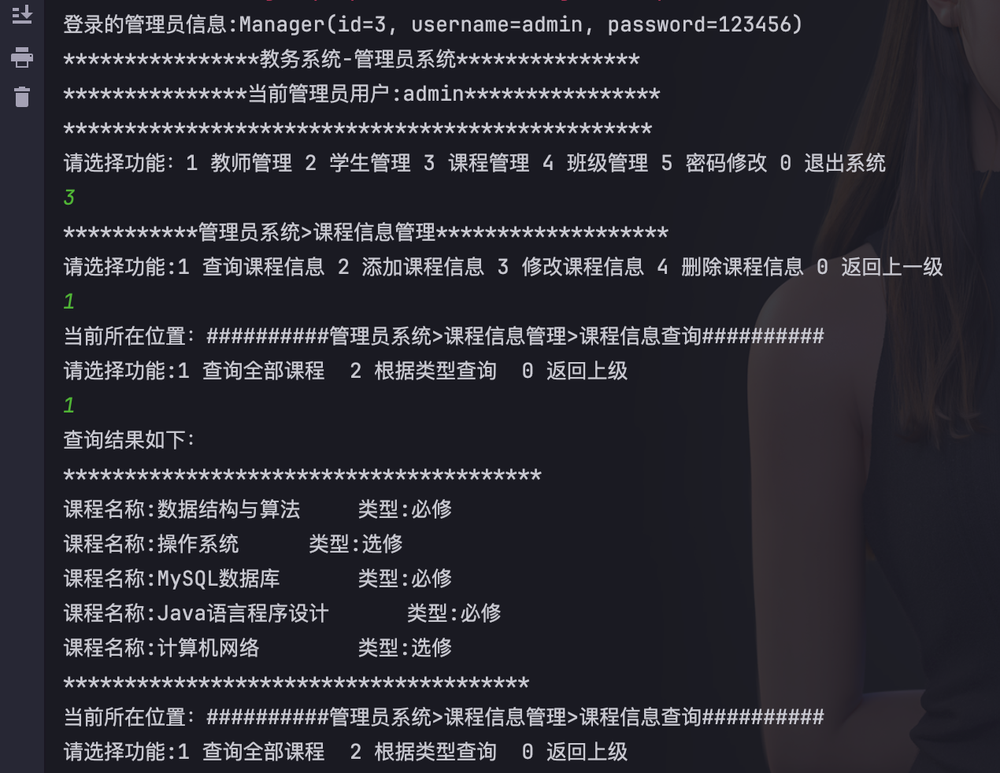

##### 课程添加

==注意：后续业务层代码不再给出，参考上一个模块，课程的相关方法在业务层和数据访问层再增加方法即可。==

界面:  在ManagerView.java添加如下方法

```java
private void addCourseView() {
    Course course = new Course();
    while (true) {
        System.out.println("****************课程添加**********************");
        System.out.println("请输入课程名称:");
        String cname = sc.nextLine();
        //验证课程名称是否存在: true存在  false不存在
        boolean bl = courseService.checkCname(cname);
        if (!bl) {
            course.setCname(cname);
            System.out.println("请选择课程类型：1 必修 2 选修");
            String tid = chooseType();
            course.setType(Integer.valueOf(tid));
            courseService.addCourse(course);
            System.out.println("添加完成是否继续？y/n");
            if (!out()) {
                break;
            }
        }
        System.out.println("该课程已经存在，请重新添加");
    }
}
```

数据访问层：

```java
public void addCourse(Course course) {
    template.update("insert into course values(null,?,?)",course.getCname(),course.getType());
}
```

##### 课程删除

界面

```java
private void removeCourseView() {
    while (true) {
        System.out.println("当前所在位置：##########管理员系统>课程信息管理>删除课程########");
        System.out.println("课程信息如下：");
        System.out.println("*********************************************");
        List<Course> courses = courseService.findAllCourse();
        if (courses.size() == 0) {
            System.out.println("当前暂未课程信息");
            return;
        }
        courses.stream().forEach(System.out::println);
        System.out.println("*********************************************");
        System.out.println("请输入需要删除的课程名称：");
        String cname = sc.nextLine();
        boolean bl = courseService.removeCourse(cname);
        if (bl) {
            System.out.println("删除成功，是否继续？y/n");
            if (!out()) {
                return;
            }
        } else {
            System.out.println("课程不存在，请重新输入");
        }
    }
}
```

 持久层

```java
public int removeCourse(String cname) {
    return template.update("delete from course where cname=?",cname);
}
```

##### 课程修改

界面

```java
private void editCourseView() {
    while (true) {
        System.out.println("当前所在位置：##########管理员系统>课程信息管理>课程信息修改##########");
        System.out.println("*******************当前课程信息如下：**********************");
        List<Course> courses = courseService.findAllCourse();
        if (courses.size() == 0) {
            System.out.println("暂无课程信息，请先添加课程。");
            return;
        }
        courses.stream().forEach(System.out::println);
        System.out.println("****************************************************");
        System.out.println("请选择功能:1 修改课程名 2 修改课程类型 0 返回上一级");
        String num = sc.nextLine();
        switch (num) {
            case "1":
                System.out.println("请输入修改的课程名称：");
                String cname;
                while (true) {
                    cname = sc.nextLine();
                    boolean bl = courseService.checkCname(cname);
                    if (bl) {
                        break;
                    }
                    System.out.println("该课程不存在，请重新输入");
                }
                System.out.println("请输入新课程名称：");
                while (true) {
                    String newName = sc.nextLine();
                    boolean bl = courseService.checkCname(newName);
                    if (!bl) {
                        courseService.modifyCname(cname, newName);
                        System.out.println("修改完成");
                        break;
                    }
                    System.out.println("该课程已存在，请重新输入");
                }
            case "2":
                System.out.println("请输入修改的课程名称：");
                while (true) {
                    cname = sc.nextLine();
                    boolean bl = courseService.checkCname(cname);
                    if (bl) {
                        break;
                    }
                    System.out.println("该课程不存在，请重新输入");
                }
                System.out.println("请选择类型：");
                String tid = chooseType();
                courseService.updateType(cname, tid);
                System.out.println("修改完成");
                break;
            case "0":
                return;
            default:
                System.out.println("功能暂未开放，请重新选择");
        }
    }
}
```

 持久层

```java
/**
 * 修改课程名称
 * @param cname
 * @param newName
 */
@Override
public void modifyCname(String cname, String newName) {
    template.update("update course set cname=? where cname=?",newName,cname);
}
/**
 * 根据课程名称修改类型
 * @param cname
 * @param tid
 */
@Override
public void updateType(String cname, String tid) {
    template.update("update course set type=? where cname=?",tid,cname);
}
```

## 本章总结

本章重点讲解管理员模块中课程模块和教师模块的开发实现。

## 布置作业

1. 完成教师管理模块开发。

2. 完成课程管理模块开发。

