# 第⼀章 **项⽬简介&环境搭建**

**项⽬简介**    

教务管理系统是一款专为教育机构量身打造的高效管理工具。该系统通过集成课程管理、学生信息管理、成绩录入与查询等功能，实现了教务工作的数字化、自动化和智能化。该系统不仅减轻了教务人员的工作负担，提高了工作效率，还确保了数据的准确性和安全性。同时，它为学生、管理人员和教师提供了便捷的在线服务，促进了信息的共享与协作。教务管理系统的开发，为教育机构带来了全新的管理体验，是现代化教育不可或缺的一部分。

 

基于控制台实现的教务管理系统

 

## 开发环境

IDEA 2022.2或者2023.3版本，下载地址https://www.jetbrains.com/idea/download/?section=windows

### JDK8或者JDK17

下载地址：https://www.oracle.com/java/technologies/downloads/#jdk17-windows


### 数据库mysql8

 

## **本章⽬标**

### 1、完成表结构创建

```sql
-- 班级表
CREATE TABLE classes  (
  id int   PRIMARY KEY AUTO_INCREMENT,
  name varchar(50)
);
-- 成绩表
CREATE TABLE course  (
  id int primary key AUTO_INCREMENT,
  cname varchar(50) ,
  type int   COMMENT '必修1，选修2'
);
-- 管理员表
CREATE TABLE manager  (
  id int primary key AUTO_INCREMENT,
  username varchar(50) ,
  password varchar(50) 
);
-- 成绩表
CREATE TABLE score  (
  scid int primary key AUTO_INCREMENT,
  grade double ,
  cid int ,
  sid varchar(30) 
);
-- 学生表
CREATE TABLE student  (
  id varchar(30) primary key,
  name  varchar(50),
  sex char(1) ,
  phone varchar(50) ,
  address varchar(50) ,
  password varchar(50) ,
  enrollmentTime date ,
  classid int ,
 );
-- 教师表
CREATE TABLE teacher (
  id varchar(20) primary key COMMENT '教师编号',
  name varchar(20) COMMENT '教师姓名',
  sex char(1) COMMENT '教师性别',
  phone varchar(11) COMMENT '教师电话',
  address varchar(50) COMMENT '教师住址',
  password varchar(50)  NULL COMMENT '教师密码',
  joineddate date  COMMENT '入职日期',
  cid int  COMMENT '专业',
);
-- 教授班级
CREATE TABLE teachingclass  (
  id int primary key AUTO_INCREMENT,
  tid int ,
  classid  varchar(20) 
);

-- 选课表
CREATE TABLE `electivecourse`  (
  id int primary key AUTO_INCREMENT,
  stid int ,
  tid int 
);
```

### 2、 构建实体

创建封装数据库表的实体类，一张表一般对应一个实体类。

 

### 3、 使用jdbc完成数据库连接

## 涉及知识点

（⼀）mysql数据库——表结构操作

（二）java 封装

（三）JDBC

## **知识点讲解**

### （一）mysql表结构操作

#### 1、创建数据库

> create database 数据库名称;

==创建数据库，并指定字符集==

> create database 数据库名称 character set 字符集名;

==查询所有数据库的名称==

> show databases;

==查询某个数据库的字符集:查询某个数据库的创建语句及字符集==

> show create database 数据库名称;

==修改数据库的字符集==

> alter database 数据库名称 character set 字符集名称;

==删除数据库==

> drop database 数据库名称;

==查询当前正在使用的数据库名称==

> select database();

==使用数据库==

> use 数据库名称;

#### 2、表常用数据类型

| **数据类型**  | **说明**                                                                      |
| --------- | --------------------------------------------------------------------------- |
| int       | 整数类型,例如 : age                                                               |
| double    | 小数类型,例如 : score double(5,2) 111.11                                          |
| date      | 日期，只包含年月日，yyyy-MM-dd                                                        |
| datetime  | 日期，包含年月日时分秒 yyyy-MM-dd HH:mm:ss                                             |
| timestamp | 时间戳类型,包含年月日时分秒 yyyy-MM-dd HH:mm:ss 如果将来不给这个字段赋值，或赋值为null，则默认使用当前的系统时间，来自动赋值 |
| varchar   | 可变字符 name varchar(20)                                                       |
| char      | 不可变字符 name varchar(20)                                                      |

#### **3、表操作**

##### 创建表

```SQL
create table 表名(
    列名（字段名） 数据类型,
    列名（字段名） 数据类型,
    列名（字段名） 数据类型
    ..
);
```

**示例：**

```SQL
create table student(
    id int,
    name varchar(32),
    birthday date,
    money double(5,2)
);
```

**注意事项:** 最后一列，不需要加逗号（,）

##### 查询表

==查询某个数据库中所有的表名称==

> show tables;

==查询表结构==

> desc 表名;

##### 修改表

**添加一列**

语法：

> ​    alter table 表名  add 列名 数据类型 约束;

实例：

```SQL
 alter table teacher add jieshao varchar(50);
```

**修改列类型**

语法：

> alter table 表名 modify 列名 新类型;

实例：

```sql
alter table teacher modify jieshao varchar(99);
```

**修改列名和类型**

语法：

> alter table 表名 change 旧列名 新列名 新类型;

实例：

```sql
alter table teacher change jieshao intro varchar(999);
```

**删除指定列**

语法：

> alter table 表名 drop 列名;

实例：

```sql
alter table teacher drop intro;
```

**修改表字符集**

语法：

> alter table 表名 charset 字符集;

实例：

```sql
alter table teacher charset gbk;
```

**查看表的字符集**

> show create table 表名

**修改表名**

语法：

> rename table 旧表名 to 新表名;

实例：

```sql
rename table teacher to tch;
```

##### 删除表

直接删除表

语法：

> drop table 表名;

实例：

```sql
drop table tch;
drop  table if exists  emp;  如果表存在就删除
```

### （二）Java封装

#### 什么是封装

面向对象编程语言是对客观世界的模拟，客观世界里成员变量都是隐藏在对象内部的，外界无法直接操作和修改。 封装可以被认为是一个保护屏障，防止该类的代码和数据被其他类随意访问。要访问该类的数据，必须通过指定的 方式。适当的封装可以让代码更容易理解与维护，也加强了代码的安全性。

#### 封装的引入

```java
/*
    定义一个学生类,成员变量：name，age,成员方法：show()方法
    private:私有的。可以修饰成员变量和成员方法。
    注意：被private修饰的成员只能在本类中访问。
    其实我讲到现在讲解的是一个封装的思想。
    封装：是指隐藏对象的属性和实现细节，仅对外提供公共访问方式。
*/
public class Student{
    //姓名
    String name;
    //年龄
    private int age;
    /**
     * 为了年龄的正确性，写一个方法给年龄进行赋值
     * 1、需要一个int类型的参数
     * 2、需要不需要返回值类型
     * @param a
     */
     public void setAge(int a){
            if( a <=0 || a >= 100){
                System.out.println("您给出的年龄有问题！！");
            }else{
                age = a;
            }
    }
    public void show(){
        System.out.println("姓名："+name);
        System.out.println("年龄："+age);
    }
}
public class StudentDemo {
    public static void main(String[] args) {
        //创建对象
        Student s = new Student();
        s.show();
        System.out.println("=========================");
        //给成员变量赋值
        s.name = "小江";
        // s.age = 27;
        s.show();
        System.out.println("=========================");       
        s.name = "小燕";
        //这次给成员变量赋值一个 负数
        // s.age = -27;
        //年龄给一个负数不合理，那如何是好呢？
        //解决办法：不让用户直接赋值(private)，然后方法(setAge())进行判断
        s.setAge(27);
        s.show();
    }

}
```

#### 封装的原则

将属性隐藏起来，若需要访问某个属性，提供公共方法对其访问。 

#### 如何封装

使用 private 关键字来修饰成员变量。 

对需要访问的成员变量，提供公共对应的一对 getXxx 方法 、setXxx 方法。  

#### private 关键字

##### 什么是private关键字

1. private是一个权限修饰符，代表最小权限。 

2. 可以修饰成员变量和成员方法。 

3. 被private修饰后的成员变量和成员方法，只在本类中才能访问 

##### private的使用格式

   private 数据类型 变量名 ； 

#### 使⽤idea创建项⽬

eclipse⾥有workspace的概念，⼯作空间，workspace下⾯是eclipse的项⽬；

idea⾥是 Project，相当于eclipse的workspace，idea⾥的项⽬是module模块的概念。

第⼀步：创建⼀个空项⽬，File – > New —>Project…

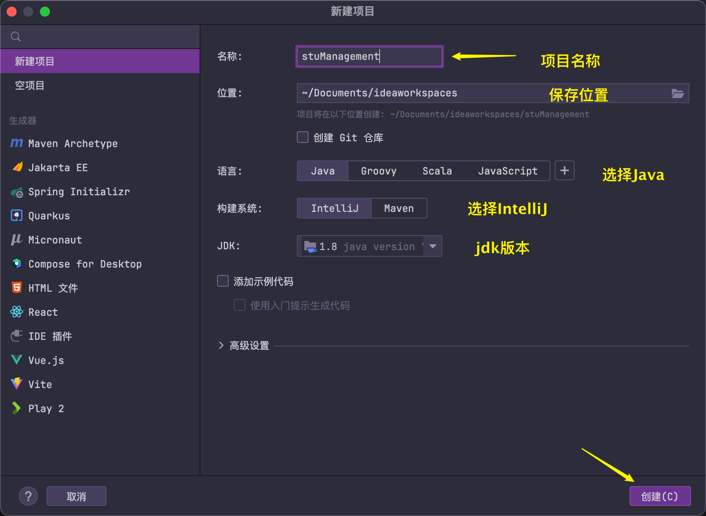

第⼆步：查看创建的项目。

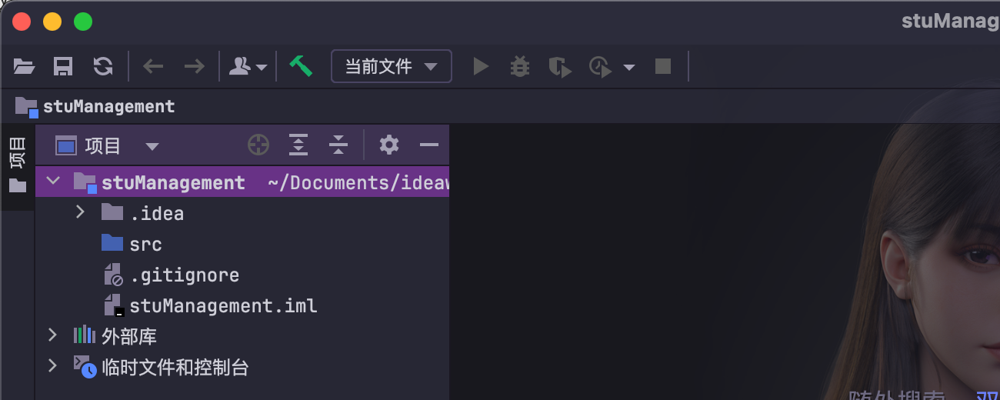

#### 使用Lombok 简化实体类编写

 

##### 什么是lombok

Lombok项目是一个java库，它可以自动插入到编辑器和构建工具中，增强java的性能。不需要再写getter、setter或equals方法，只要有一个注解，就有一个功能齐全的构建器、自动记录变量等等。把lombok.jar添加到项目，在项目中创建 lib 文件夹，把lombok.jar复制到lib文件夹，第二步把lib文件夹添加到构建路径，选择【文件】—【项目结构】菜单。

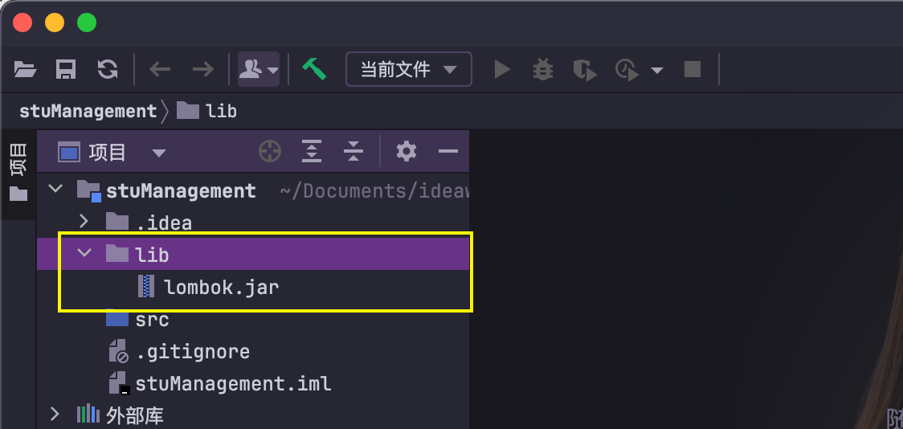

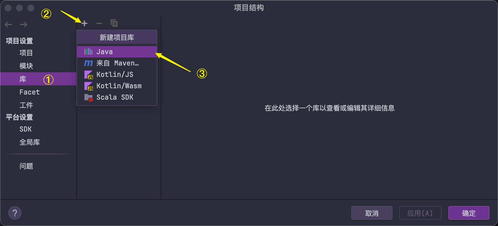

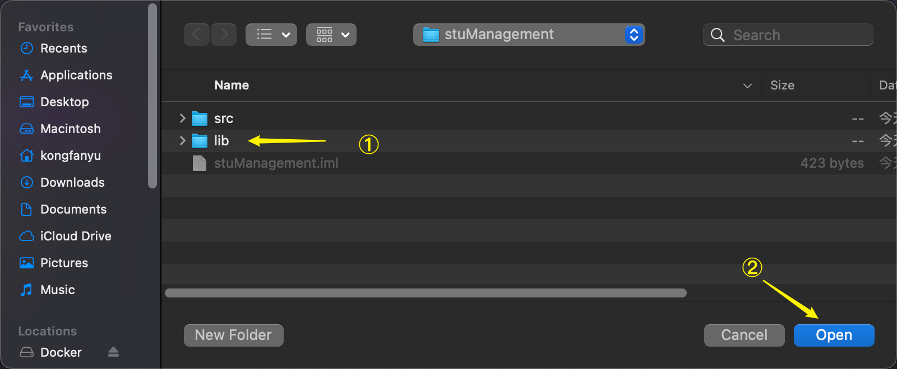

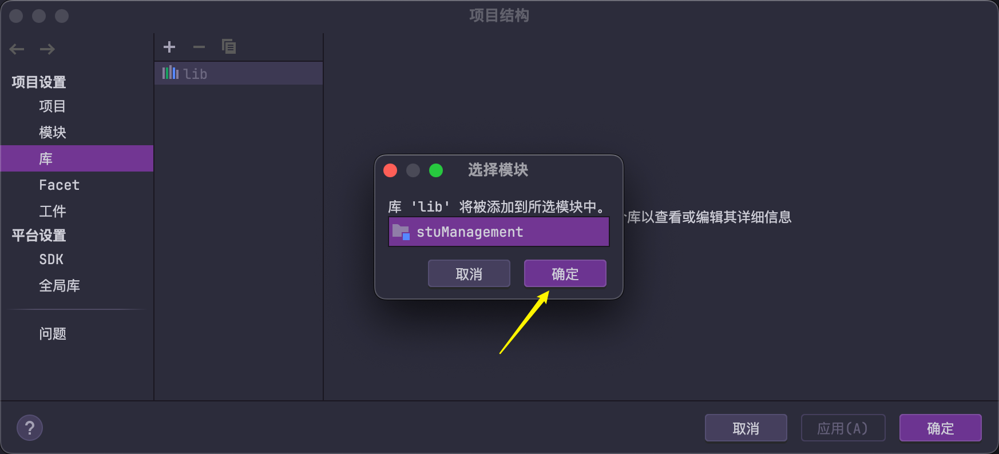

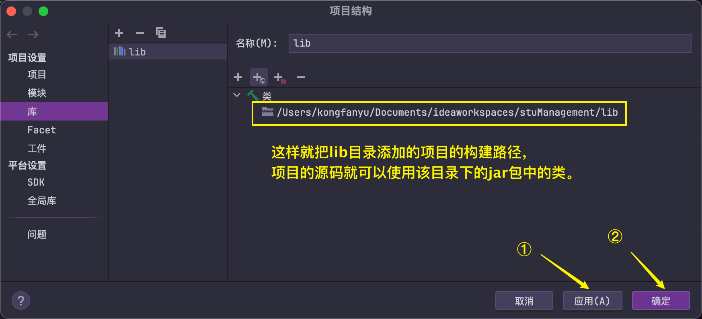

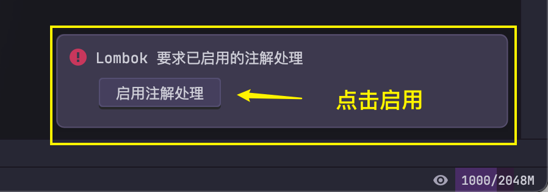

如果错过了，可以在IDEA的设置里启用注解处理器，否则lombok不可使用：

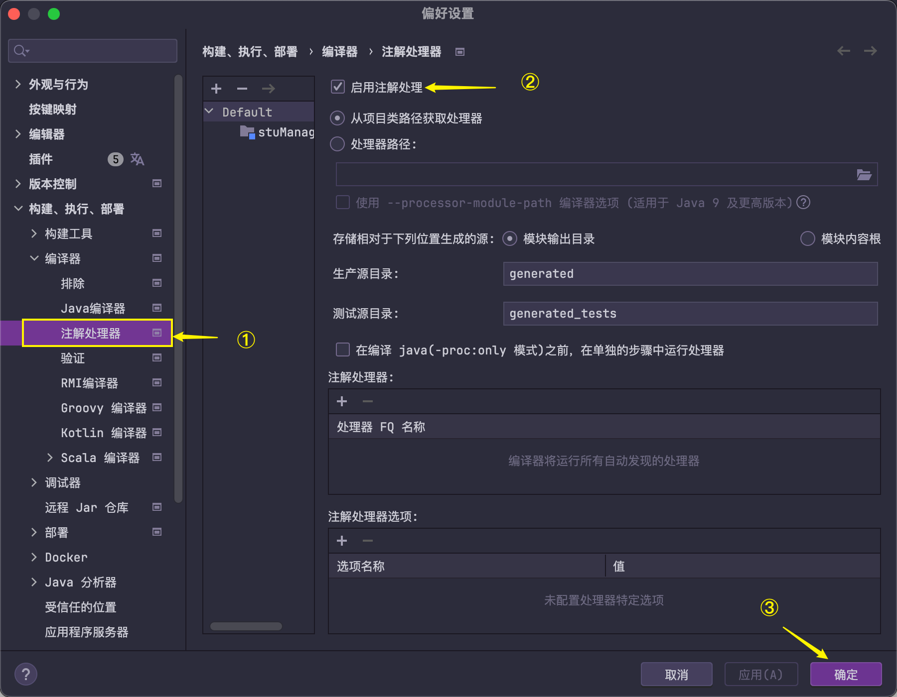

##### lombok下的实体类

```java
@Data
public class Student {
    private String id;
    private String name;
    private String sex;
    private String phone;
    private String address;
    private String password;
    private Date enrollmentTime;
    private int classId;
}    
```

 创建测试类可以看到lombok启用成功，不用再编写大量的getter/setter方法。

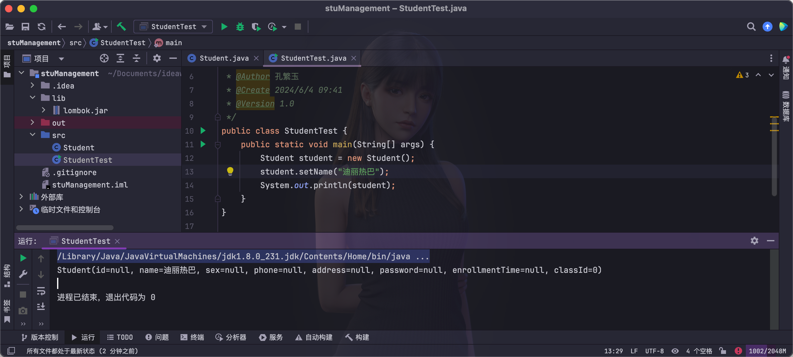

### (三) JDBC

#### 什么是jdbc？

Java DataBase Connectivity Java 数据库连接技术

#### JDBC的作用

通过Java语言操作数据库，操作表中的数据

SUN公司为了简化、统一对数据库的操作，定义了一套Java操作数据库的规范，称之JDBC。

#### JDBC的本质

JDBC是官方（Sun公司）定义的一套操作所有关系型数据库的规则（接口）。各个数据库厂商去实现这套接口，提供数据库驱动jar包。我们可以使用这套接口（JDBC）编程，运行时的代    码其实是驱动jar包中的实现类。

总结：在java中要想访问数据库只能通过JDBC，JDBC是java访问数据库的基础，其他数据库访问技术都是对JDBC的封(Hibernate,MyBatis)。JDBC是为了访问不同的数据库,提供了一种统一的访问方式。JDBC本身是java连接数据库的一个标准，是进行数据库连接的抽象层，由Sun公司提供的一组类和接口，接口的实现由各大数据库厂商来实现。

#### JDBC的使用步骤

1、加载驱动

2、连接数据库

3、创建statement对象

4、发送sql

5、处理结果集

6、关闭连接

#### JDBC案例

1、添加JDBC驱动包到项目

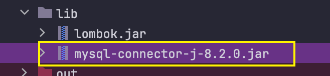

2、创建数据库表并添加数据

```java
DROP TABLE IF EXISTS `t_user`;
CREATE TABLE `t_user` (
  `id` int(11) NOT NULL AUTO_INCREMENT,
  `username` varchar(255) DEFAULT NULL,
  `password` varchar(255) DEFAULT NULL,
  `age` int(11) DEFAULT NULL,
  PRIMARY KEY (`id`)
) ENGINE=InnoDB AUTO_INCREMENT=8 DEFAULT CHARSET=utf8mb4;

-- ----------------------------
-- Records of t_user
-- ----------------------------
BEGIN;
INSERT INTO `t_user` (`id`, `username`, `password`, `age`) VALUES (1, '王军', '123456', 18);
INSERT INTO `t_user` (`id`, `username`, `password`, `age`) VALUES (2, '张明', 'abc123', 22);
INSERT INTO `t_user` (`id`, `username`, `password`, `age`) VALUES (3, '李赫', '456789', 33);
INSERT INTO `t_user` (`id`, `username`, `password`, `age`) VALUES (4, '何明', '111111', 23);
INSERT INTO `t_user` (`id`, `username`, `password`, `age`) VALUES (5, '王旭', '990088', 33);
INSERT INTO `t_user` (`id`, `username`, `password`, `age`) VALUES (6, '王可人', '334477', 23);
INSERT INTO `t_user` (`id`, `username`, `password`, `age`) VALUES (7, '陆晓', '321789', 25);
COMMIT;
```

3、编写查询案例

```java
import java.sql.Connection;
import java.sql.DriverManager;
import java.sql.ResultSet;
import java.sql.Statement;

public class JDBC_CRUD {
    /**
     * jdbc实现查询操作
     */
    public static void main(String[] args) throws Exception{
        //1、加载驱动
        Class.forName("com.mysql.cj.jdbc.Driver");
        //2、连接数据库
        String url = "jdbc:mysql://localhost:3306/testdb";
        String user = "root";
        String password = "123456";
        Connection conn = DriverManager.getConnection(url, user, password);
        //3、创建statement对象,这个对象是可以发送sql
        Statement statm = conn.createStatement();
        //4、发送sql
        String sql = "select * from t_user";
        ResultSet rs = statm.executeQuery(sql);
        //5、处理结果集
        while (rs.next()) {//指针一个一个的去找，如果找到就取出
            int id = rs.getInt("id");
            String username = rs.getString("username");
            String userpwd = rs.getString("password");
            int age = rs.getInt("age");
            System.out.println(id + "-" + username + "-" + userpwd + "-" + age);
        }
        //6、关闭连接 后打开的先关闭
        rs.close();
        statm.close();
        conn.close();
    }
}
```

两种取值方式

​    处理结果集while (rs.next()){//指针一个一个的去找，如果找到就取出

​    取值方式有两种：

​        1、按字段名来取，比较真观，推荐使用（常用）

​        2、按列号来取，可以在字段少的情况下使用

```java
int id = rs.getInt(1);//表示第一列id字段
String username = rs.getString(2);//表示第二列username字段
String passworld2 = rs.getString("passworld");
int age = rs.getInt("age");
System.out.println(id+"-"+username+"-"+passworld2+"-"+age);
```

#### 数据操作CRUD

Junit单元测试，每次测试代码都要编写main方法，不方便，Junit可以在方法添加一个注解@Test即可运行该方法；Junit学习参考资料：

[Junit 进行单元测试_junit 单元测试-CSDN博客](https://blog.csdn.net/yyp0719/article/details/138280478)

首先在项目中添加junit-4.12.jar、hamcrest-core-1.3.jar添加到项目中，复制到lib文件夹即可。

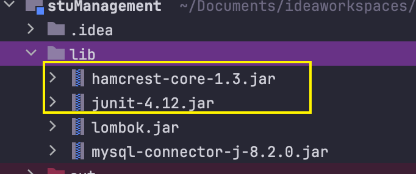

##### JDBC的添加操作

```java
import org.junit.Test;

import java.sql.Connection;
import java.sql.DriverManager;
import java.sql.ResultSet;
import java.sql.Statement;

public class JDBC_CRUD {
    /**
     * jdbc实现查询操作
     */
    public static void main(String[] args) throws Exception{
        //1、加载驱动
        Class.forName("com.mysql.cj.jdbc.Driver");
        //2、连接数据库
        String url = "jdbc:mysql://localhost:3306/testdb";
        String user = "root";
        String password = "123456";
        Connection conn = DriverManager.getConnection(url, user, password);
        //3、创建statement对象,这个对象是可以发送sql
        Statement statm = conn.createStatement();
        //4、发送sql
        String sql = "select * from t_user";
        ResultSet rs = statm.executeQuery(sql);
        //5、处理结果集
        while (rs.next()) {//指针一个一个的去找，如果找到就取出
            int id = rs.getInt("id");
            String username = rs.getString("username");
            String userpwd = rs.getString("password");
            int age = rs.getInt("age");
            System.out.println(id + "-" + username + "-" + userpwd + "-" + age);
        }
        //6、关闭连接 后打开的先关闭
        rs.close();
        statm.close();
        conn.close();
    }
    @Test
    public void TestAddUser() throws Exception {
        // 1、加载驱动
        Class.forName("com.mysql.cj.jdbc.Driver");
        //2、连接数据库
        String url = "jdbc:mysql://localhost:3306/testdb";
        String user = "root";
        String password = "123456";
        Connection conn = DriverManager.getConnection(url, user, password);
        //3、创建statement对象
        Statement stmt = conn.createStatement();
        //4、发送sql  添加，修改，删除 都用executeUpdate()方法
        String sql = "INSERT INTO `testdb`.`t_user`(`id`, `username`, `password`, `age`) VALUES (null, 'rose', '123', 97)";
        int i = stmt.executeUpdate(sql);
        System.out.println(i);//表示的影响的行数
        //5、关闭连接
        stmt.close();
        conn.close();
    }
    // JDBC的删除操作
    @Test
    public void TestDeleteUser() throws Exception {
        // 1、加载驱动
        Class.forName("com.mysql.cj.jdbc.Driver");
        // 2、连接数据库
        String url = "jdbc:mysql://localhost:3306/testdb";
        String user = "root";
        String password = "123456";
        Connection conn = DriverManager.getConnection(url, user, password);
        // 3、创建statement对象
        Statement stmt = conn.createStatement();
        // 4、发送sql
        String sql="delete from t_user where id = 8";
        int i = stmt.executeUpdate(sql);
        System.out.println(i);
        // 5、关闭连接
        stmt.close();
        conn.close();
    }
    // JDBC的修改操作
    @Test
    public void TestUpdateUser() throws Exception {
        // 1、加载驱动
        Class.forName("com.mysql.cj.jdbc.Driver");
        // 2、连接数据库
        String url = "jdbc:mysql://localhost:3306/testdb";
        String user = "root";
        String password = "123456";
        Connection conn = DriverManager.getConnection(url, user, password);
        // 3、创建statement对象
        Statement stmt = conn.createStatement();
        // 4、发送sql
        String sql="update t_user set username ='张三' where id = 4 ";
        int i = stmt.executeUpdate(sql);
        System.out.println(i);
        // 5、关闭连接
        stmt.close();
        conn.close();
    }
    // JDBC的查询操作
    @Test
    public void TestSelectUser() throws Exception {
        //1、加载驱动
        Class.forName("com.mysql.cj.jdbc.Driver");
        //2、连接数据库
        String url = "jdbc:mysql://localhost:3306/testdb";
        String user = "root";
        String password = "123456";
        Connection conn = DriverManager.getConnection(url, user, password);
        //3、创建statement对象,这个对象是可以发送sql
        Statement statm = conn.createStatement();
        //4、发送sql
        String sql="select * from t_user";
        ResultSet rs = statm.executeQuery(sql);
        //5、处理结果集
        while (rs.next()){//指针一个一个的去找，如果找到就取出
            int id = rs.getInt("id");
            String username = rs.getString("username");
            String passworld2 = rs.getString("password");
            int age = rs.getInt("age");
            System.out.println(id+"-"+username+"-"+passworld2+"-"+age);

        }
        //6、关闭连接 后打开的先关闭
        rs.close();
        statm.close();
        conn.close();
    }
}
```

选择方法邮件运行即可：

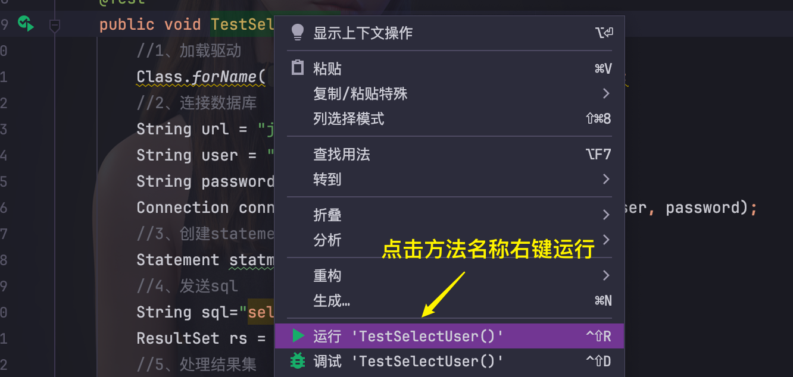

### c3p0数据库连接池

#### **连接池概念**

概念：其实就是一个容器(集合)，存放数据库连接的容器。当系统初始化好后，容器被创建，容器中会申请一些连接对象，当用户来访问数据库时，从容器中获取连接对象，用户访问完之后，会将连接对象归还给容器。

缺点：用户每次请求都需要向数据库获得链接，而数据库创建连接通常需要消耗相对较大的资源，创建时间也较长。假设网站一天10万访问量，数据库服务器就需要创建10万次连接，极大的浪费数据库的资源，并且极易造成数据库服务器内存溢出。

连接池技术的核心思想是：连接复用，通过建立一个数据库连接池以及一套连接使用、分配、管理策略，使得该连接池中的连接可以得到高效、安全的复用，避免了数据库连接频繁建立、关闭的开销。

#### **连接池好处**

​    1. 节约资源 

​    2. 减少连接db的次数    

​    3. 用户访问高效

#### **实现步骤**

1、导入jar包  `c3p0-0.9.5.5.jar，  mchange-commons-java-0.2.19.jar`

2、定义配置文件：

名称： c3p0.properties 或者 c3p0-config.xml  

路径：直接将文件放在src目录下即可，jar包河配置文件的位置如下图所示。

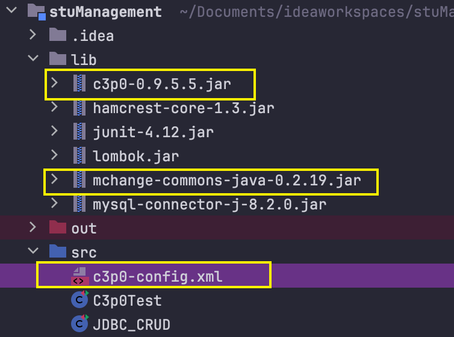

3、 创建核心对象 数据库连接池对象 ComboPooledDataSource

4、获取连接： getConnection()，代码：

```java
//1.创建数据库连接池对象
DataSource ds  = new ComboPooledDataSource();
//2. 获取连接对象
Connection conn = ds.getConnection();
```

#### 具体实现：

##### 1、工具类的抽取

```java
import com.mchange.v2.c3p0.ComboPooledDataSource;
import org.junit.Test;

import java.sql.Connection;
import java.sql.SQLException;
import java.sql.Statement;

public class JdbcUtils {
    //默认加载src 下面c3p0-config.xml加载
    private static ComboPooledDataSource ds = new ComboPooledDataSource();
    //创建连接
    public static Connection getConnection() throws SQLException {
        return ds.getConnection();
    }

    @Test
    public void test1() throws SQLException {
        //封装的c3p0相关代码
        Connection conn = JdbcUtils.getConnection();
        Statement stmt = conn.createStatement();
        int i = stmt.executeUpdate("delete from t_user where id = 7");
        System.out.println(i);
    }
}
```

##### 2、配置文件

c3p0-config.xml 注意一定放在src下

```xml
<?xml version="1.0" encoding="UTF-8"?>
<c3p0-config>
    <default-config>
        <!-- name 属性定义 链接参数的key 标签的内容 代表值-->
        <property name="driverClass">com.mysql.cj.jdbc.Driver</property>
        <property name="jdbcUrl">jdbc:mysql:///testdb</property>
        <property name="user">root</property>
        <property name="password">123456</property>

        <!-- 连接池参数 -->
        <property name="initialPoolSize">5</property>
        <property name="maxPoolSize">10</property>
        <property name="checkoutTimeout">3000</property>
    </default-config>
</c3p0-config>
```

##### 3、测试

```java
import org.junit.Test;

import java.sql.Connection;
import java.sql.SQLException;
import java.sql.Statement
public class C3p0Test {
    @Test
    public void test1() throws SQLException {
        //封装的c3p0相关代码
        Connection conn = JdbcUtils.getConnection();
        Statement stmt = conn.createStatement();
        int i = stmt.executeUpdate("delete from t_user where id = 7");
        System.out.println(i);
    }
}
```

### JdbcTemplate模板类

#### 概述

Spring JDBC Spring框架对JDBC的简单封装。提供了一个JDBCTemplate对象简化JDBC的开发（后面我们专门讲spring框架）。

#### 实现步骤

1. 导入jar包 4 个  
   
    spring-beans-5.0.0.RELEASE.jar
    spring-core-5.0.0.RELEASE.jar
    spring-jdbc-5.0.0.RELEASE.jar
    spring-tx-5.0.0.RELEASE.jar
    commons-logging-1.2.jar

2. 创建JdbcTemplate对象。依赖于数据源DataSource

​     `JdbcTemplate template = new JdbcTemplate(ds);` 

3. 调用JdbcTemplate的方法来完成CRUD的操作，update():执行DML语句。增、删、改语句
4. queryForMap():查询结果将结果集封装为map集合，将列名作为key，将值作为value 将这条记录封装为一个map集合注意：这个方法查询的结果集长度只能是1
5. queryForList():查询结果将结果集封装为list集合，注意：将每一条记录封装为一个Map集合，再将Map集合装载到List集合中。
6. query():查询结果，将结果封装为JavaBean对象，query的参数：RowMapper，一般我们使用BeanPropertyRowMapper实现类。可以完成数据到JavaBean的自动封装new BeanPropertyRowMapper<类型>(类型.class)。
7. queryForObject：查询结果，将结果封装为对象，一般用于聚合函数的查询。

#### 快速入门

1、工具类添加一个方法

```java
import com.mchange.v2.c3p0.ComboPooledDataSource;

import javax.sql.DataSource;
import java.sql.Connection;
import java.sql.SQLException;

public class JdbcUtils {
    //默认加载src 下面c3p0-config.xml加载
    private static ComboPooledDataSource ds = new ComboPooledDataSource();
    //创建连接
    public static Connection getConnection() throws SQLException {
        return ds.getConnection();
    }
    //获取数据源方法
    public static DataSource getDataSource(){
        return  ds;
    }

}
```

2、测试案例

```java
import org.springframework.jdbc.core.JdbcTemplate;

/**
 * JdbcTemplate入门
 */
public class JdbcTemplateDemo1 {
    public static void main(String[] args) {
        //1.导入jar包
        //2.创建JDBCTemplate对象
        JdbcTemplate template = new JdbcTemplate(JdbcUtils.getDataSource());
        //3.调用方法
        String sql = "update t_user set username = '迪丽热巴' where id = ?";
        int count = template.update(sql, 3);//insert update delete
        System.out.println(count);
        //自已关闭，自已归还
    }
}
```

查看数据库，可以看出执行成功。

#### CRUD的测试

##### 代码实现

##### 数据库准备

```sql
CREATE TABLE `emp` (
  `id` int(11) NOT NULL AUTO_INCREMENT,
  `username` varchar(25) DEFAULT NULL,
  `job` varchar(100) DEFAULT NULL,
  `addr` varchar(25) DEFAULT NULL,
  PRIMARY KEY (`id`)
) ENGINE=InnoDB DEFAULT CHARSET=utf8;
INSERT INTO `testdb`.`emp`(`id`, `username`, `job`, `addr`) VALUES (1, 'tom', '开发', '上海');
INSERT INTO `testdb`.`emp`(`id`, `username`, `job`, `addr`) VALUES (2, 'mary', '测试', '郑州');
```

实体类

注意事项：java属性名   要与   数据库的字段名保持一致，不然无法封装

```java
import lombok.Data;
@Data
public class Emp {
    private Integer id;
    private String username;
    private String job;
    private String addr;
}
```

测试类

```java
import org.junit.Test;
import org.springframework.dao.DataAccessException;
import org.springframework.jdbc.core.BeanPropertyRowMapper;
import org.springframework.jdbc.core.JdbcTemplate;

import javax.sql.DataSource;
import java.util.List;
import java.util.Map;
import java.util.Set;

public class Test1 {
    //获取数据源
    private DataSource dataSource = JdbcUtils.getDataSource();
    //使用jdbcTemplate 技术，简化jdbc操作
    private JdbcTemplate JdbcTemplate = new JdbcTemplate(dataSource);
    //修改
    @Test
    public void testUpdateById(){
        String sql ="update emp set job = '财务' where id = ? ";
        int i = this.JdbcTemplate.update(sql, 2);
        System.out.println(i);
    }
    //添加
    @Test
    public void testAdd(){
        String sql ="insert into emp (id , username , job ,addr) values(?,?,?,?)";
        int i = JdbcTemplate.update(sql, null, "yiyan", "小秘", "郑州");
        System.out.println(i);
    }
    //删除
    @Test
    public void testDeleteById(){
        String sql ="delete from emp where id = ?";
        int i = JdbcTemplate.update(sql, 1);
        System.out.println(i);
    }
    //查询数据返回list
    @Test
    public void testQueryById(){
        String sql ="select * from emp where id = ?";
        //返回的是list
        List<Emp> emps = this.JdbcTemplate.query(sql, new BeanPropertyRowMapper<>(Emp.class), 2);
        for(Emp e : emps){
            System.out.println(e);
        }
    }
    //查询条数
    @Test
    public void testForObject(){
        String sql = "select count(1) from emp";
        Long i = this.JdbcTemplate.queryForObject(sql, Long.class);
        System.out.println(i);
    }
    //查询数据返回map
    @Test
    public void testQuery2(){
        String sql = "select * from emp where id = ?";
        //返回map
        Map<String, Object> map = this.JdbcTemplate.queryForMap(sql,2);
        //map遍历
        Set<String> set = map.keySet();
        for(String key : set){
            Object o = map.get(key);
            System.out.println(key+" : "+o);
        }
    }

     /**
      * 查询数据返回对象中
      * 注意事项： 返回的单个对象必须要有结果，这个结果只能接受一条
      */
     public  Emp queryTest3(){
         Emp emp = null;
         try {
             String sql = "select * from emp where id = ?";
             //如果这里查到数据，就直接返回
             return this.JdbcTemplate.queryForObject(sql, new BeanPropertyRowMapper<>(Emp.class),3);
         } catch (DataAccessException e) {
             //没有查询到，方式一
             // throw new RuntimeException("没有查询到数据！");
             //没有查询到，方式二
             return null;
         }
     }
     //测试 查询数据返回对象中
    public static void main(String[] args) {
        Test1 jt = new Test1();
         Emp emp = jt.queryTest3();
         System.out.println(emp);
     }
}
```

## 本章总结

本章重点讲解开发环境的搭建，数据库结构的搭建，以及实体类封装和jdbc连接数据库的实现。

## 布置作业

1. 完成表的创建，以及对应实体类的创建。

2. 完成数据库的连接和数据操作。

3. 查询资料学习druid连接池的用法，并做测试。
