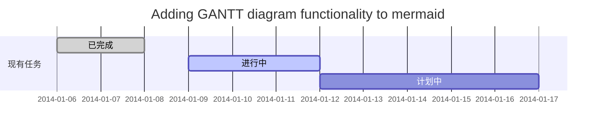

> [Markdown](https://so.csdn.net/so/search?q=Markdown&spm=1001.2101.3001.7020)是一种轻量级标记语言，常用于撰写博客、文档、论文等。它可以让你使用易读易写的纯文本格式来编写文档，然后通过转换成有效的HTML文档进行发布。以下是Markdown常用的语法：

#### 这里写目录标题

-   -   [标题](https://blog.csdn.net/yh4494/article/details/130114921?ops_request_misc=&request_id=&biz_id=102&utm_term=markdown%E8%AF%AD%E6%B3%95&utm_medium=distribute.pc_search_result.none-task-blog-2~blog~sobaiduweb~default-2-130114921.nonecase&spm=1018.2226.3001.4450#_3)
    -   [列表](https://blog.csdn.net/yh4494/article/details/130114921?ops_request_misc=&request_id=&biz_id=102&utm_term=markdown%E8%AF%AD%E6%B3%95&utm_medium=distribute.pc_search_result.none-task-blog-2~blog~sobaiduweb~default-2-130114921.nonecase&spm=1018.2226.3001.4450#_14)
    -   [引用](https://blog.csdn.net/yh4494/article/details/130114921?ops_request_misc=&request_id=&biz_id=102&utm_term=markdown%E8%AF%AD%E6%B3%95&utm_medium=distribute.pc_search_result.none-task-blog-2~blog~sobaiduweb~default-2-130114921.nonecase&spm=1018.2226.3001.4450#_55)
    -   -   [一级引用](https://blog.csdn.net/yh4494/article/details/130114921?ops_request_misc=&request_id=&biz_id=102&utm_term=markdown%E8%AF%AD%E6%B3%95&utm_medium=distribute.pc_search_result.none-task-blog-2~blog~sobaiduweb~default-2-130114921.nonecase&spm=1018.2226.3001.4450#_57)
        -   [嵌套引用](https://blog.csdn.net/yh4494/article/details/130114921?ops_request_misc=&request_id=&biz_id=102&utm_term=markdown%E8%AF%AD%E6%B3%95&utm_medium=distribute.pc_search_result.none-task-blog-2~blog~sobaiduweb~default-2-130114921.nonecase&spm=1018.2226.3001.4450#_67)
    -   [粗体和斜体](https://blog.csdn.net/yh4494/article/details/130114921?ops_request_misc=&request_id=&biz_id=102&utm_term=markdown%E8%AF%AD%E6%B3%95&utm_medium=distribute.pc_search_result.none-task-blog-2~blog~sobaiduweb~default-2-130114921.nonecase&spm=1018.2226.3001.4450#_74)
    -   [删除线和分隔线以及下划线](https://blog.csdn.net/yh4494/article/details/130114921?ops_request_misc=&request_id=&biz_id=102&utm_term=markdown%E8%AF%AD%E6%B3%95&utm_medium=distribute.pc_search_result.none-task-blog-2~blog~sobaiduweb~default-2-130114921.nonecase&spm=1018.2226.3001.4450#_86)
    -   -   [删除线](https://blog.csdn.net/yh4494/article/details/130114921?ops_request_misc=&request_id=&biz_id=102&utm_term=markdown%E8%AF%AD%E6%B3%95&utm_medium=distribute.pc_search_result.none-task-blog-2~blog~sobaiduweb~default-2-130114921.nonecase&spm=1018.2226.3001.4450#_87)
        -   [分隔线](https://blog.csdn.net/yh4494/article/details/130114921?ops_request_misc=&request_id=&biz_id=102&utm_term=markdown%E8%AF%AD%E6%B3%95&utm_medium=distribute.pc_search_result.none-task-blog-2~blog~sobaiduweb~default-2-130114921.nonecase&spm=1018.2226.3001.4450#_94)
        -   [下划线](https://blog.csdn.net/yh4494/article/details/130114921?ops_request_misc=&request_id=&biz_id=102&utm_term=markdown%E8%AF%AD%E6%B3%95&utm_medium=distribute.pc_search_result.none-task-blog-2~blog~sobaiduweb~default-2-130114921.nonecase&spm=1018.2226.3001.4450#_117)
    -   [链接和图片](https://blog.csdn.net/yh4494/article/details/130114921?ops_request_misc=&request_id=&biz_id=102&utm_term=markdown%E8%AF%AD%E6%B3%95&utm_medium=distribute.pc_search_result.none-task-blog-2~blog~sobaiduweb~default-2-130114921.nonecase&spm=1018.2226.3001.4450#_122)
    -   [代码块](https://blog.csdn.net/yh4494/article/details/130114921?ops_request_misc=&request_id=&biz_id=102&utm_term=markdown%E8%AF%AD%E6%B3%95&utm_medium=distribute.pc_search_result.none-task-blog-2~blog~sobaiduweb~default-2-130114921.nonecase&spm=1018.2226.3001.4450#_137)
    -   [表格](https://blog.csdn.net/yh4494/article/details/130114921?ops_request_misc=&request_id=&biz_id=102&utm_term=markdown%E8%AF%AD%E6%B3%95&utm_medium=distribute.pc_search_result.none-task-blog-2~blog~sobaiduweb~default-2-130114921.nonecase&spm=1018.2226.3001.4450#_151)
    -   [时序图](https://blog.csdn.net/yh4494/article/details/130114921?ops_request_misc=&request_id=&biz_id=102&utm_term=markdown%E8%AF%AD%E6%B3%95&utm_medium=distribute.pc_search_result.none-task-blog-2~blog~sobaiduweb~default-2-130114921.nonecase&spm=1018.2226.3001.4450#_175)
    -   [类图](https://blog.csdn.net/yh4494/article/details/130114921?ops_request_misc=&request_id=&biz_id=102&utm_term=markdown%E8%AF%AD%E6%B3%95&utm_medium=distribute.pc_search_result.none-task-blog-2~blog~sobaiduweb~default-2-130114921.nonecase&spm=1018.2226.3001.4450#_199)
    -   [甘特图](https://blog.csdn.net/yh4494/article/details/130114921?ops_request_misc=&request_id=&biz_id=102&utm_term=markdown%E8%AF%AD%E6%B3%95&utm_medium=distribute.pc_search_result.none-task-blog-2~blog~sobaiduweb~default-2-130114921.nonecase&spm=1018.2226.3001.4450#_240)

### 标题

使用#可以表示标题，#的数量表示标题的级别，一共有六个级别，分别对应HTML中的h1~h6标签。  
例如：

一级标题`#`  
二级标题`##`  
三级标题`###`  
四级标题`####`  
五级标题`#####`  
六级标题`######`

### 列表

使用`-`或`*`可以表示无序列表，数字加.可以表示有序列表。  
例如：

-   无序列表1
-   无序列表2
-   无序列表3

`markdown` 代码：

```markdown
* 无序列表1 * 无序列表2
```

1.  有序列表1
2.  有序列表2

`markdown` 代码：

```markdown
1. 有序列表1 2. 有序列表2
```

在Markdown中嵌套无序列表同样也需要注意一些细节，下面是示例代码：

-   无序列表一
    -   嵌套无序列表一
    -   嵌套无序列表二
        -   嵌套无序列表一
        -   嵌套无序列表二
-   无序列表二

```markdown
* 无序列表一 * 嵌套无序列表一 * 嵌套无序列表二 * 嵌套无序列表一 * 嵌套无序列表二 * 无序列表二
```

有序列表也是相同的。

### 引用

#### 一级引用

使用`>`表示引用。  
例如：

> 这是引用的内容

markdown 代码：

```markdown
> 这是引用的内容
```

#### 嵌套引用


```markdown
> 最外层 > > 第一层嵌套 > > > 第二层嵌套
```

### 粗体和斜体

使用两个包围的内容表示粗体，一个包围的内容表示斜体。  
例如：  
**这是粗体**  
_这是斜体_

markdown代码如下：

```markdown
**这是粗体** *这是斜体*
```

### 删除线和分隔线以及下划线

#### 删除线

~删除线~

```markdown
~~删除线~~
```

#### 分隔线

___

___

___

___

___

```text
*** * * * ***** - - - ----------
```

#### 下划线

<u>带下划线文本</u>

```text
<u>带下划线文本</u>
```

### 链接和图片

使用`[]`和`()`可以表示链接和图片。  
例如：  
这是链接的表示方式:

[链接](http://google.com/)

```markdown
[标题](连接地址)
```

这是图片的表示方式:

```text
[外链图片转存失败,源站可能有防盗链机制,建议将图片保存下来直接上传(img-tGEyrqp7-1681305425502)(/home/picture/1.png)]
```

### 代码块

使用\`\`\`包围的内容表示代码块。  
例如：

```php
echo 'hello world!';
```

`markdown`代码：

````
```php
echo 'hello world!';
```
````

### 表格

```markdown
| 表头 | 表头 | | ---- | ---- | | 单元格 | 单元格 | | 单元格 | 单元格 |
```

| 左对齐 | 右对齐 | 居中对齐 |
| --- | --- | --- |
| 单元格 | 单元格 | 单元格 |
| 单元格 | 单元格 | 单元格 |

```markdown
| 左对齐 | 右对齐 | 居中对齐 | | :-----| ----: | :----: | | 单元格 | 单元格 | 单元格 | | 单元格 | 单元格 | 单元格 |
```

### 时序图

````
```mermaid
sequenceDiagram
    小程序 -&gt;&gt; 小程序 : wx.login()获取code
    小程序 -&gt;&gt; + 服务器 : wx.request()发送code
    服务器 -&gt;&gt; + 微信服务器 : code+appid+secret
    微信服务器 --&gt;&gt; - 服务器 : openid
    服务器 -&gt;&gt; 服务器 : 根据openid确定用户并生成token
    服务器 --&gt;&gt; - 小程序 : token
```
````

  
参考文章： [Markdown 进阶技能：用代码画时序图](https://zhuanlan.zhihu.com/p/70261692)

### 类图

````
```mermaid
classDiagram
    Class01 &lt;|-- AveryLongClass : Cool
    &lt;&gt; Class01
    Class09 --&gt; C2 : Where am i?
    Class09 --* C3
    Class09 --|&gt; Class07
    Class07 : equals()
    Class07 : Object[] elementData
    Class01 : size()
    Class01 : int chimp
    Class01 : int gorilla
    class Class10 {
        &gt;&gt;service&gt;&gt;
        int id
        size()
    }
```
````

### 甘特图

[参考文档](https://mermaid-js.github.io/mermaid/#/gantt)

````
[参考文档](https://mermaid-js.github.io/mermaid/#/gantt)

````