# 一、课程目标

```markdown
1.  【了解】 Web基本只是
2.  【了解】 Http协议格式
3.  【掌握】 服务器的安装和配置
4.  【掌握】 服务器和开发工具的使用
```

# 二、Web基本知识

## 2.1 概念

* 网页，javaweb：使用java语言编写网页

## 2.2 网页分类

* 静态web资源：页面的数据不会发生改变。html，css
* 动态web资源：页面的数据会发生改变。Jsp/Servlet

## 2.3 常见的web资源架构

* ### B/S：brower/server-浏览器/服务器
  
  * 淘宝，京东

优点:减少客户端的维护成本,无需客户端安装通过浏览器直接请求使用

缺点:加大了服务器端的压力

* ### C/S：client/server-客户端/服务器
  
  * 微信，12306

优点:核心运行在客户端对服务器端压力较小

缺点:核心代码在客户端需要维护并解决安全性

## 2.4 服务器概念

* 概念
  
  * 就是一台电脑，必须安装一些指定的软件（tomcat软件）。

* 或者是用于服务器系统的电脑

* 访问
  
  * http://ip地址:端口号

## 2.5 Socket回顾

### 2.5.1 TCP进行数据发送代码

```java
//客户端socket
public class ClientSocket {
    public static void main(String[] args) throws Exception {
        //创建客户端服务指定连接ip与端口
        Socket s = new Socket("192.168.0.101", 8888);
        //获取输出流对象
        OutputStream os = s.getOutputStream();
        //使用输出流对象将数据发送至服务器端
        os.write("abcdefg".getBytes());

        os.flush();
        //关闭客户端服务
        s.close();
    }
}
```

### 2.5.2 TCP进行数据接收代码

```java
//服务器端Socket
public class ServiceSocket {
    public static void main(String[] args) throws Exception {
         ServerSocket ss=new ServerSocket(8888);
         //通过阻塞方法获取连接的客户端对象
         Socket s = ss.accept();
         //获取输入流
         InputStream is = s.getInputStream();
         byte [] b=new byte[1024];
         int len =0;
         //读取客户端发送信息并打印
         while((len=is.read(b))!=-1){
             System.out.println(new String(b,0,len));
         }
         s.close();
         ss.close();  
    }
}
```

# 三、HTTP协议

## 3.1 HTTP概述

### 3.1.1 概念

​        超文本传输协议（英文：**H**yper**T**ext **T**ransfer **P**rotocol，缩写：HTTP）是一种用于分布式、协作式和超媒体信息系统的应用层协议。HTTP是万维网的数据通信的基础。

​        http是一个简单的**请求-响应**协议，它通常运行在TCP之上。它指定了客户端可能发送给服务器什么样的消息以及得到什么样的响应。请求和响应消息的头以ASCII码形式给出；而消息内容则具有一个类似MIME的格式。这个简单模型是早期Web成功的有功之臣，因为它使得开发和部署是那么的直截了当。

http是**应用层**基于**请求与响应**的**无状态**传输协议

### 3.1.2 作用

​        HTTP是一个客户端终端（用户）和服务器端（网站）请求和应答的标准（TCP）。通过使用网页浏览器、网络爬虫或者其它的工具，客户端发起一个HTTP请求到服务器上指定端口（默认端口为80）。我们称这个客户端为用户代理程序（user agent）。应答的服务器上存储着一些资源，比如HTML文件和图像。我们称这个应答服务器为源服务器（origin server）。在用户代理程序和源服务器中间可能存在多个“中间层”，比如代理服务器、网关或者隧道（tunnel）。

​        尽管TCP/IP协议是互联网上最流行的应用，HTTP协议中，并没有规定必须使用它或它支持的层。事实上，HTTP可以在任何互联网协议上，或其他网络上实现。HTTP假定其下层协议提供可靠的传输。因此，任何能够提供这种保证的协议都可以被其使用。因此也就是其在TCP/IP协议族使用TCP作为其传输层。

​        通常，由HTTP客户端发起一个请求，创建一个到服务器指定端口（默认是80端口）的TCP连接。HTTP服务器则在那个端口监听客户端的请求。一旦收到请求，服务器会向客户端返回一个状态，比如"HTTP/1.1 200 OK"，以及返回的内容，如请求的文件、错误消息、或者其它信息。

http协议可以理解为底层使用tcp协议,当浏览器发起请求时会建立连接,当服务器响应后就会断开本次连接(每次输入网址发送请求都会建立一起连接,服务器会根据本次请求进行响应后结束连接)

### 3.1.3 协议目的

 HTTP是基于客户/服务器模式，且面向连接的。典型的HTTP事务处理有如下的过程： 

（1）客户与服务器建立连接；

（2）客户向服务器提出请求；

（3）服务器接受请求，并根据请求返回相应的文件作为应答；

（4）客户与服务器关闭连接。

客户与服务器之间的HTTP连接是一种一次性连接，它限制每次连接只处理一个请求，当服务器返回本次请求的应答后便立即关闭连接，下次请求再重新建立连接。这种一次性连接主要考虑到WWW服务器面向的是Internet中成干上万个用户，且只能提供有限个连接，故服务器不会让一个连接处于等待状态，及时地释放连接可以大大提高服务器的执行效率。

## 3.2 HTTP格式

### 3.2.1 HTTP状态码

 

### 3.2.2 HTTP请求格式(请求协议)

#### 1）请求图例


#### 2） 请求参数解析

* 请求行
  
  * 提交方式
    
    * get：将提交的参数拼接显示在地址栏，不安全，传递的参数大小有限制
    * post：提交的参数封装在请求体内，比较安全，支持大数据传输（文件，图片）
  
  * 提交的路径
  
  * 协议版本
    
    * 1.0：发送一次请求，产生一次响应，链接断开
    * 1.1：发送一次请求，产生一次响应，链接并不会马上断开，如果一段时间没有请求，链接自动断开。

* 请求头
  
  * 每个请求头都有固定的作用
    * user-agent:获取浏览器的版本信息
    * referer:获取网页的来源

* 空行

* 请求体

#### 3）使用tcp模拟http发送请求并接受请求服务器返回的结果**

```java
import java.io.InputStream;
import java.io.OutputStream;
import java.net.Socket;

public class TcpSendHttp {
    public static void main(String[] args) throws   Exception {
        //书写tcp客户端 连接指定服务器端
        Socket s=new Socket("220.181.38.149", 80);
        OutputStream os = s.getOutputStream();
        //通过输出流输出请求格式对应的字符串
        os.write("GET / HTTP/1.1\n".getBytes());
        //设置User-Agent 告诉指定服务器 我是个浏览器
        os.write("User-Agent: Mozilla/5.0 (Windows NT 10.0; Win64; x64) AppleWebKit/537.36 (KHTML, like Gecko) Chrome/100.0.4896.75 Safari/537.36".getBytes());
        os.write("\n\n".getBytes());
        //获取服务器返回的数据
        InputStream is = s.getInputStream();
        //尽量不要写循环 可能无法结束
        byte b[]=new byte[2048];
        int len = is.read(b);
        System.out.println(new String(b,0,len));
        s.close();    
    }
}
```

### 3.2.3 HTTP响应格式（响应协议）

#### 1) 请求图例


#### 2) 响应参数解析

* 响应行
  * 协议版本
  * 状态码
    * 200 一切正常
    * 302 重定向
    * 304 浏览器缓存
    * 404 客户端发生错误（地址有问题）
    * 500 服务器内部发生错误
* 响应头
  * refresh：页面定时刷新
  * location：重定向页面（与302状态码结合使用）
* 空行
* 响应体
  * 响应的内容

#### 3) 使用tcp协议处理浏览器http发送的请求并响应数据

```java
import java.io.BufferedReader;
import java.io.InputStream;
import java.io.InputStreamReader;
import java.io.OutputStream;
import java.net.ServerSocket;
import java.net.Socket;

public class TcpGetHttp {
    public static void main(String[] args) throws Exception {
        //创建tcp服务器端 监听端口
        ServerSocket ss=new ServerSocket(10086);
        //获取客户端连接
        while(true){
            Socket s = ss.accept();
            InputStream is = s.getInputStream();
            //获取客户端浏览器请求的数据
            //转换为字符流
            InputStreamReader isr=new InputStreamReader(is);
            //转换字符高效流就是为了按行读取
            BufferedReader br=new BufferedReader(isr);
            //如果使用while会使页面一直等待
            //所以我们只获取请求第一行
            String line= br.readLine();
            System.out.println("浏览器请求:"+line);

            //http协议基于请求与响应 
            //所以服务器需要返回响应数据

            //浏览器页面第一次请求时会额外请求favicon.ico
            //作为当前服务器的图标 如果没有可能报错

            //返回响应数据
            OutputStream os = s.getOutputStream();
            os.write("HTTP/1.1 200 OK\nContent-Type: text/html; charset=utf-8 \r\n\r\n请求成功".getBytes());

            //防止乱码 添加返回为html 编码为utf-8
            s.close();
        }
    }
}
```

# 四、Socket模拟服务器处理请求

**使用Socket请求百度获取百度响应信息**

```java
//客户端socket
public class ClientSocket {
    public static void main(String[] args) throws Exception {
        // 创建客户端服务指定连接ip与端口
        Socket s = new Socket("www.baidu.com", 80);
        // 获取输出流对象
        OutputStream os = s.getOutputStream();
        InputStream is = s.getInputStream();

        // 使用输出流对象将数据发送至服务器端
        os.write("GET / HTTP/1.1\n".getBytes());
        os.write("\r\n".getBytes());
        os.flush();


        byte[] b=new byte[1024];
        int len=0;
        while((len=is.read(b))!=-1){
            System.out.println(new String(b,0,len));
        }
        // 关闭客户端服务
        s.close();
    }
}
```

**百度响应信息**

```html
HTTP/1.1 200 OK
Accept-Ranges: bytes
Cache-Control: no-cache
Connection: keep-alive
Content-Length: 14615
Content-Type: text/html
Date: Mon, 09 Aug 2021 02:53:28 GMT
P3p: CP=" OTI DSP COR IVA OUR IND COM "
P3p: CP=" OTI DSP COR IVA OUR IND COM "
Pragma: no-cache
Server: BWS/1.1
Set-Cookie: BAIDUID=2891F7401E9F30AC9014BC5F4CF3FE8E:FG=1; expires=Thu, 31-Dec-37 23:55:55 GMT; max-age=2147483647; path=/; domain=.baidu.com
Set-Cookie: BIDUPSID=2891F7401E9F30AC9014BC5F4CF3FE8E; expires=Thu, 31-Dec-37 23:55:55 GMT; max-age=2147483647; path=/; domain=.baidu.com
Set-Cookie: PSTM=1628477608; expires=Thu, 31-Dec-37 23:55:55 GMT; max-age=2147483647; path=/; domain=.baidu.com
Set-Cookie: BAIDUID=2891F7401E9F30ACD654ACBAE3F7E218:FG=1; max-age=31536000; expires=Tue, 09-Aug-22 02:53:28 GMT; domain=.baidu.com; path=/; version=1; comment=bd
Traceid: 162847760828380290667205192330022957930
Vary: Accept-Encoding
X-Frame-Options: sameorigin
X-Ua-Compatible: IE=Edge,chrome=1

<!DOCTYPE html><!--STATUS OK-->
<html>
.....
</html>
```

## **4.1 使用tcp模拟处理http请求与响应**

```java
//使用tcp处理http请求并响应数据
public class TcpResponse {
    // 使用tcp socket介绍浏览器发生的http请求 并解析请求中的数据
    // 根据http响应的语法 将数据发送至浏览器显示
    // 客户端在浏览器输入网址 输入请求数据
    // localhost:8888/login?username=zhangsan&password=123456
    // 根据输入的数据判断账号密码 返回 登录成功 或 登录失败
    public static void main(String[] args) throws Exception {
        // 创建sokect服务器监听指定端口
        ServerSocket ss = new ServerSocket(8888);
        while (true) {
            // 获取客户端连接对象
            Socket s = ss.accept();
            // 获取输入流 读取客户端发送的请求信息
            // 使用转换流与高效流读取
            InputStream is = s.getInputStream();
            // 使用转换流将字节流换行为字符流
            InputStreamReader isr = new InputStreamReader(is);
            // 创建字符高效流
            BufferedReader br = new BufferedReader(isr);
            // 如果使用while可能导致一直读取
            // 在获取请求信息时 实际基本只有第一行数据有用 所以获取第一行数据即可
            String readLine = br.readLine();
            // 解析请求数据获取请求信息
            // 使用空格获取中间数据
            String[] split = readLine.split(" ");
            System.out.println(split[1]);
            String data = split[1];
            // 判断是否包含? 判断请求格式是否符合标准
            String msg = "";
            if (data.contains("?")) {
                // 继续截取
                String[] dataArr = data.split("\\?");
                System.out.println("请求的服务地址为:" + dataArr[0]);
                HashMap<String, String> parseSring = parseSring(dataArr[1]);
                System.out.println("请求的数据为:" + parseSring);
                if(dataArr[0].equals("/login")){
                    if(parseSring.get("username").equals("zhangsan")&&parseSring.get("password").equals("123456")){
                        msg="登录成功";
                    }else{
                        msg="登录失败";
                    }
                }else{
                    msg="无法处理该请求";
                }
            } else {
                msg = "请输入正确的请求格式";
            }
            // 获取输出流
            OutputStream os = s.getOutputStream();
            // 根据http响应格式 响应客户端的请求
            os.write("HTTP/1.1 200 OK\n".getBytes());
            // 设置页面解析数据的编码格式
            os.write("Content-Type: text/html ;charset=utf-8\n".getBytes());
            os.write("\r\n".getBytes());
            os.write(msg.getBytes());
            os.flush();
            os.close();
            // 关闭流
            br.close();
            s.close();
        }
        // ss.close();
    }

    //将参数字符串转换为map集合
    public static HashMap<String, String> parseSring(String str){
        HashMap<String, String> values=new HashMap<>();
        String[] split = str.split("&");
        for (String string : split) {
            String[] split2 = string.split("=");
            values.put(split2[0],split2[1]);
        }
        return values;
    }
}
```

**注意:**

1.使用tcp协议处理http请求时 本质还是通过io流进行数据的发送与返回

2.因为http协议在1.1之后一次连接可以多次请求(长连接),所以不能使用while读取 否则会一直进行读取操作(等待客户端发送信息),不会继续进行,所以一般只读取首行即可

3.书写服务器接收数据后必须书写响应数据(按照http协议响应的格式),否则浏览器会一直等待,直至超时,显示请求失败(因为没有接收到服务器的响应信息,默认理解为服务器找不到)

4.如果返回的数据存在中文,那么可能出现乱码,可以在相应的字符串中添加对应的编码集

​    os.write("Content-Type: text/html ;charset=utf-8\n".getBytes());

5.建议使用无痕浏览器打开,否则可能出现修改后页面不更改

## **4.2 使用tcp处理请求并返回响应的页面**

```java
import java.io.BufferedReader;
import java.io.File;
import java.io.FileInputStream;
import java.io.FileNotFoundException;
import java.io.IOException;
import java.io.InputStream;
import java.io.InputStreamReader;
import java.io.OutputStream;
import java.net.ServerSocket;
import java.net.Socket;
import java.util.HashMap;

//使用tcp处理http请求并响应数据
public class TcpResponseHtml {
    // 使用tcp socket介绍浏览器发生的http请求 并解析请求中的数据
    // 根据http响应的语法 将数据发送至浏览器显示
    // 客户端在浏览器输入网址 输入请求数据
    // localhost:8888/login?username=zhangsan&password=123456
    // 根据输入的数据判断账号密码 返回 登录成功 或 登录失败
    public static void main(String[] args) throws Exception {
        // 创建sokect服务器监听指定端口
        ServerSocket ss = new ServerSocket(8888);
        while (true) {
            // 获取客户端连接对象
            Socket s = ss.accept();
            // 获取输入流 读取客户端发送的请求信息
            // 使用转换流与高效流读取
            InputStream is = s.getInputStream();
            // 使用转换流将字节流换行为字符流
            InputStreamReader isr = new InputStreamReader(is);
            // 创建字符高效流
            BufferedReader br = new BufferedReader(isr);
            // 如果使用while可能导致一直读取
            // 在获取请求信息时 实际基本只有第一行数据有用 所以获取第一行数据即可
            String readLine = br.readLine();
            String[] split = readLine.split(" ");
            String data = split[1];

            // 获取输出流
            OutputStream os = s.getOutputStream();
            // 根据http响应格式 响应客户端的请求
            os.write("HTTP/1.1 200 OK\n".getBytes());
            // 设置页面解析数据的编码格式
            os.write("Content-Type: text/html ;charset=utf-8\n".getBytes());
            os.write("\r\n".getBytes());

            // 创建返回页面的文件对象
            File path = new File("D:/eclipse/work/Day0809/src/com/yunhe/tcpTOhttp");
            File f = new File(path, data);
            // 读取文件将文件写入响应中
            try {
                FileInputStream fis = new FileInputStream(f);
                byte b[] = new byte[1024];
                int len = 0;
                while ((len = fis.read(b)) != -1) {
                    os.write(b, 0, len);
                }
                fis.close();
            } catch (FileNotFoundException e) {
                System.out.println(data+"文件不存在");
            }

            os.flush();
            os.close();
            // 关闭流
            br.close();
            s.close();
        }
    }
}
```

**常见面试题**

> **HTTP协议与TCP协议的区别**
> 
> **1.使用位置不同**
> 
> http是应用层协议,tcp是传输层协议(tcp更底层)
> 
> http针对于万维网数据请求与响应,tcp就是直连数据传输
> 
> **2.连接方式不同**
> 
> http基于请求与响应进行连接,tcp经过三次握手建立连接
> 
> **3.同一个连接中数据交互次数不同**
> 
> http请求一次建立一次连接(1.0),在1.1之后可以多次 但是一定时间没有请求则断开,tcp可以在连接期间无限制的进行数据的交互,直至主动断开
> 
> **4.数据交互方式不同**
> 
> http在连接时会将数据书写在请求中,服务器通过解析请求获取数据
> 
> tcp在建立连接后直接进行数据的交互

# 五、Web项目创建与Tomcat服务器

## 5.1 Tomcat的安装

* 直接解压
* 运行：双击startup.bat(在安装目录下的bin目录)
* 访问测试:在浏览器输入http://localhost:8080

### 5.1.1 安装过程中常见问题

* #### 黑窗口一闪而过
  
  * 原因：java环境变量设置有问题

* #### 端口占用的问题
  
  * 解决方案
    
    * 杀死现有的程序
      
      * 查看占用8080端口号的PID
      * netstat -ano
      * 杀死该进程
        * taskkill -pid  进程号
    
    * 修改tomcat的端口号
      
      * conf/server.xml
      
      * ```xml
        <Connector port="9999" protocol="HTTP/1.1"connectionTimeout="20000" redirectPort="8443" />
        ```

## 5.2 安装目录介绍

* bin
  * 存放启动和关闭tomcat的脚本文件
* conf
  * tomcat服务器的配置文件
* lib
  * tomcat服务器运行需要的jar文件
* logs
  * tomcat服务器运行产生的日志文件
* temp
  * 运行时产生的临时文件
* webapps
  * 存放的都是部署的项目
* work
  * JSP和session运行过程中产生的文件

## 5.3 开发工具与Tomcat 的结合配置

### 5.3.1 Eclipse

#### （1）使用Eclipse搭建Web项目

* 动态web项目目录介绍
  
  * 项目名
    * 静态资源（HTML，CSS,JAVASCRIPT）
    * WEB-INF（必须有）
      * classes：java文件编译生成的字节码文件
      * lib:项目运行需要的jar文件
      * web.xml:核心配置文件

* 静态WEB项目结构
  
  * 项目名（文件夹）
    * 静态资源

#### （2）配置Tomcat安装目录

* Windows--->Preperences--->Server--->Runtime Environment--->add--->选择版本--->配置tomcat安装目录---->选择运行jre版本--->Finish

* 展示server窗口
  
  * Windows--->show view--->Servers-->添加Tomcat
  * 修改tomcat的部署目录

### 5.3.2 Idea

#### （1） 配置tomcat安装目录

idea需要为项目配置tomcat

点击右上的add configuration 添加tomcat环境

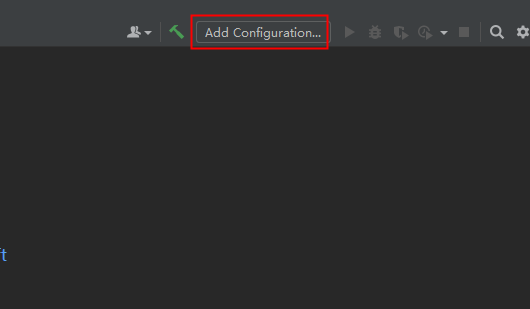

点击左上角+号  下拉选择tomcat server 下的local

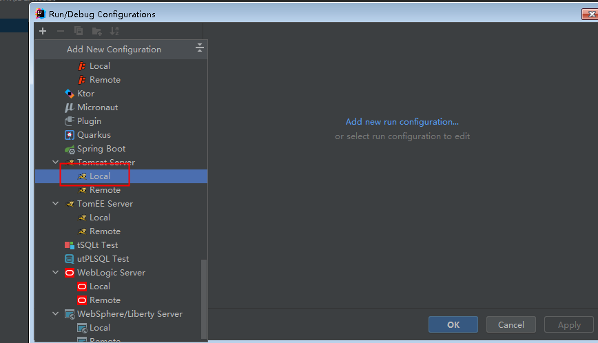

输入服务器名称,选择服务器tomcat所在目录,设置打开的默认浏览器

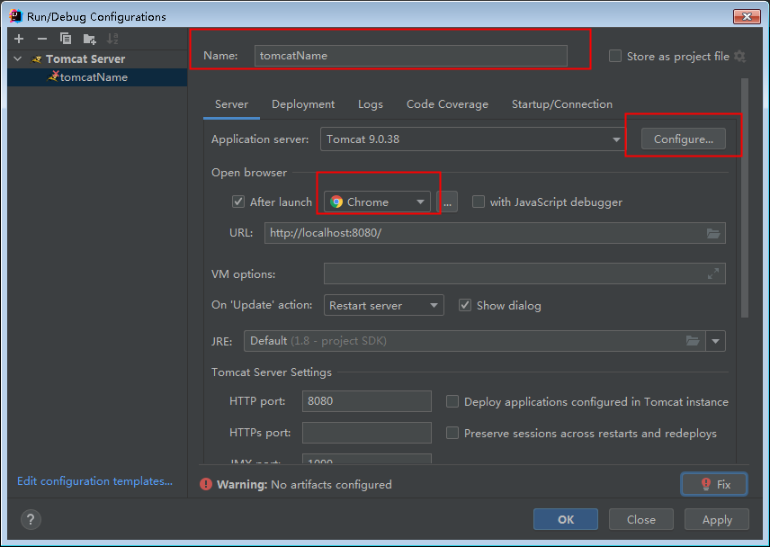

#### （2）创建java项目更改为web项目

idea每个工作台只操作一个项目,并且在2021版本之后不直接提供javaweb项目的创建,而是先创建java项目,之后添加相应的web功能进行配置

右键项目名点击 Add Framwork Support

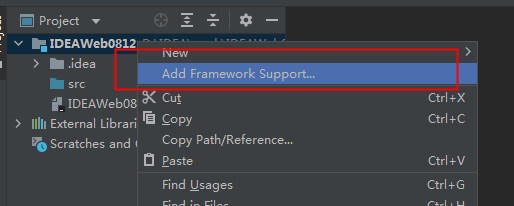

勾选 Web Application 勾选创建web.xml(虽然4.0版本之后支持注解开发,但是有些配置还是需要在web.xml中书写)

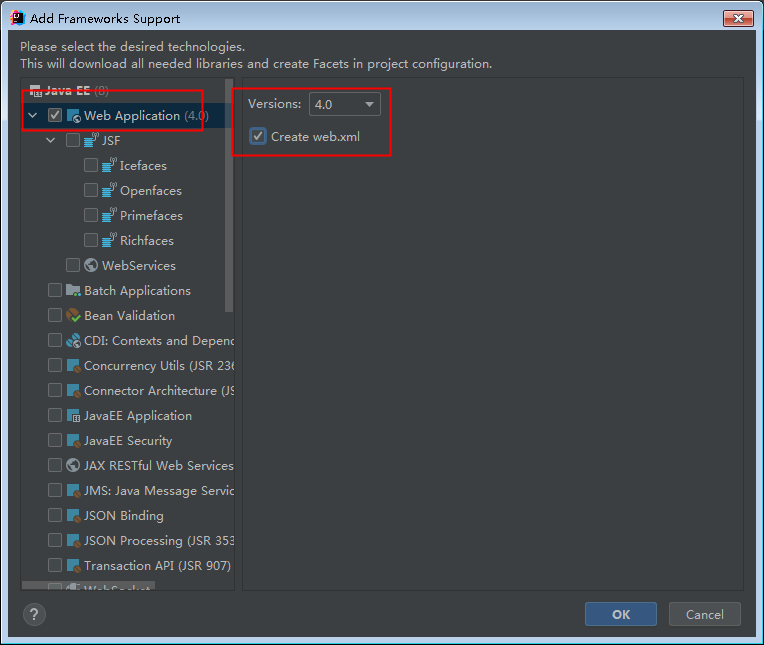

会自动创建web相应的文件夹

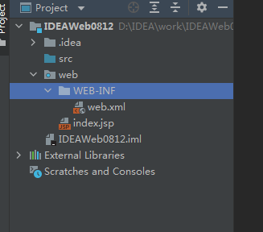

#### （3）创建lib文件夹并进行配置

在WEB-INF下创建lib文件夹

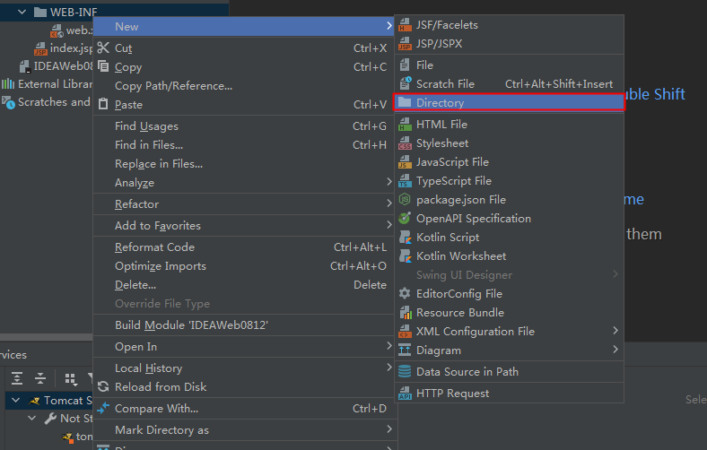

分别配置对应文件夹

点击file->Project Structure进行项目结构的配置

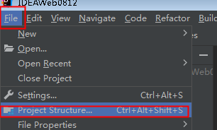

继续配置lib文件夹下的jar自动导入

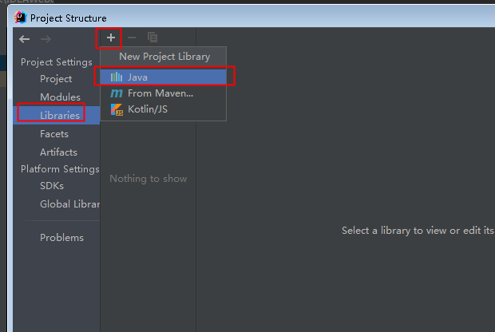

选择创建的lib文件夹

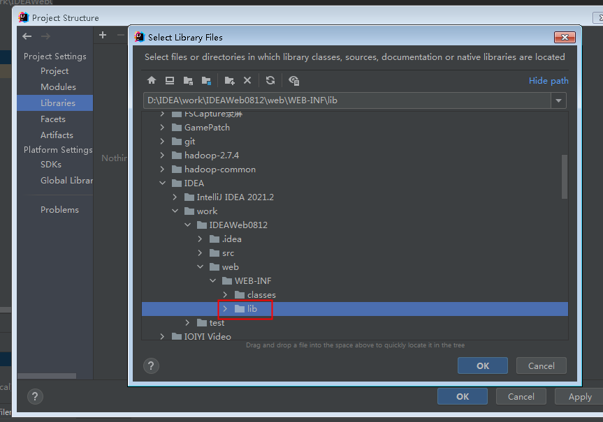

导入方式选择jar 文件夹

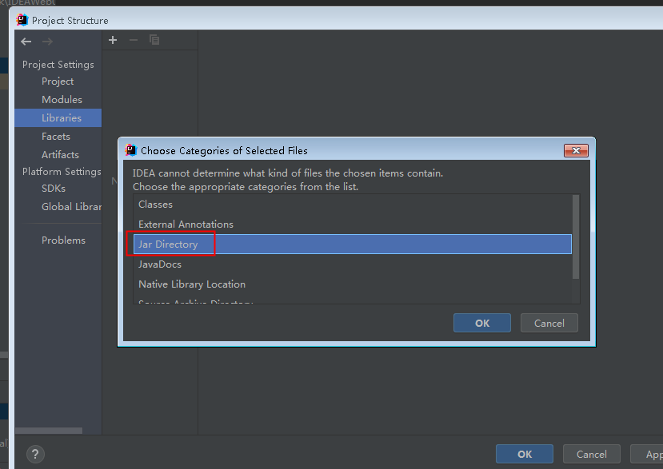

#### （4）将配置好的web项目配置到tomcat中运行

再次点击tomcat的配置

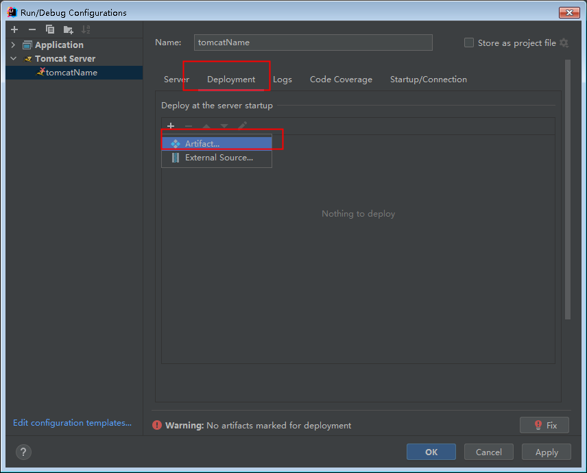

添加当前项目设置项目请求url

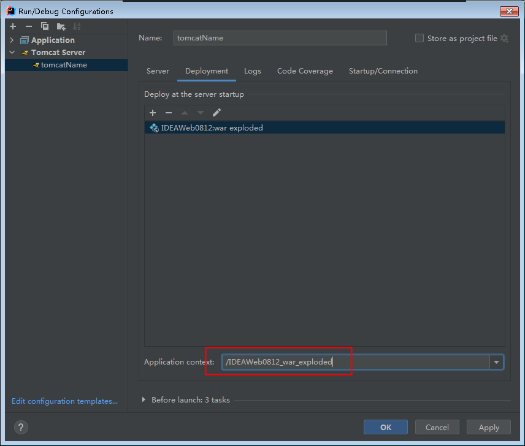

5)将tomcat环境加入当前项目

继续选择 项目配置

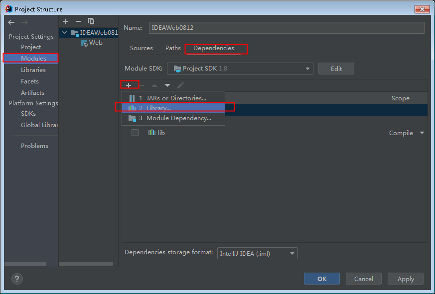

选择tomcat添加

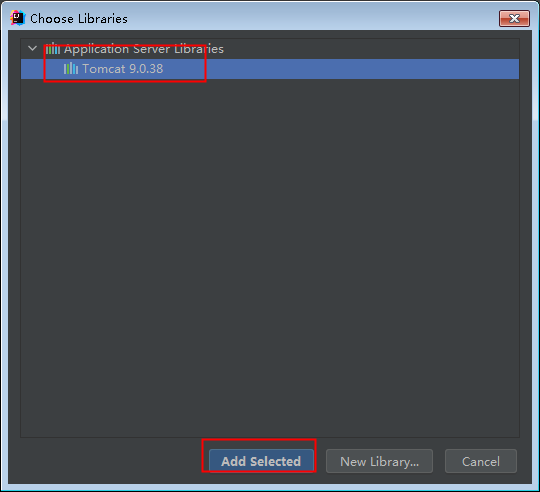
