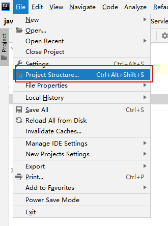
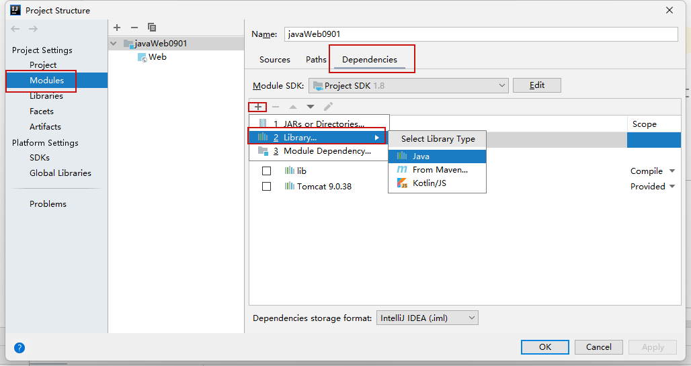
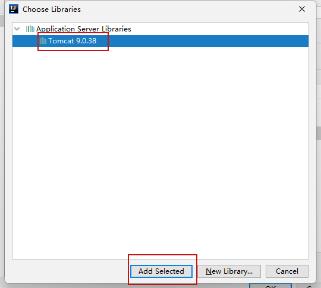

# 一、课程目标


```markdown
1.  【了解】 Servlet的配置与创建方式
2.  【掌握】 servlet的生命周期
3.  【了解】 servletConfig对象使用
4.  【掌握】 servletContext对象的使用
```

# 二 、Servlet

## 2.1 概述

> Servlet全称“Java Servlet”，中文意思为小服务程序或服务连接器，是运行在Web服务器或应用服务器上的程序，它是作为来自Web浏览器或其他HTTP客户端的请求和HTTP服务器上的数据库或应用程序之间的中间层。Servlet具有独立于平台和协议的特性，主要功能在于交互式地浏览和生成数据，生成动态Web内容。 
>
>本质就是一个Servlet接口，通过实现该接口创建Servlet服务在web中执行

<font color='#ff0000'>注意事项：Servlet接口由Tomcat提供所以需要将Tomcat环境添加到当前项目中</font>








## 2.2 配置使用

### 2.2.1 实现Servlet接口创建Servlet服务

**MyServlet1.java**

```java
package com.yh.servlet;
//Servlet
//小型应用服务程序 用于处理客户的请求
//(客户每请求一个url对于这个url我们需要书写对应的java代码进行处理
// 处理这些对应url请求的java代码就是servlet)
//tomcat服务器会帮我们分清页面与服务的请求

import javax.servlet.*;
import java.io.IOException;
//普通的java代码肯定不行 需要特殊的书写方式
//Servlet是服务接口 如果想让其方法在web运行 必须实现该接口
//该接口由Tomcat提供 所以需要将tomcat运行环境添加到当前项目中
public class MyServlet1 implements Servlet {
    @Override
    public void init(ServletConfig servletConfig) throws ServletException {

    }
    @Override
    public ServletConfig getServletConfig() {
        return null;
    }
    //具体提供服务的方法
    @Override
    public void service(ServletRequest servletRequest, ServletResponse servletResponse) throws ServletException, IOException {
        System.out.println("服务执行");
//        这样在客户端请求服务器时 会自动调用该方法
        //问题在于哪个url执行该方法？（还需要进行配置web.xml）
    }
    @Override
    public String getServletInfo() {
        return null;
    }
    @Override
    public void destroy() {
    }
}

```

**web.xml**

```xml
<?xml version="1.0" encoding="UTF-8"?>
<web-app xmlns="http://xmlns.jcp.org/xml/ns/javaee"
         xmlns:xsi="http://www.w3.org/2001/XMLSchema-instance"
         xsi:schemaLocation="http://xmlns.jcp.org/xml/ns/javaee http://xmlns.jcp.org/xml/ns/javaee/web-app_4_0.xsd"
         version="4.0">

<!--    在这配置的文件 tomcat启动时会自动进行加载
所以在这里配置url与对应类之间的关系
-->
    <servlet-mapping>
        <!--  name唯一标识 一般使用类名称 -->
        <servlet-name>myServlet1</servlet-name>
        <url-pattern>/servlet1</url-pattern>
    </servlet-mapping>

    <servlet>
        <servlet-name>myServlet1</servlet-name>
        <!-- 类的全路径 -->
        <servlet-class>com.yh.servlet.MyServlet1</servlet-class>
    </servlet>
</web-app>
```


### 2.2.2 继承GenericServlet抽象类创建Servlet服务

**MyServlet2.java**

```java
package com.yh.servlet;

import javax.servlet.GenericServlet;
import javax.servlet.ServletException;
import javax.servlet.ServletRequest;
import javax.servlet.ServletResponse;
import java.io.IOException;

//我们发现第一种实现方式中 仅需要书写service方法即可
//其他方法在某些功能中也会书写(少)
//这样每次实现servlet接口 都得额外实现那些方法
//所以提供了GenericServlet抽象类 帮我们实现Servlet接口
//我们只需要继承GenericServlet实现对应方法即可
public class MyServlet2 extends GenericServlet {

    @Override
    public void service(ServletRequest servletRequest, ServletResponse servletResponse) throws ServletException, IOException {
        System.out.println("myServlet2执行");
    }
}
```

**web.xml**

```xml
<?xml version="1.0" encoding="UTF-8"?>
<web-app xmlns="http://xmlns.jcp.org/xml/ns/javaee"
         xmlns:xsi="http://www.w3.org/2001/XMLSchema-instance"
         xsi:schemaLocation="http://xmlns.jcp.org/xml/ns/javaee http://xmlns.jcp.org/xml/ns/javaee/web-app_4_0.xsd"
         version="4.0">

<!--    在这配置的文件 tomcat启动时会自动进行加载
所以在这里配置url与对应类之间的关系
servlet1
-->
    <servlet-mapping>
        <!--  name唯一标识 一般使用类名称 -->
        <servlet-name>myServlet1</servlet-name>
        <url-pattern>/servlet1</url-pattern>
    </servlet-mapping>

    <servlet>
        <servlet-name>myServlet1</servlet-name>
        <!-- 类的全路径 -->
        <servlet-class>com.yh.servlet.MyServlet1</servlet-class>
    </servlet>

    
      <!--  servlet2 -->
    <servlet-mapping>
        <!--  name唯一标识 一般使用类名称 -->
        <servlet-name>myServlet2</servlet-name>
        <url-pattern>/servlet2</url-pattern>
    </servlet-mapping>

    <servlet>
        <servlet-name>myServlet2</servlet-name>
        <!-- 类的全路径 -->
        <servlet-class>com.yh.servlet.MyServlet2</servlet-class>
    </servlet>

</web-app>
```


### 2.2.3 继承HttpServt实现方法创建Servlet服务

**MyServlet3.java**

```java
package com.yh.servlet;

import javax.servlet.ServletException;
import javax.servlet.http.HttpServlet;
import javax.servlet.http.HttpServletRequest;
import javax.servlet.http.HttpServletResponse;
import java.io.IOException;

//实际web访问现在都是使用http协议
//http协议其实有7种不同的请求方式
//service方法只有一个处理不同的请求(通过if判断分支处理 太过麻烦)
//所以tomcat提供HttpServlet 用于负责http协议的服务处理
//只需要继承HttpServlet重写对应的请求处理方法即可
//会自动根据客户端发生的请求类型完成对应方法的执行
//HttpServlet是一个普通的类
public class MyServlet3 extends HttpServlet {
    //http协议常用请求方式get  post

    //处理get请求的方法
    @Override
    protected void doGet(HttpServletRequest req, HttpServletResponse resp) throws ServletException, IOException {
        System.out.println("myServlet3-get方法执行");
    }

    //处理post请求方法
    @Override
    protected void doPost(HttpServletRequest req, HttpServletResponse resp) throws ServletException, IOException {
        System.out.println("myServlet3-post方法执行");
    }
}

```


**web.xml**

```xml
<?xml version="1.0" encoding="UTF-8"?>
<web-app xmlns="http://xmlns.jcp.org/xml/ns/javaee"
         xmlns:xsi="http://www.w3.org/2001/XMLSchema-instance"
         xsi:schemaLocation="http://xmlns.jcp.org/xml/ns/javaee http://xmlns.jcp.org/xml/ns/javaee/web-app_4_0.xsd"
         version="4.0">

    <!--    在这配置的文件 tomcat启动时会自动进行加载
    所以在这里配置url与对应类之间的关系
    myServlet1
    -->
    <servlet-mapping>
        <!--  name唯一标识 一般使用类名称 -->
        <servlet-name>myServlet1</servlet-name>
        <url-pattern>/servlet1</url-pattern>
    </servlet-mapping>

    <servlet>
        <servlet-name>myServlet1</servlet-name>
        <!-- 类的全路径 -->
        <servlet-class>com.yh.servlet.MyServlet1</servlet-class>
    </servlet>
    <!--    myServlet2-->

    <servlet-mapping>
        <!--  name唯一标识 一般使用类名称 -->
        <servlet-name>myServlet2</servlet-name>
        <url-pattern>/servlet2</url-pattern>
    </servlet-mapping>

    <servlet>
        <servlet-name>myServlet2</servlet-name>
        <!-- 类的全路径 -->
        <servlet-class>com.yh.servlet.MyServlet2</servlet-class>
    </servlet>


    <!--  myServlet3  -->
    <servlet-mapping>
        <!--  name唯一标识 一般使用类名称 -->
        <servlet-name>myServlet3</servlet-name>
        <url-pattern>/servlet3</url-pattern>
    </servlet-mapping>

    <servlet>
        <servlet-name>myServlet3</servlet-name>
        <!-- 类的全路径 -->
        <servlet-class>com.yh.servlet.MyServlet3</servlet-class>
    </servlet>


</web-app>
```


### 2.2.4 Servlet3.0注解开发创建Servlet服务

**MyServlet4.java**

```java
package com.yh.servlet;

import javax.servlet.ServletException;
import javax.servlet.annotation.WebServlet;
import javax.servlet.http.HttpServlet;
import javax.servlet.http.HttpServletRequest;
import javax.servlet.http.HttpServletResponse;
import java.io.IOException;

//随着技术的发展 初期使用配置文件简化代码的形式已经不满足于开发的使用
//复杂的配置减缓了开发的效率 由此提出了注解开发的概念
//回归代码 使用简单的注解代替复杂的配置

//servlet3.0之后servlet全面升级 提供了注解开发
//仅需要使用@WebServlet注解 添加对应的参数就可以实现之前配置的内容
//value等价于servlet标签中的 <url-pattern>
//name对应<servlet-name> 如果没有设置默认使用类名
//如果仅配置value值可以简写为@WebServlet("url")
@WebServlet(value = "/servlet4",name = "myServlet4")
public class MyServlet4 extends HttpServlet {
    @Override
    protected void doGet(HttpServletRequest req, HttpServletResponse resp) throws ServletException, IOException {
        System.out.println("myServlet4");
    }
}

//idea在添加tomcat环境之后 可以使用默认的servlet模板直接创建如上代码
```


# 三、Servlet的生命周期

## 3.1 生命周期方法

* 构造 servlet，然后使用 `init` 方法将其初始化。
  * 第一次发送请求的时候。 执行一次(servlet可以看做是单例模式)
* 处理来自客户端的对 `service` 方法的所有调用。
  * 客户端发送一次请求，调用service方法一次。执行多次
* 从服务中取出 servlet，然后使用 `destroy` 方法销毁它，最后进行垃圾回收并终止它。
  * tomcat服务器关闭的时候，销毁

```java
import java.io.IOException;
import javax.servlet.ServletConfig;
import javax.servlet.ServletException;
import javax.servlet.annotation.WebServlet;
import javax.servlet.http.HttpServlet;
import javax.servlet.http.HttpServletRequest;
import javax.servlet.http.HttpServletResponse;

@WebServlet("/my")
public class MyServlet extends HttpServlet {
	private static final long serialVersionUID = 1L;

	// servlet类由容器tomcat进行统一管理
	//根据书写相应的方法进行调用执行
	//servlet 的生命周期是由三个方法进行控制
	//init()初始化方法
	//destroy()销毁方法
	//service()服务方法
	
	
	//servlet初始化方法
	//servlet对象由tomcat进行在第一次请求时创建(单例)
	//init方法用于初始化配置当前servlet对象  且只会执行一次
	//在服务第一次被请求时tomcat会创建对应的servlet对象 并调用对应的init方法进行初始化	
	public void init(ServletConfig config) throws ServletException {
		 System.out.println("myServlet的init方法执行");
	}

	//servlet服务方法
	//每次接受到请求都会执行的方法
	protected void service(HttpServletRequest request, HttpServletResponse response)
			throws ServletException, IOException {
		System.out.println("myServlet的service方法执行");
	}

	//servlet销毁方法
	//当服务器正常关闭时 在删除servlet对象之前执行的方法 
	//在servlet删除之前进行一些关闭操作 防止资源的占用
	//仅在服务器关闭前执行一次
	//注意:需要服务器正常关闭
	public void destroy() {
		System.out.println("myServlet的destroy方法执行");
	}
}
```


当浏览器请求服务器对应服务时,服务器会根据请求url查找是否创建了对应url的servlet,如果已经创建则直接调用对应的service方法进行服务的处理,如果没有创建,则会创建对应的servlet并调用对应servlet的init方法进行servlet的初始化工作,之后继续调用service方法进行服务的处理,当服务器正常关闭时,在销毁删除servlet对象之前,会调用对应servlet的destory方法,进行资源释放或关闭执行功能的执行


## 3.2 Servlet访问路径配置 

* 完全路径匹配
  * 以/开头，配置文件中url-pattern怎么写，浏览器就怎么访问（servlet）

* 目录匹配
  * 以/开头，以*结尾（过滤器）

* 扩展名匹配
  * 不以/开头，以扩展名结尾 (*.do,*.action  struts2框架)

# 四、ServletConfig对象

## 4.1 概念

* 用于保存当前Servlet的配置信息,并可以通过对应的方法进行获取

## 4.2 作用

* 与servlet对象一同创建用于保存对应servlet的配置信息

**获取配置信息**

* ```
  String getServletName()//获取Servlet的名称
  ```

* ```
  String getInitParameter(String name)//获取初始化参数
  ```

  * ```xml
    <!-- 配置初始化参数 -->
      	<init-param>
      		<param-name>username</param-name>
      		<param-value>rose</param-value>
      	</init-param>
      	
      	<init-param>
      		<param-name>password</param-name>
      		<param-value>123456</param-value>
      	</init-param>
    ```

*  Enumeration<E>getInitParameterNames() //获取所有初始化参数名


**ConfigServlet.java**

```java
import java.util.Enumeration;
import javax.servlet.ServletConfig;
import javax.servlet.ServletException;
import javax.servlet.annotation.WebInitParam;
import javax.servlet.annotation.WebServlet;
import javax.servlet.http.HttpServlet;

@WebServlet(value = "/config", loadOnStartup = 0, initParams = { @WebInitParam(name = "username", value = "zhangsan"),
		@WebInitParam(name = "password", value = "123456") })
// value配置请求url路径
// name配置当前servletname
// loadOnStartup配置当前servlet对象创建时间 负数第一次请求创建 0或正数启动服务器创建
public class ConfigServlet extends HttpServlet {
	private static final long serialVersionUID = 1L;

	public void init(ServletConfig config) throws ServletException {
		// ServletConfig 是当前servlet的配置类
		// 每个servlet对象在创建后都会创建对应的servletConfig对象用于保存当前servlet信息

		// 获取当前servletname 如果没有配置使用唯一全路径当做name
		String servletName = config.getServletName();
		System.out.println("servletName:" + servletName);

		// 获取正在配置中书写的初始化参数 书写在servlet标签中
		// <!-- 配置初始化参数 -->
		// <init-param>
		// <param-name>username</param-name>
		// <param-value>rose</param-value>
		// </init-param>
		//
		// <init-param>
		// <param-name>password</param-name>
		// <param-value>123456</param-value>
		// </init-param>
		
		String username = config.getInitParameter("username");
		String password = config.getInitParameter("password");
		System.out.println(username+"|"+password);
		
		
		//获取所有初始化参数的name
		Enumeration<String> names = config.getInitParameterNames();
		 while(names.hasMoreElements()){
			 System.out.println(names.nextElement());
		 }
	}
}
```


**web.xml配置形式**

```xml
<servlet>
		<servlet-name>ConfigServlet</servlet-name>
		<servlet-class>com.yunhe.config.ConfigServlet</servlet-class>
		<init-param>
			<param-name>username</param-name>
			<param-value>zhangsan</param-value>
		</init-param>
		<init-param>
			<param-name>password</param-name>
			<param-value>123456</param-value>
		</init-param>
		<load-on-startup>0</load-on-startup>
	</servlet>
	<servlet-mapping>
		<servlet-name>ConfigServlet</servlet-name>
		<url-pattern>/config</url-pattern>
	</servlet-mapping>
```


# 五、ServletContext对象

## 5.1 概念

* 在web服务器启动后，就为每一个web应用创建该对象，在web应用中包含很多web资源，所有的资源共享一个ServletContext对象，就可以通过ServletContext传递数据。

在服务器启动后,创建一个对应的对象,用于保存当前服务器相关的数据,一般用于servlet对象之间的数据传递,只要是在当前服务器中的servlet都可以获取这个对象以及这个对象中的数据


## 5.2 如何获取该对象

* 通过getServletConfig().getServletContext()获取
* 通过getServletContext()获取

```java
		//1通过servletConfig对象获取
		ServletConfig servletConfig = getServletConfig();
		ServletContext servletContext1 = servletConfig.getServletContext();
		
		
		//2直接通过HttpServlet提供的方法获取
		ServletContext servletContext2 = this.getServletContext();
```

## 5.3 作用

### 5.3.1 获取全局化参数

* 在web.xml配置全局化参数

  ```xml
    <!-- 上下文参数配置不是应用于某个servlet而是所有servlet都可以访问 -->
    <!-- 所以在配置时  直接书写在根标签下即可 -->
    <context-param>
    	<param-name></param-name>
    	<param-value></param-value>
    </context-param>
  ```

* 在Servlet中获取

  ```java
  		//直接通过HttpServlet提供的方法获取
  		ServletContext servletContext2 = this.getServletContext();
  		//与servletConfig对象获取初始化参数方法一致
  		String username = servletContext2.getInitParameter("username");
  		String password = servletContext2.getInitParameter("password");
  		System.out.println(username+"|"+password);
  ```
  
  

### 5.3.2 作为域对象传递数据

* 代表的范围是整个应用,所有的servlet都可以通过对应方法进行赋值取值删除
* setAttribute(str, obj);
* getAttribute(str);
* removeAttribute(str);

**C1Servlet.java**

```java
	protected void doGet(HttpServletRequest request, HttpServletResponse response)
			throws ServletException, IOException {
		// 所有的servlet都可以访问servletContext对象 并且通过方法进行数据的添加与获取
		ServletContext servletContext = getServletContext();
		
		//赋值setAttribute("key","value")
		//key必须为字符串类  value可以为任意对象
		//执行后会将键值对存储在servletContext对象中
		servletContext.setAttribute("username", "lisi");
	}
```

**C2Servlet.java**

```java
	protected void doGet(HttpServletRequest request, HttpServletResponse response)
			throws ServletException, IOException {
		ServletContext servletContext = getServletContext();
		//取值attribute("key")
		//传入要获取数据的key 返回对应的value对象
		Object attribute = servletContext.getAttribute("username");
		System.out.println(attribute);
	}
```

**C3Servlet.java**

```java
	protected void doGet(HttpServletRequest request, HttpServletResponse response) throws ServletException, IOException {
		 ServletContext servletContext = getServletContext();
		 //销毁对应数据removeAttribute("key")
		 //将对应key数据销毁
		 servletContext.removeAttribute("username");
	}
```


### 5.3.3 读取资源文件

* 方法

* ### InputStream **getResourceAsStream**(String path)

  * 传入资源文件的虚拟路径，得到资源文件的流对象

* ### public String **getRealPath**(String path)

  * 传入资源文件的虚拟路径，得到文件的绝对路径

```java
	protected void doGet(HttpServletRequest request, HttpServletResponse response)
			throws ServletException, IOException {
		// 数据传输本质是io流
		// servletContext提供了获取文件虚拟路径的方法
		ServletContext servletContext = getServletContext();
		String realPath = servletContext.getRealPath("a.txt");
		System.out.println(realPath);

		// servletContext提供了快速读取文件的方法
		InputStream is = servletContext.getResourceAsStream("a.txt");
		byte b[] = new byte[1024];
		int len = 0;
		while ((len = is.read(b)) != -1) {
			System.out.println(new String(b, 0, len));
		}
	}
```

**虚拟路径**

在使用开发工具进行开发书写的代码位置与实际执行web项目使用的路径是不一样的,以eclipse为例,当执行web项目时,会自动根据当前的项目在临时文件夹下创建对应的目录,用于保存项目运行时使用的文件,这些文件的路径称之为虚拟路径,有开发工具以及服务器进行配置,虚拟目录会在项目关闭后自动清除对应的数据,如果想保存这些数据,可以手动配置虚拟路径与实际路径的映射