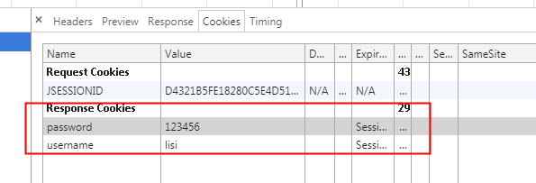
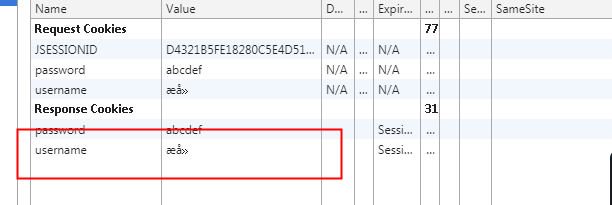
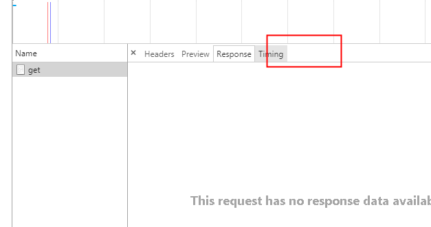
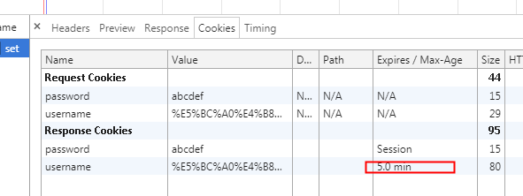
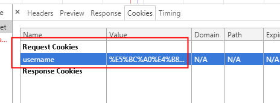
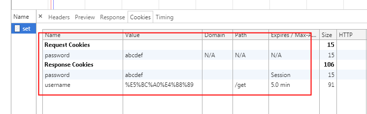
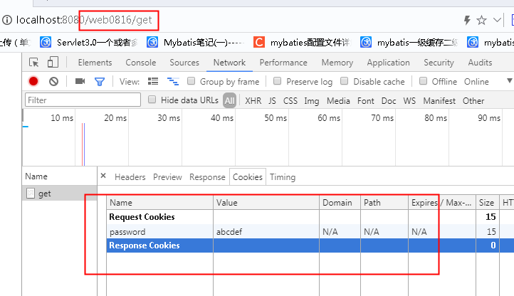
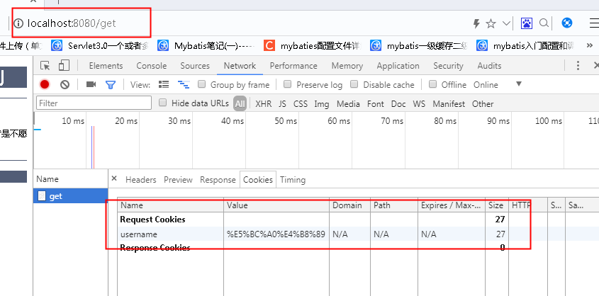
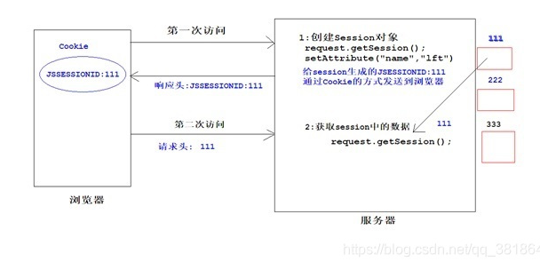

# 一、课程目标


```markdown
1.  【了解】 会话的概念
2.  【掌握】 cookie的使用
3.  【掌握】 session的使用
4.  【掌握】 cookie与session的区别
```


# 二、会话

## 2.1 概念

http协议是基于请求与响应的无状态协议,但是进行使用时,通常会进行多次的请求与响应,将多次的请求与响应当做一个会话(浏览器窗口没有关闭)

* 是一个过程，用户打开浏览器浏览网页（对同一个服务器多次请求--响应），关闭浏览器，这个过程称为会话

## 2.2 作用

因为http协议不会保存客户端状态,所以需要使用会话技术进行客户端数据的存储

* 每个用户与服务器交互，会产生一些数据，程序希望保存这些数据，就可以保存在会话对象中。


# 三、cookie

## 3.1 概念

* 是客户端的会话技术，默认cookie是保存在用户的浏览器上
* 程序把用户的数据以cookie的形式写回到用户的浏览器上（响应头：set-cookie）
* 当用户使用浏览器访问程序的时候，携带自己浏览器上的cookie(请求头：cookie)

## 3.2 原理

* cookie是服务器端创建，客户端保存（默认浏览器的缓存中）
* cookie是基于http协议的
* cookie可以在客户端与服务器端传递数据

当浏览器向服务器发送请求,服务根据请求处理后决定是否创建cookie,服务器创建cookie并设置cookie相关的信息(数据.地址.时效),并将其放置到响应头中,发送至浏览器,浏览器解析响应头获取cookie数据进行保存(浏览器允许存储cookie的情况下),当浏览器再次请求服务器时,根据存储时cookie设置的信息(地址:判断是否是设置的地址,,时效:是否过期)判断是否携带cookie,将cookie放置到请求头中,发送给服务器,服务器接收后从请求头中解析cookie数据并使用.


## 3.3 cookie的使用

### **3.3.1 创建cookie对象并发送至客户端**

| 方法                    | 参数                                       | 备注                                    |
| ----------------------- | ------------------------------------------ | --------------------------------------- |
| new Cookie(name,value); | name:存储cookie的名字 value:存储cookie的值 | name与value都为字符串(最好不要使用中文) |
| response.addCookie(c1); | c1:在响应头中添加的cookie对象              | 该方法由响应对象提供                    |


```java
@WebServlet(name = "SetCookieServlet", value = "/set")
public class SetCookieServlet extends HttpServlet {
    @Override
    protected void doGet(HttpServletRequest request, HttpServletResponse response) throws ServletException, IOException {
        //cookie由服务器创建 存储在客户端浏览器中

        //cookie在java中使用Cookie类创建的对象进行表示
        //当客户端浏览器请求服务 需要创建cookie时 创建Cookie对象
        //cookie只能存储字符串 并每个cookie都是一个键值对 对象
        //key与value都是字符串  不建议使用中文 如果使用中文在添加与获取时需要特殊操作
        Cookie c1=new Cookie("username","李四");
        Cookie c2=new Cookie("password","abcdef");

        //cookie通过响应发送至客户端
        response.addCookie(c1);
        response.addCookie(c2);
    }
}
```

当浏览器请求对应url后,服务器创建cookie对象并响应 存储在客户端  cookie响应结果如下




注意:在进行数据传输时会进行流的形式传输,如果数据是中文可能导致乱码问题(所以不建议使用中文作为数据)




客户端获取cookie后进行保存,当再次请求时会携带请求的缓存数据,如上图request cookies所示


### **3.3.2 获取请求中的cookie数据**

| 方法                 | 参数 | 备注                                             |
| -------------------- | ---- | ------------------------------------------------ |
| request.getCookies() | 无   | 由request对象提供的获取请求头中cookie数组的方法  |
| c.getName()          | 无   | 由cookie对象提供的,获取对应cookie对象name的方法  |
| c.getValue()         | 无   | 由cookie对象提供的,获取对应cookie对象value的方法 |
| c.getPath()          | 无   | 由cookie对象提供的,获取cookie携带请求url路径     |
| c.getMaxAge()        | 无   | 由cookie对象提供的,获取cookie的存活时间          |

```java
@WebServlet(name = "GetCookieServlet", value = "/get")
public class GetCookieServlet extends HttpServlet {
    @Override
    protected void doGet(HttpServletRequest request, HttpServletResponse response) throws ServletException, IOException {
        //当客户端请求中携带了cookie数据 可以通过请求对象的方法获取cookie数组
        Cookie[] cookies = request.getCookies();
        //判断cookie是否为null
        if(cookies!=null){
            for (Cookie c:cookies) {
                //获取name与value
                System.out.println(c.getName()+"|"+c.getValue());
                //因为存储数据的编码与当前环境一致 所以在浏览器显示的中文乱码可以识别
            }
        }

    }
}
```


### 3.3.3 cookie中文数据的编码与解码

在进行cookie创建时,如果书写中文,在浏览器存储时可能出现乱码,所以可以先将其转换一定的编码后存储,获取后再解码(编码解码只不过是不想将中文直接显示.也可以理解为简单的加密)

- URLEncoder.encode(“张三”, “UTF-8”);//编码
- URLDecoder.decode(cookie.getValue(), “UTF-8”);//解码

```java
       //在创建cookie添加value时  将数据字符串编码后添加
        Cookie c1=new Cookie("username", URLEncoder.encode("张三", "UTF-8") );//编码 			 
	   //张三编码后=>%E5%BC%A0%E4%B8%89
	   //在获取cookie后进行解码 输出  
        URLDecoder.decode(c.getValue(), "UTF-8");//解码
```

该编码与解码方式使用的是中文在url地址栏进行传输时的编码方式


### 3.3.4 设置cookie的持久化时间

| 方法               | 参数                        | 备注                                           |
| ------------------ | --------------------------- | ---------------------------------------------- |
| c1.setMaxAge(min); | min:设置持久化时间 单位 :秒 | 如果不设置 或设置为任意负数 则为关闭浏览器失效 |

在创建cookie时,可以通过方法设置cookie的持久化时间,如果没有设置默认为-1(任意负数),时间为当前浏览器关闭前(有些浏览器不允许没有进行安全注册(备案)的服务器存储长时间的cookie,但是允许默认cookie的使用)

当关闭浏览器,再次请求时,cookie就会失效,不会携带cookie数据



```java
@WebServlet(name = "SetCookieServlet", value = "/set")
public class SetCookieServlet extends HttpServlet {
    @Override
    protected void doGet(HttpServletRequest request, HttpServletResponse response) throws ServletException, IOException {

        //在创建cookie添加value时  将数据字符串编码后添加
        Cookie c1=new Cookie("username", URLEncoder.encode("张三", "UTF-8") );//编码
        Cookie c2=new Cookie("password","abcdef");

        //设置cookie的持久化时间 单位秒
        c1.setMaxAge(60*5);

        //cookie通过响应发送至客户端
        response.addCookie(c1);
        response.addCookie(c2);
    }
```



当关闭浏览器 请求获取cookie地址,由于只设置了username的存活时间,所以password设置为默认浏览器关闭失效,所以重新打开浏览器请求只有username




### 3.3.5 设置cookie的访问路径

当创建cookie时可以设置cookie的访问路径(当前请求服务器对应路径时才会携带cookie,请求其他路径不会携带cookie)

| 方法             | 参数               | 备注                                        |
| ---------------- | ------------------ | ------------------------------------------- |
| c1.setPath(url); | url:设置请求的路径 | 如果没有设置则当前服务器任意url都携带cookie |


```java
        //设置cookie访问路径
        //只有请求当前服务器并且访问路径为指定路径时才携带cookie
        //如果没有设置 默认为/  请求当前服务器任意路径都会携带cookie
        c1.setPath("/get");
```

由于username设置了请求的url为get  所以请求set路径时不会携带cookie




由于设置了项目名称,所以请求的url前需要书写项目名称,所以uername还是不会携带




当直接请求服务器地址/get时,就会携带对应的cookie




```java
		//cookie常用的path设置路径
		//1.默认路径/
		//只要请求的是当前的服务器 都会携带cookie(默认)	
		c1.setPath();
		//2.项目路径 /项目名
		//只要请求的url是指定项目下的url 都会携带cookie
		c1.setPath("/web0816")
        //3.服务路径 /项目名/服务名
        //只有请求指定服务时 才会携带cookie
        c1.setPath("/web0816/get")
```


### 3.3.6 删除cookie

cookie由服务器创建存储在客户端浏览器,所以不能通过方法直接删除,但是可以通过设置cookie的存活时间进行删除,也可以将value设置为空字符串

```java
//清除Cookie
Cookie cookie = new Cookie("username", "");
//1:设置访问的路径path,  这里的Path必须和设置Cookie 的路径保持一致
cookie.setPath(request.getContextPath());
//2:设置存活时间
cookie.setMaxAge(0);
//3:将cookie发送到浏览器
response.addCookie(cookie);
//删除cookie就是将指定cookie存活时间设置为0让浏览器删除
```


### 3.3.7 案例

#### 显示上一次访问时间

```java
package com.yh;

import java.io.IOException;
import java.text.SimpleDateFormat;
import java.util.Date;

import javax.servlet.ServletException;
import javax.servlet.http.Cookie;
import javax.servlet.http.HttpServlet;
import javax.servlet.http.HttpServletRequest;
import javax.servlet.http.HttpServletResponse;

public class LastTimeServlet extends HttpServlet {
	@Override
	protected void doGet(HttpServletRequest req, HttpServletResponse resp)
			throws ServletException, IOException {
		//通过request获取所有的cookie
		Cookie [] cks = req.getCookies();
		
		//定义cookie变量
		Cookie c = null;
		
		//判断cks是否为空
		if(cks != null){
			//遍历数组
			for (Cookie cookie : cks) {
				//查找名字是lasttime的cookie
				if(cookie.getName().equals("lasttime")){
					//找到了
					c = cookie;
					break;
				}
			}
		}
		//获取系统当前时间
		Date date = new Date();
		//判断c是否为空
		if(c == null){
			//用户是第一次访问
			c = new Cookie("lasttime", Long.toString(date.getTime()));
			
			//向客户端响应你好
			resp.getWriter().write("Hello");
		}else{
			//用户不是第一次访问
			String lasttime = c.getValue();
			
			//日期解析
			SimpleDateFormat df = new SimpleDateFormat("yyyy-MM-dd HH:mm:ss");
			
			String now = df.format(new Date(new Long(lasttime)));
			
			//响应到客户端
			resp.getWriter().write("你好上一次访问的时间是"+now);
			
			c.setMaxAge(10);
			
			//将当前系统时间写入到cookie中
			c.setValue(Long.toString(date.getTime()));
			
		}
		
		//将cookie写回浏览器
		resp.addCookie(c);
	}

	@Override
	protected void doPost(HttpServletRequest req, HttpServletResponse resp)
			throws ServletException, IOException {
		doGet(req, resp);
	}
}
```


# 四、session

## 4.1 概念

* session是服务器端的技术
* 服务器在运行时为每一个用户创建一个独享的session对象
* 每个用户在访问服务器过程中，产生的数据可以放在session对象中
* 每个用户需要保存个人的，每次访问服务器的时候，都携带个人的sessionid
* session技术基于cookie，使用cookie传递sessionid。


## 4.2 原理



session依赖于cookie保存sessionid,当客户端第一次请求服务器端时,服务器端根据需求判断是否需要创建存储会话数据的session对象(请求服务器可能不会直接创建session对象),如果需要创建session对象存储数据,那么在创建后获取创建session对象的id,在响应中添加对应的cookie存储并响应,当客户端再次请求时(没有关闭浏览器拥有sessionid缓存cookie),服务端获取请求携带的coolie数据中的sessionid获取存储对应会话的session对象并进行数据操作

注意：在客户端cookie中存储的id，只是一个标识，用于在请求时告诉服务器，应该从哪个sessio对象中获取数据，当浏览器关闭时，丢失的是在客户端浏览器存储的cookie对象，而在服务器中对应存储的session并没有丢失，而是达到最大存活时间后自动回收


## 4.3 session有关的API

| 方法名                                       | 功能                                      | 备注 |
| -------------------------------------------- | ----------------------------------------- | ---- |
| void setAttribute(String name, Object value) | 向域对象存入值                            |      |
| Object getAttribute(String name)             | 域对象取值                                |      |
| void removeAttribute(String name)            | 域对象删除值                              |      |
| String getId()                               | session的空间有唯一的id值，获取该id值的。 |      |
| void invalidate()                            | 销毁session对象                           |      |
| ServletContext getServletContext()           | 获取ServletContext域对象                  | 重要 |


域对象：全称作用域对象，用于在对应的域中进行数据操作，使在同一作用域下对应对象可以进行使用。

servletContent：servlet上下文对象(应用作用域)，保存的数据当前服务器下所有servlet共享

servletRequest：servlet请求域对象，保存本次请求中的数据，在拥有同一个请求的servlet下共享

httpSession：会话域对象，保存的会话数据，在当前会话下的所有数据共享(由同一个服务器发送的请求)


## 4.4 Session的使用

### 4.4.1 创建

*  request.getSession()
  * 该方法可以创建session的对象，但是也可以来获取到session对象
  * 根据cookie对象中是否有jsessionid的cookie，如果有，通过id值查找，找到了不用创建了，返回。如果没有找到，创建一个新的session对象。


### 4.4.2 销毁

* 配置session的默认销毁时间，默认值是30分钟（在tomcat/conf/web.xml文件中设置了session默认超时时间）

  ```xml
  <session-config>
  	<session-timeout>30</session-timeout>
  </session-config>
  ```

* 关闭服务器销毁session
  * 非正常的原因关闭服务器，销毁session
  * 如果正常关闭服务器，session会被序列化到磁盘上。

* 设置session最大的存活的时间
  
  * void setMaxInactiveInterval(int interval) 
* 直接使用方法，销毁session
  
  * invalidate() 


### 4.4.3 案例

#### 购物车案例

product_list.jsp

```jsp
<%@ page language="java" contentType="text/html; charset=UTF-8"
    pageEncoding="UTF-8"%>
<!DOCTYPE html PUBLIC "-//W3C//DTD HTML 4.01 Transitional//EN" "http://www.w3.org/TR/html4/loose.dtd">
<html>
<head>
<meta http-equiv="Content-Type" content="text/html; charset=UTF-8">
<title>Insert title here</title>

<style type="text/css">
	img{
		width:200px;
		
	}
</style>
</head>
<body>
<h2>商品列表</h2>
<div>
	
	<a href="./addCart?pid=1">添加到购物车</a>
</div>
<div>
	
	<a href="./addCart?pid=2">添加到购物车</a>
</div>
<div>
	
	<a href="./addCart?pid=3">添加到购物车</a>
</div>
<div>
	
	<a href="./addCart?pid=4">添加到购物车</a>
</div>
</body>
</html>
```

AddCartServlet.java

```java
package com.yh;

import java.io.IOException;
import java.util.HashMap;

import javax.servlet.ServletException;
import javax.servlet.http.HttpServlet;
import javax.servlet.http.HttpServletRequest;
import javax.servlet.http.HttpServletResponse;
import javax.servlet.http.HttpSession;

public class AddCartServlet extends HttpServlet {
	@Override
	protected void doGet(HttpServletRequest req, HttpServletResponse resp)
			throws ServletException, IOException {
		
		//获取商品id
		String pid = req.getParameter("pid");
		
		//获取session  创建session
		HttpSession session = req.getSession();
		
		//获取session中的购物车信息
		Object o = session.getAttribute("cart");
		
		//判断o是否为空
		if(o == null){
			//第一次添加购物车
			//创建购物车
			HashMap<String, Integer> map = new HashMap<String, Integer>();
			
			//将商品放入购物车
			map.put(pid, 1);
			
			//将购物车放入session
			session.setAttribute("cart", map);
		}else{
			//不是第一次添加商品到购物车
			//判断购物车中是否包含当前pid
			HashMap<String, Integer> map = (HashMap<String,Integer>)o;
			if(map.containsKey(pid)){
				//获取当前商品的数量
				Integer count = map.get(pid);
				//数量+1
				count++;
				//将数量放入map集合
				map.put(pid, count);
			}else{
				//购物车不存在当前商品
				map.put(pid, 1);
			}
			
			System.out.println(map);
		}
		
		//跳转添加成功页面
		resp.sendRedirect("/huihua/addSucc.jsp");
	}

	@Override
	protected void doPost(HttpServletRequest req, HttpServletResponse resp)
			throws ServletException, IOException {
		doGet(req, resp);
	}
}

```

addCartSucc.jsp

```jsp
<%@ page language="java" contentType="text/html; charset=UTF-8"
    pageEncoding="UTF-8"%>
<!DOCTYPE html PUBLIC "-//W3C//DTD HTML 4.01 Transitional//EN" "http://www.w3.org/TR/html4/loose.dtd">
<html>
<head>
<meta http-equiv="Content-Type" content="text/html; charset=UTF-8">
<title>Insert title here</title>
</head>
<body>
<h2>添加成功页面</h2>
<a href="./product_list.jsp">继续剁手</a>
<a href="./cart">结算</a>
</body>
</html>
```


 


# 五、Cookie和Session的区别

**从存储方式上比较**

Cookie只能存储字符串，如果要存储非ASCII字符串还要对其编码； Session可以存储任何类型的数据，可以把Session看成是一个容器
cookie数据存放在客户的浏览器上，session数据放在服务器上；
单个cookie在客户端的限制是4K，就是说一个站点在客户端存放的COOKIE不能超过4K（不同浏览器不同）； 

**从隐私安全上比较**

Cookie存储在浏览器中，对客户端是可见的。信息容易泄露出去。如果使用Cookie，最好将Cookie加密
Session存储在服务器上，对客户端是透明的。不存在敏感信息泄露问题。

**从有效期上比较**

Cookie保存在硬盘中，只需要设置maxAge属性为比较大的正整数，即使关闭浏览器，Cookie还是存在的
Session的保存在服务器中，设置maxInactiveInterval属性值来确定Session的有效期。并且Session依赖于名为JSESSIONID的Cookie，该Cookie默认的maxAge属性为-1。如果关闭了浏览器，该Session虽然没有从服务器中消亡，但也就失效了。


**从对服务器的负担比较**

Session是保存在服务器的，每个用户都会产生一个Session，如果是并发访问的用户非常多，是不能使用Session的，Session会消耗大量的内存。
Cookie是保存在客户端的。不占用服务器的资源。像baidu这样的大型网站，一般都是使用Cookie来进行会话跟踪。


 

