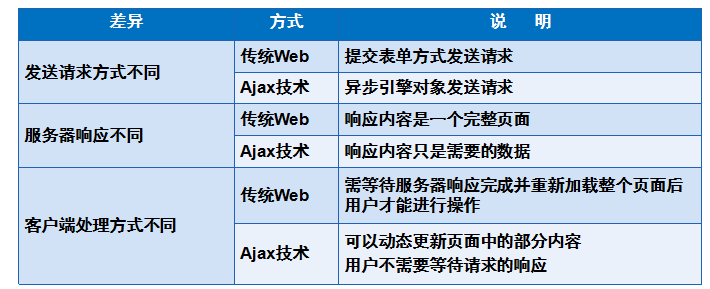

# 一、课程目标


```markdown
1.  【了解】 Ajax异步请求概述
2.  【掌握】 axios的使用
3.  【掌握】 Json数据的封装与解析
```


# 二、Ajax

## 2.1 概念

* Asynchronous JavaScript and XML：异步的js和xml:客户端与服务器端进行数据交互

## 2.2 异步与同步

* 异步：使用XMLHttpRequest对象完成异步操作,和服务器进行数据的交互
  * 不是提交整个页面,而是提交向服务器一部分数据,得到服务器的响应后,做局部刷新;如果服务器没有响应,那么可以操作页面其他内容
* 同步：使用表单或者超链接提交数据
  * 需要把表单数据提交到后台服务器,页面发生跳转,需要等待服务器作出相应,如果服务器没有做出相应,需要等待,不能操作页面其他内容

## 2.3 传统请求与ajax



## 2.4 异步的使用场景

* 百度输入框
* 验证用户名是否存在
* 异步分页
* 实现前后台分离项目(基石)

前台后台代码存放不同的服务器,这样既减轻了服务器的压力,也在服务器宕机时还能提供页面展示,只不过没有数据

## 2.5 传输数据类型

* 异步
  * 字符串
  * xml：前台得到的是一个document对象
  * json：特殊的数据格式,获取的是字符串,需要使用eval函数执行一次,得到json对象
* 同步
  * 响应的都是以整个HTML页面


# 三、Vue的Ajax(axios)

> ```java
> 在Vue.js中发送网络请求本质还是ajax，我们可以使用插件方便操作。
> 1. vue-resource: Vue.js的插件，已经不维护，不推荐使用 
> 2. axios :不是vue的插件，可以在任何地方使用，推荐
> ```

## 3.1 导入

> ```Html
> 不推荐使用cdn链接axios
> <script src="https://unpkg.com/axios/dist/axios.min.js"></script>
> ```

## 3.2 axios请求

> ```Js
> axios({
>      // 请求方式
>      method: 'post',
>      url: 'api',
>      // 传递参数 data使用流发送数据 params台servlet可以直接获取
>      params: obj,
>      //响应的数据格式 默认就是json 可以省略
>   responseType: 'json'
>  }).then(response => {
>      // 请求成功
>      let res = response.data;
>      console.log(res);
>  }).catch(error => {
>      // 请求失败，
>      console.log(error);
>         // 一般不用
>  });
> ```
>
> 

## 3.3 GET请求

> ```Js
> axios.get('/user?id=12345')
>   .then(response => {
>           console.log(response.data);
>   })
>   .catch(error => {
>           console.dir(error)
>  });
> 
> ```

## 3.4 POST请求

> ```Js
> axios.post('/user', "name=迪丽热巴&age=23") .then(response => {
>   console.log(response.data);
> })
> .catch(error => {
>   console.dir(err)
> });
> ```
>
> ```java
> 补充：
> 	为方便起见，为所有支持的请求方法提供了别名
> 	axios.request(confifig) 
> 	axios.get(url[, confifig]) 
> 	axios.delete(url[, confifig]) 
> 	axios.head(url[, confifig]) 
> 	axios.post(url[, data[, confifig]]) 
> 	axios.put(url[, data[, confifig]]) 
> 	axios.patch(url[, data[, confifig]])
> ```
>

## 3.5 案例

### 使用axios完成注册页面账号是否存在判断

**reg.html**

```html
<!DOCTYPE html>
<html>

<head>
    <meta charset="UTF-8">
    <title>Insert title here</title>
    <!-- 引入axios   -->
    <script src="../js/axios.min.js"></script>
    <!-- 引入vue -->
    <script src="../js/vue.min.js"></script>


</head>

<body>
    <div id="app">
        <form action="login" method="post">
            账号:<input type="text" name="username" v-model="username" id="username" @blur="uname"><span id="s1"></span><br> 密码:<input type="password" name="password"><br> <input type="submit" value="注册">
        </form>
    </div>
</body>
<script>
    new Vue({
        el: "#app",
        data: {
            username: ""
        },
        methods: {
            uname() {
                axios({
                    // 请求方式
                    method: 'get',
                    url: '/reg?username=' + this.username,
                    //响应的数据格式 默认就是json 可以省略
                    responseType: 'text'
                }).then(response => {
                    // 请求成功
                    let res = response.data;
                    console.log(res);
                }).catch(error => {
                    // 请求失败，
                    console.log(error);
                    // 一般不用
                });
            }
        }
    });
</script>

</html>
```


**RegServlet.java**

```java
@WebServlet("/reg")
public class RegServlet extends HttpServlet {
	private static final long serialVersionUID = 1L;

	 
	protected void doGet(HttpServletRequest request, HttpServletResponse response) throws ServletException, IOException {
		response.setCharacterEncoding("UTF-8");
		response.setContentType("text/html;charset=utf-8"); 
		//书写账号是否存在验证
		//获取要注册的账号
		String username = request.getParameter("username");
		//书写判断sql
		String sql="select * from account where username=?";
		ArrayList<Account> accounts = MyJDBCutil.dql(sql, Account.class, username);
		//获取打印流
		PrintWriter writer = response.getWriter();	
		if(accounts.isEmpty()){
			writer.print("账号可以使用");
		}else{
			writer.print("账号已经被注册");
		}
		
		
	}
	protected void doPost(HttpServletRequest request, HttpServletResponse response) throws ServletException, IOException {
		 //post用于真正的注册功能使用
	}

}
```


# 四、JSON数据封装和解析

## 4.1 概述

* js提供的一种数据交换的格式,一般情况,都是再后台拼接json数据,响应前台.前台使用js代码就可以方便操作json
* 当前台请求设置dataType为json时,会自动将服务返回的数据转换为json对象,如果在转换时失败,则会出现明明服务执行但仍然调用失败方法回调

## 4.2 数据规范

* 定义json数据

  * 格式必须使用{}包括起来,当做对象来使用，对象包含属性和值,如果是属性,必须使用双引号括起来，属性与值之间使用冒号,属性与属性之间使用逗号

* 获取json数据的方式

  * 对象名.属性名

* ```javascript
  var person = {}
  ```


json本质是字符串,后台可以通过字符串拼接的形式进行json字符串的创建并返回,但是由于json的key必须为字符串(""包裹)所以需要使用转义符\进行标注


```javascript
                axios.post('/user', "name=迪丽热巴&age=23").then(response => {
                        console.log(response.data.msg);
                    })
                    .catch(error => {
                        console.dir(err)
                    });
```

```java
		String jsonStr="{\"msg\":\"请求成功\"}";
		writer.print(jsonStr);
```

**常用的使用方式：从后台发送json数据格式的数据,再前台使用js解析数据**

## 4.3 后台封装json

通常后台通过数据库查询数据返回集合,但是如果通过json数据传输,那么需要将集合转换为json字符串,我们不可能逐个拼接,所以我们使用工具类完成

### 4.3.1 案例

```java
		String sql="select * from account";
		ArrayList<Account> accounts = MyJDBCutil.dql(sql, Account.class);
		 
		//JSONArray 可以将集合转换为json数组
		//fromObject JSONArray提供的静态方法 可以将集合数组转换为对应的json数组
		JSONArray jsonArr = JSONArray.fromObject(accounts);
		 
		Account account=new Account(1,"zhangsan","123456");
		
		//JSONObject 在java中代表json对象的类 提供了操作json数据的方法
		//fromObject JSONObject提供的静态方法  可以将对象转换为json对象
		//可以创建返回json数据对象 通常拥有属性int code,String msg,list data
		JSONObject accjson = JSONObject.fromObject(account);
		//System.out.println(accjson);
		
		//也可以通过自己创建json对象 并进行数据存储返回
		//创建一个空的json对象  并自己进行赋值操作
		JSONObject jsonObj=new JSONObject();
		
		//为当前json对象添加对应数据(如果已存储指定key则覆盖)
		jsonObj.element("code", "200");
		jsonObj.element("code", "201");
		
		//为当前json对象添加对相应数据(如果存在指定key 将value已数组形式继续添加)
		jsonObj.accumulate("msg","错误信息");
		jsonObj.accumulate("msg","错误信息1");
		 
		System.out.println(jsonObj);
```

### 4.3.2 总结

* JSONObject(类似与map集合,对象)
  * 无参构造方法   创建空的json对象
  * element(k,v)   添加对应数据key相同进行覆盖
  * accumulate(k,v)   添加对应数据 key相同,value使用数据继续添加
  
  

## 4.4 前台json解析

* ajax会将后台返回的json字符串解析为json对象,可以使用接受参数直接获取通过key进行操作

```javascript
 if (response.code == 200) {
     //根据json数据进行操作
	var dataArr = response.data;
    console.log(dataArr)
 } else {
	alert(response.msg)
 }
```

### 4.4.1 案例

#### 查询数据库,根据返回json数据生成页面表格

**json.html**

```java
<!DOCTYPE html>
<html>

<head>
    <meta charset="UTF-8">
    <title>Insert title here</title>
    <!-- 引入axios   -->
    <script src="../js/axios.min.js"></script>
    <!-- 引入vue -->
    <script src="../js/vue.min.js"></script>


</head>

<body>
    <table border="1">
        <thead>
            <tr>
                <th>id</th>
                <th>账号</th>
                <th>密码</th>
            </tr>
        </thead>
        <tbody>
                    <tr v-for="obj in allData">
                    <td>{{obj.id}}</td>
                    <td>{{obj.username}}</td>
                    <td>{{obj.password}}</td>
                </tr>
    </tbody>
    </table>
</body>
<script>
    new Vue({
        el: "#app",
        data: {
            username: "",
            allData: []
        },
        methods: {
            uname() {
                axios({
                    // 请求方式
                    method: 'get',
                    url: '/json',
                    //响应的数据格式 默认就是json 可以省略
                    responseType: 'json'
                }).then(response => {
                    // 请求成功
                    if (response.code == 200) {
                        let res = response.data;
                        console.log(res);
                        this.allData = res;
                    } else {
                        alert(data.msg)
                    }
                }).catch(error => {
                    // 请求失败，
                    console.log(error);
                    // 一般不用
                });
            }
        }
    });
</script>
</html>
```


**JsonServlet.java**

```java
@WebServlet("/json")
public class JsonServlet extends HttpServlet {
	private static final long serialVersionUID = 1L;

	protected void doGet(HttpServletRequest request, HttpServletResponse response)
			throws ServletException, IOException {
		response.setCharacterEncoding("UTF-8");
		response.setContentType("text/html;charset=utf-8");
		// 服务器返回json数据本质返回的是json字符串
		// 在后台拼接json字符串并返回
		System.out.println("jsonServlet执行");
		PrintWriter writer = response.getWriter();
		String sql = "select * from account";
		ArrayList<Account> accounts = MyJDBCutil.dql(sql, Account.class);
		JSONObject jsonObj = new JSONObject();
		jsonObj.element("code", 200);
		jsonObj.element("msg", "请求成功");
		jsonObj.element("data", accounts);
		
		writer.print(jsonObj);

	}
}
```


